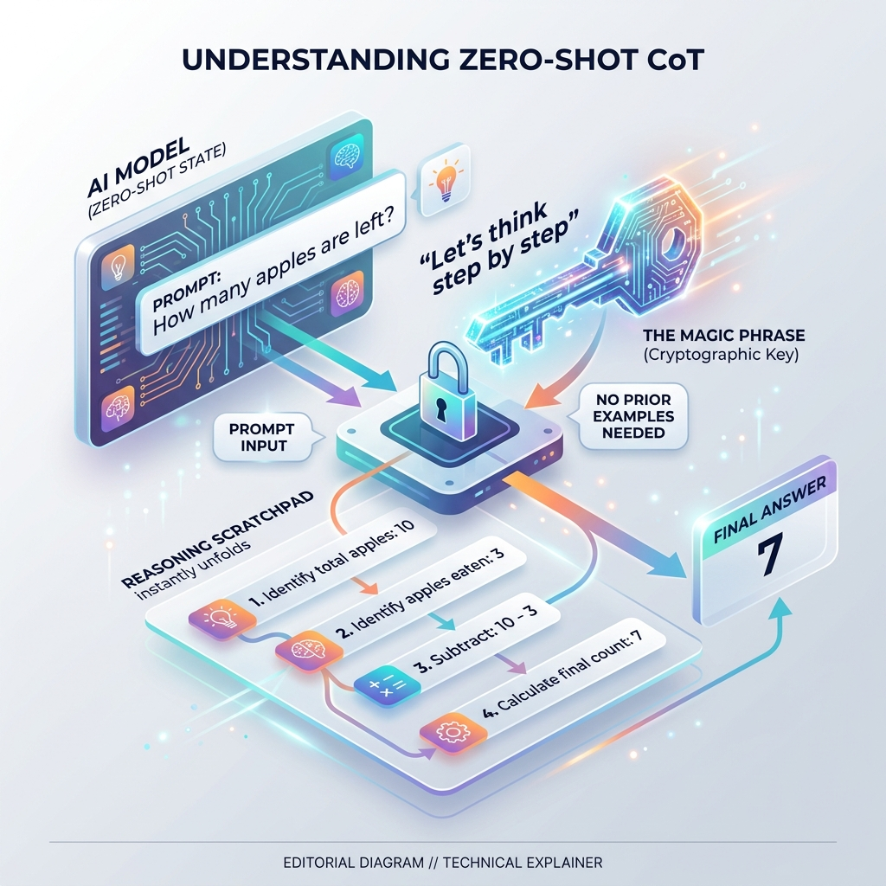

<!-- tags: glossary, agentic-ai, prompt-engineering, zero-shot-cot -->
# Zero-Shot CoT

> Appending a specific phrase like "Let's think step by step" to a prompt, triggering the model to generate a chain of thought without needing any prior examples.

| Aspect | Detail |
| --- | --- |
| **Domain** | Prompt Engineering |
| **Used by** | AI engineer, casual user |
| **Related** | Chain of Thought, Zero-Shot Prompting |

📅 Created: 2026-04-28 · 🔄 Updated: 2026-05-06 · ⏱️ 5 min read

---

## 1. DEFINE

**Zero-Shot CoT (Chain of Thought)** is a fascinating prompt engineering discovery. Researchers found that simply adding the exact phrase *"Let's think step by step"* to the end of a [Zero-Shot Prompt](./16-zero-shot-prompting.md) acts as a cryptographic key that unlocks the model's latent reasoning capabilities.

Because LLMs are trained on vast amounts of internet data, they have seen millions of step-by-step explanations. Appending this phrase forces the model to begin generating an explanation rather than an immediate answer. As it generates this explanation, it builds a scratchpad in its context window, naturally leading it to a highly accurate conclusion—all without the developer needing to provide complex [Few-Shot](./17-few-shot-prompting.md) examples.

---

## 2. CONTEXT

**Who uses it**: Developers looking for a cheap, immediate increase in model logic performance without building complex prompt templates.

**When**: When asking logic, math, or multi-stage questions.

**In this ecosystem**:
- It is the intersection of [Zero-Shot Prompting](./16-zero-shot-prompting.md) and [Chain of Thought](./19-chain-of-thought.md).

---

## 3. EXAMPLES

### Example 1: The Magic Phrase
**Prompt**: "A juggler has 16 balls. Half of them are golf balls. Half of the golf balls are blue. How many blue golf balls are there? *Let's think step by step.*"

The model is forced to start its response with reasoning:
*Output*: "1. Total balls = 16. 2. Half are golf balls, so 16 / 2 = 8 golf balls. 3. Half of those are blue, so 8 / 2 = 4 blue golf balls. The answer is 4."

---

## 4. COMPARE

| | Zero-Shot CoT | Few-Shot CoT | Standard Zero-Shot |
|--|---|---|---|
| **Examples Given** | None | 2+ step-by-step examples | None |
| **Trigger Mechanism**| "Let's think step by step" | Pattern matching the examples | Just asking the question |
| **Setup Effort** | Extremely Low | High | Extremely Low |

---

## 5. REF

| Resource | Type | Link | Note |
| --- | --- | --- | --- |
| Kojima et al. (2022) | Research | https://arxiv.org/abs/2205.11916 | The seminal paper that discovered the "Let's think step by step" phenomenon |

---

## 6. RECOMMEND

| Explore next | When | Why | File/Link |
| --- | --- | --- | --- |
| Chain of Thought | You want the foundational theory | Zero-Shot CoT is just a hack to trigger CoT | [Chain of Thought](./19-chain-of-thought.md) |
| Few-Shot Prompting | Zero-Shot CoT is reasoning in the wrong format | Use examples to control the reasoning structure | [Few-Shot Prompting](./17-few-shot-prompting.md) |

**Links**: [← Previous](./19-chain-of-thought.md) · [→ Next](./21-tree-of-thought.md)
