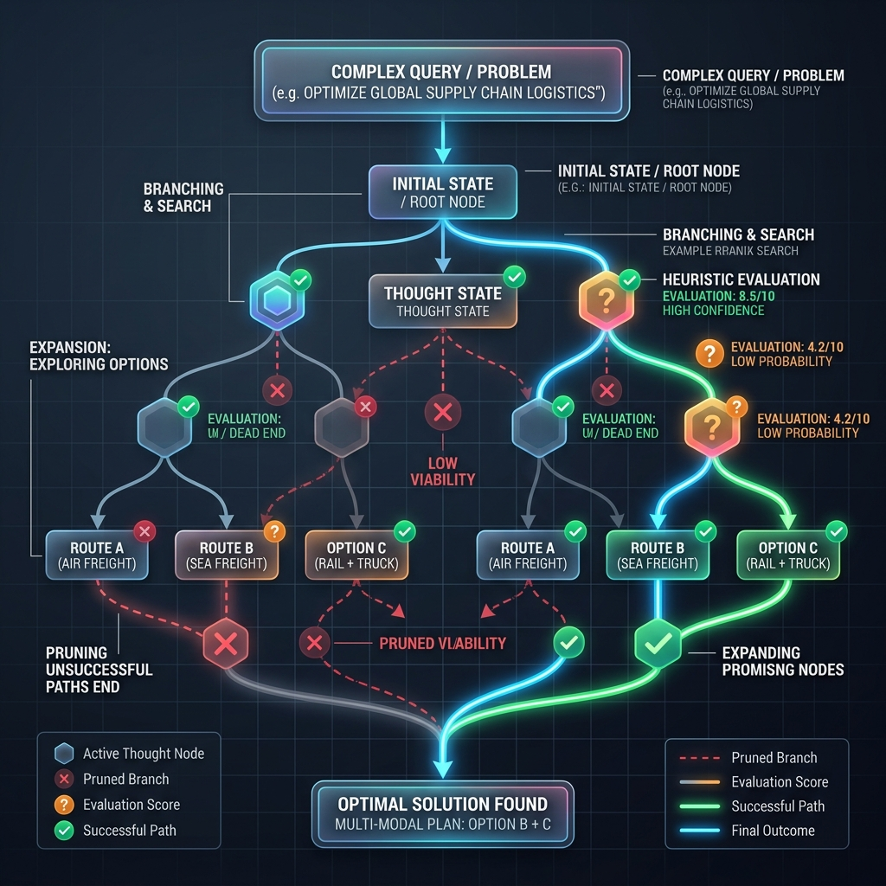

<!-- tags: glossary, agentic-ai, prompt-engineering, tree-of-thought -->
# Tree of Thought (ToT)

> An advanced prompting and orchestration framework where the LLM generates multiple possible reasoning paths, evaluates them, and branches out to explore the best options, similar to how humans brainstorm.

| Aspect | Detail |
| --- | --- |
| **Domain** | Prompt Engineering |
| **Used by** | AI researcher, advanced AI engineer |
| **Related** | Chain of Thought, Self-Consistency, Multi-Agent System |

📅 Created: 2026-04-28 · 🔄 Updated: 2026-05-06 · ⏱️ 5 min read

---

## 1. DEFINE

[Chain of Thought](./19-chain-of-thought.md) is linear; if the model makes a mistake on step 2, the entire rest of the chain is flawed. 

**Tree of Thought (ToT)** solves this by treating reasoning as a search problem. The LLM generates multiple possible "next steps" (branches). An evaluator prompt then scores these branches. The orchestrator prunes the bad ideas and expands on the good ones, building a tree of logic. If a path leads to a dead end, the system backtracks and explores a different branch.

This is fundamentally an orchestration pattern wrapped around prompting, requiring multiple API calls to manage the search tree.

---

## 2. CONTEXT

**Who uses it**: Researchers solving complex puzzles (like crosswords, 24-game) or engineers building high-stakes planning agents.

**When**: When linear reasoning is insufficient and the problem requires exploration, lookahead, and backtracking.

**In this ecosystem**:
- It is an evolution of [Chain of Thought](./19-chain-of-thought.md).
- It is closely related to [Task Decomposition](../agentic-core/40-task-decomposition.md).

---

## 3. EXAMPLES

### Example 1: Creative Writing
Task: Write a 4-paragraph short story ending with a specific sentence.
1. **Generate**: The system asks the LLM to outline 3 different plot directions (Nodes 1, 2, 3).
2. **Evaluate**: The system asks the LLM to score how well each plot can end with the required sentence. Node 2 scores highest.
3. **Expand**: The system asks the LLM to write 3 different paragraph 1s based on Node 2.
4. **Repeat**: It searches the tree until a perfect 4-paragraph story is constructed.

---

## 4. COMPARE

| | Tree of Thought (ToT) | Chain of Thought (CoT) | Self-Consistency |
|--|---|---|---|
| **Structure** | Branching tree with backtracking | Single linear path | Multiple parallel linear paths |
| **Execution** | Multiple dependent API calls | Single API call | Multiple independent API calls |
| **Best For** | Complex planning, puzzles, search | Standard logic, math | Reliable consensus |

---

## 5. REF

| Resource | Type | Link | Note |
| --- | --- | --- | --- |
| Yao et al. (2023) | Research | https://arxiv.org/abs/2305.10601 | "Tree of Thoughts: Deliberate Problem Solving with Large Language Models" |

---

## 6. RECOMMEND

| Explore next | When | Why | File/Link |
| --- | --- | --- | --- |
| Chain of Thought | You want the foundational concept | ToT is built upon multiple CoTs | [Chain of Thought](./19-chain-of-thought.md) |
| Self-Consistency | You want reliability without complex trees | It's a simpler alternative to ToT | [Self-Consistency](./22-self-consistency.md) |
| AI Orchestrator | You want to implement ToT | Managing the tree requires an orchestrator | [AI Orchestrator](../workflow-orchestration/63-ai-orchestrator.md) |

**Links**: [← Previous](./20-zero-shot-cot.md) · [→ Next](./22-self-consistency.md)
