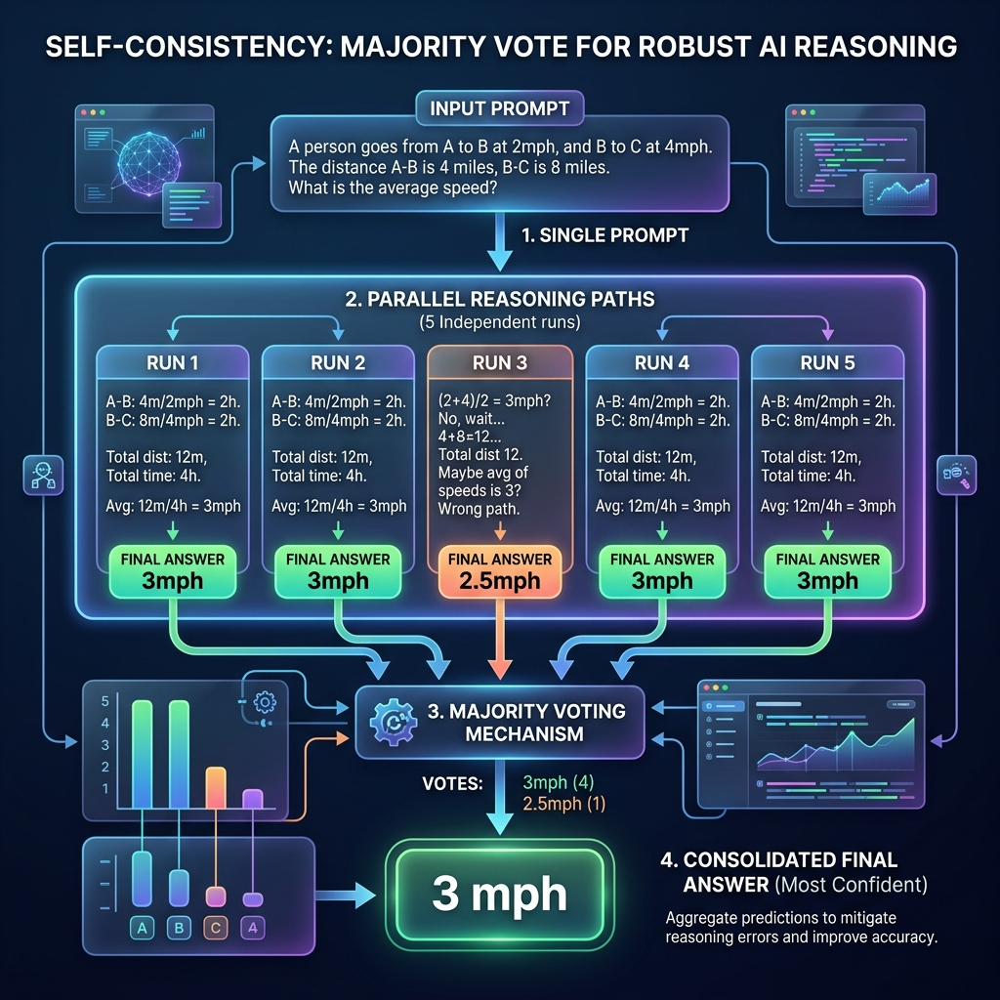

<!-- tags: glossary, agentic-ai, prompt-engineering, self-consistency -->
# Self-Consistency

> An evaluation and decoding technique where the LLM is asked to generate multiple independent reasoning paths for the same problem, and the final answer is chosen by majority vote.

| Aspect | Detail |
| --- | --- |
| **Domain** | Prompt Engineering |
| **Used by** | AI engineer, QA engineer |
| **Related** | Chain of Thought, Tree of Thought, Parallel Execution |

📅 Created: 2026-04-28 · 🔄 Updated: 2026-05-06 · ⏱️ 5 min read

---

## 1. DEFINE

Even with [Chain of Thought](./19-chain-of-thought.md), an LLM can occasionally hallucinate a bad intermediate step and arrive at the wrong answer. 

**Self-Consistency** mitigates this by running the exact same prompt multiple times in parallel (e.g., 5 times) using a non-zero temperature. This produces 5 different reasoning paths. The system then extracts the final answer from each path and takes a majority vote. If 4 paths say the answer is "42" and 1 path says "40", the system confidently returns "42".

---

## 2. CONTEXT

**Who uses it**: Engineers building deterministic, high-stakes AI systems (like financial data extraction or math solvers) where accuracy is paramount.

**When**: Used when the cost of a wrong answer is higher than the financial cost and latency of running 5 API calls instead of 1.

**In this ecosystem**:
- It utilizes [Parallel Execution](../workflow-orchestration/68-parallel-execution.md) at the orchestrator level.
- It relies entirely on [Chain of Thought](./19-chain-of-thought.md) to generate diverse paths.

---

## 3. EXAMPLES

### Example 1: The Math Solver
An agent is tasked with calculating the projected revenue from a messy financial document.
The orchestrator fires off 5 parallel LLM calls.
- Path 1: Reasons through the data... gets `$45,000`.
- Path 2: Reasons differently... gets `$45,000`.
- Path 3: Hallucinates a tax rate... gets `$41,000`.
- Path 4: Reasons through the data... gets `$45,000`.
- Path 5: Reasons through the data... gets `$45,000`.

The Self-Consistency orchestrator sees a 4-to-1 vote for `$45,000` and returns that to the user, masking the hallucination in Path 3.

---

## 4. COMPARE

| | Self-Consistency | Tree of Thought (ToT) | Chain of Thought (CoT) |
|--|---|---|---|
| **Method** | Multiple parallel paths -> Majority vote | Branching paths -> Evaluation -> Expand | Single linear path |
| **Dependency** | Independent calls | Dependent calls (Search tree) | Single call |
| **Compute Cost** | High (n calls) | Very High | Low |

---

## 5. REF

| Resource | Type | Link | Note |
| --- | --- | --- | --- |
| Wang et al. (2022) | Research | https://arxiv.org/abs/2203.11171 | "Self-Consistency Improves Chain of Thought Reasoning in Language Models" |

---

## 6. RECOMMEND

| Explore next | When | Why | File/Link |
| --- | --- | --- | --- |
| Chain of Thought | You are generating the paths | SC relies on CoT to create diverse reasoning | [Chain of Thought](./19-chain-of-thought.md) |
| Parallel Execution | You are orchestrating SC | SC requires fanning out multiple API calls | [Parallel Execution](../workflow-orchestration/68-parallel-execution.md) |
| Tree of Thought | SC isn't enough to solve the puzzle | ToT provides deeper, guided exploration | [Tree of Thought](./21-tree-of-thought.md) |

**Links**: [← Previous](./21-tree-of-thought.md) · [→ Next](./23-react.md)
