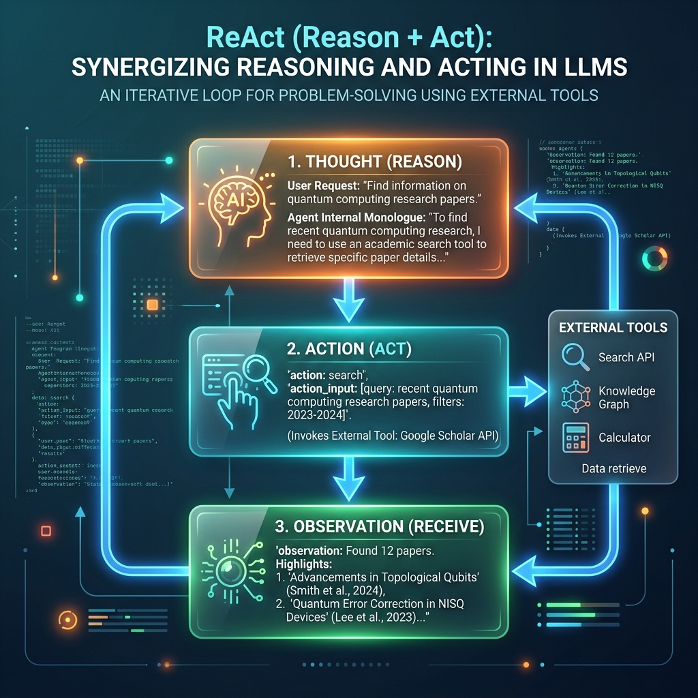

<!-- tags: glossary, agentic-ai, prompt-engineering, react -->
# ReAct (Reason + Act)

> A prompting and execution paradigm where an agent interleaves internal reasoning (Chain of Thought) with concrete external actions (Tool use) to solve complex, interactive tasks.

| Aspect | Detail |
| --- | --- |
| **Domain** | Prompt Engineering |
| **Used by** | AI engineer, framework developer |
| **Related** | ReAct Loop, Chain of Thought, Tool Registry |

📅 Created: 2026-04-28 · 🔄 Updated: 2026-05-06 · ⏱️ 5 min read

---

## 1. DEFINE

In 2022, researchers at Princeton and Google realized that [Chain of Thought](./19-chain-of-thought.md) was powerful, but it trapped the LLM inside its own head. It could reason, but it couldn't look up live data. 

They introduced **ReAct**. ReAct forces the LLM to output a specific syntax, usually:
1. **Thought**: What do I need to do next?
2. **Action**: What tool should I call?
3. **Observation**: What did the tool return? (This is injected by the orchestrator).

By interleaving reasoning with acting, the agent can navigate Wikipedia, query databases, or execute code, adapting its next *Thought* based on the *Observation* of its previous *Action*.

---

## 2. CONTEXT

**Who uses it**: Every engineer building an autonomous agent.

**When**: When a task cannot be solved with the model's internal weights alone and requires calling APIs, reading files, or searching the web.

**In this ecosystem**:
- ReAct is the prompt engineering pattern that powers the [ReAct Loop](../agentic-core/36-react-loop.md) architecture.
- It relies heavily on a [Tool Registry](../tools-capabilities/48-tool-registry.md).

---

## 3. EXAMPLES

### Example 1: The Classic Wikipedia Agent
**Prompt**: "Who is the current mayor of the city where the Eiffel Tower is located?"
**Thought**: I need to find out what city the Eiffel Tower is in.
**Action**: `Search[Eiffel Tower location]`
**(System injects Observation)**: Paris, France.
**Thought**: Now I need to find the current mayor of Paris.
**Action**: `Search[Current Mayor of Paris]`
**(System injects Observation)**: Anne Hidalgo.
**Thought**: I have the answer.
**Action**: `Finish[Anne Hidalgo]`

---

## 4. COMPARE

| | ReAct (Reason + Act) | Chain of Thought (CoT) | Act-Only (Tool Use) |
|--|---|---|---|
| **Paradigm** | Think -> Act -> Observe | Think -> Answer | Act -> Answer |
| **External I/O** | Yes (Calls tools) | No (Pure text generation) | Yes |
| **Handling Errors**| High (Can observe failure and try again) | Low (Blind guessing) | Low |

---

## 5. REF

| Resource | Type | Link | Note |
| --- | --- | --- | --- |
| Yao et al. (2022) | Research | https://arxiv.org/abs/2210.03629 | "ReAct: Synergizing Reasoning and Acting in Language Models" |

---

## 6. RECOMMEND

| Explore next | When | Why | File/Link |
| --- | --- | --- | --- |
| ReAct Loop | You want to code it | ReAct is the prompt; the ReAct Loop is the code | [ReAct Loop](../agentic-core/36-react-loop.md) |
| Chain of Thought | You want the foundation | ReAct is an extension of CoT | [Chain of Thought](./19-chain-of-thought.md) |
| Tool Registry | You need the agent to Act | The Action phase requires defined tools | [Tool Registry](../tools-capabilities/48-tool-registry.md) |

**Links**: [← Previous](./22-self-consistency.md) · [→ Next](./24-prompt-injection.md)
