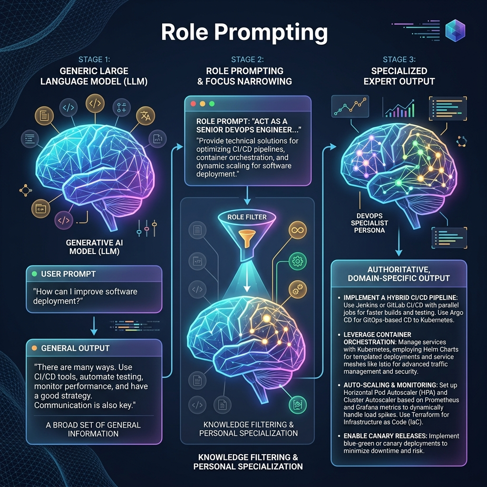

<!-- tags: glossary, agentic-ai, prompt-engineering, role-prompting -->
# Role Prompting

> A technique where the system prompt instructs the LLM to adopt a specific persona, profession, or identity to dramatically improve the tone, specificity, and accuracy of its responses.

| Aspect | Detail |
| --- | --- |
| **Domain** | Prompt Engineering |
| **Used by** | Prompt engineer, AI engineer |
| **Related** | System Prompt, Prompt Template |

📅 Created: 2026-04-28 · 🔄 Updated: 2026-05-06 · ⏱️ 5 min read

---

## 1. DEFINE

Because LLMs are trained on vast amounts of internet text, they possess knowledge spanning from layman's blog posts to PhD-level research papers. If you ask a generic question, the LLM will provide a generic, average answer based on the statistical mean of its training data.

**Role Prompting** (e.g., "Act as a...") narrows the probability distribution. By explicitly telling the model to adopt the persona of a "Principal DevOps Engineer at Google," the model's attention mechanism zeroes in on the subset of its training data that sounds like elite engineering. The resulting output is not only more authoritative in tone, but statistically more accurate and domain-specific.

---

## 2. CONTEXT

**Who uses it**: AI engineers defining the behavior of specialized agents.

**When**: Used as the very first sentence in almost every production [System Prompt](./14-system-prompt.md).

**In this ecosystem**:
- It is the defining feature of specialized [Skills](../skills-plugins/103-skill.md) in a multi-agent system.
- It transforms a generic Foundation Model into a distinct agent.

---

## 3. EXAMPLES

### Example 1: The Generic vs Role Output
**Generic**: "Review this code for a database connection."
*Output*: "The code looks okay, but make sure your password is safe."

**Role Prompt**: "You are a Senior PostgreSQL Database Administrator with 20 years of experience focusing on high-availability and security. Review this code."
*Output*: "The connection string is vulnerable to injection. Furthermore, you are not utilizing connection pooling, which will lead to socket exhaustion under high load. Implement PgBouncer immediately. Here is the refactored implementation..."

---

## 4. COMPARE

| | Role Prompting | Fine-Tuning | Jailbreak |
|--|---|---|---|
| **Mechanism** | Text instructions in the prompt | Altering neural network weights | Malicious text instructions |
| **Goal** | Adopt a helpful persona | Permanently learn new skills | Adopt a harmful/unrestricted persona |
| **Cost** | Negligible | High | N/A |

---

## 5. REF

| Resource | Type | Link | Note |
| --- | --- | --- | --- |
| OpenAI Best Practices | Guide | https://platform.openai.com/docs/guides/prompt-engineering | Explicitly recommends role prompting for better results |

---

## 6. RECOMMEND

| Explore next | When | Why | File/Link |
| --- | --- | --- | --- |
| System Prompt | You are implementing roles | Roles are defined inside the system prompt | [System Prompt](./14-system-prompt.md) |
| Prompt Template | You have dynamic roles | Templates allow you to inject different roles | [Prompt Template](./28-prompt-template.md) |
| Skill | You are building multi-agent systems | Each agent's skill is usually defined by a role prompt | [Skill](../skills-plugins/103-skill.md) |

**Links**: [← Previous](./25-jailbreak.md) · [→ Next](./27-instruction-tuning.md)
