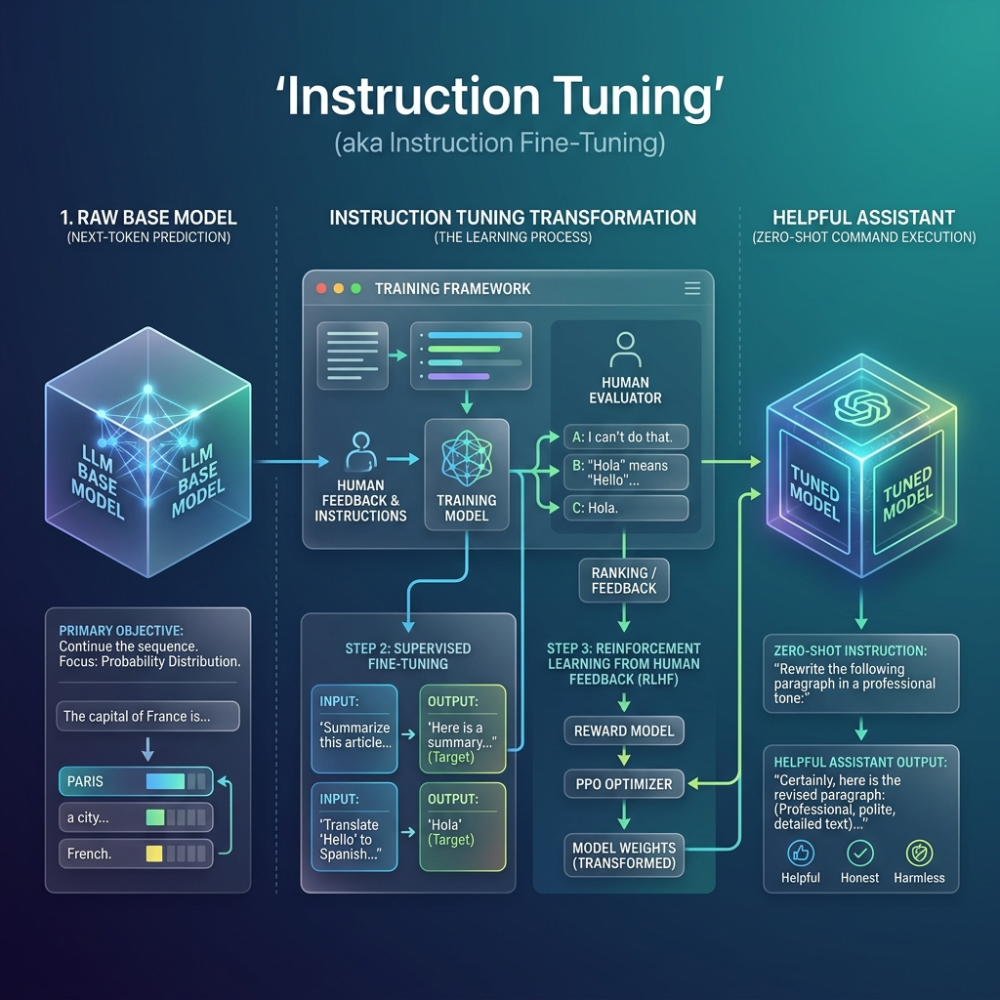

<!-- tags: glossary, agentic-ai, prompt-engineering, instruction-tuning -->
# Instruction Tuning

> The post-training process that transforms a raw base model (which just predicts the next word) into a helpful assistant that can understand and follow zero-shot natural language commands.

| Aspect | Detail |
| --- | --- |
| **Domain** | Prompt Engineering |
| **Used by** | ML researcher, model trainer |
| **Related** | RLHF, Fine-Tuning, Zero-Shot Prompting |

📅 Created: 2026-04-28 · 🔄 Updated: 2026-05-06 · ⏱️ 5 min read

---

## 1. DEFINE

A raw Foundation Model (a "Base Model") is trained purely on next-token prediction. If you prompt a Base Model with *"Write a poem about a dog"*, it might respond with *"Write a poem about a cat. Write a poem about a bird,"* because it thinks you are just making a list of writing prompts. It doesn't know it is supposed to *answer* you.

**Instruction Tuning** (often paired with [RLHF](../core-llm-concepts/12-rlhf.md)) is the fine-tuning phase where the model is fed thousands of `(Instruction, Desired Output)` pairs. This teaches the model the concept of "being an assistant." It learns to stop predicting what text comes next on a web page, and start predicting the helpful answer to the user's command. 

This process is the exact reason why [Zero-Shot Prompting](./16-zero-shot-prompting.md) works today.

---

## 2. CONTEXT

**Who uses it**: Machine Learning scientists at AI labs (OpenAI, Anthropic, Meta) creating the models.

**When**: Occurs after the massive unsupervised pre-training phase, before the model is released to the public.

**In this ecosystem**:
- It bridges the gap between [Foundation Models](../core-llm-concepts/02-foundation-model.md) and [Zero-Shot Prompting](./16-zero-shot-prompting.md).
- It heavily incorporates [RLHF](../core-llm-concepts/12-rlhf.md).

---

## 3. EXAMPLES

### Example 1: The Base vs Instruct Model
**Prompt**: "Translate the word 'Apple' to French:"

**Base Model Output**: "Translate the word 'Banana' to Spanish: Traduce la palabra..." (It continues the pattern).
**Instruction-Tuned Output**: "Pomme." (It recognizes a command and executes it).

Whenever you see a model named `Llama-3-8B-Instruct`, it means it has undergone this specific tuning phase.

---

## 4. COMPARE

| | Instruction Tuning | Pre-Training | Prompt Engineering |
|--|---|---|---|
| **Phase** | Post-training | Initial training | Application layer |
| **Goal** | Teach it to obey commands | Teach it language and facts | Elicit specific behavior |
| **Cost** | Medium | Astronomical | Very Low |

---

## 5. REF

| Resource | Type | Link | Note |
| --- | --- | --- | --- |
| Ouyang et al. (InstructGPT) | Research | https://arxiv.org/abs/2203.02155 | "Training language models to follow instructions with human feedback" |

---

## 6. RECOMMEND

| Explore next | When | Why | File/Link |
| --- | --- | --- | --- |
| RLHF | You want to know how it's tuned | RLHF is the primary mechanism for instruction tuning | [RLHF](../core-llm-concepts/12-rlhf.md) |
| Fine-Tuning | You want to tune it yourself | Instruction tuning is a specific type of fine-tuning | [Fine-Tuning](../core-llm-concepts/11-fine-tuning.md) |
| Zero-Shot Prompting | You are using the tuned model | Instruction tuning enables zero-shot capabilities | [Zero-Shot Prompting](./16-zero-shot-prompting.md) |

**Links**: [← Previous](./26-role-prompting.md) · [→ Next](./28-prompt-template.md)
