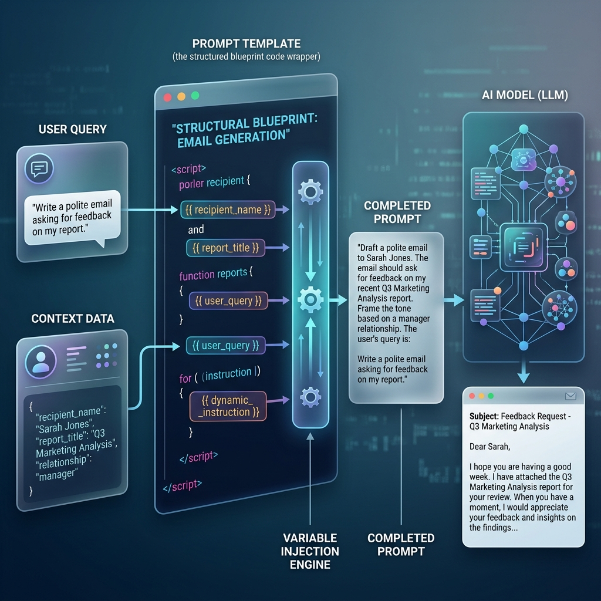

<!-- tags: glossary, agentic-ai, prompt-engineering, prompt-template -->
# Prompt Template

> A pre-defined structural blueprint that allows dynamic data, user inputs, and retrieved context to be injected into a static prompt wrapper at runtime.

| Aspect | Detail |
| --- | --- |
| **Domain** | Prompt Engineering |
| **Used by** | Backend developer, AI engineer |
| **Related** | System Prompt, User Prompt, Scaffolding |

📅 Created: 2026-04-28 · 🔄 Updated: 2026-05-06 · ⏱️ 5 min read

---

## 1. DEFINE

In production software, developers rarely send raw user text directly to an LLM. Instead, they use a **Prompt Template**. 

A template is a string containing placeholders (variables) formatted using templating languages like Jinja, f-strings, or standard bracket notation. At runtime, the application's [Scaffolding](../scaffolding-harness/57-scaffolding.md) resolves these variables—injecting the user's query, data from a database, or relevant documents from a vector search—before sending the fully constructed string to the LLM.

---

## 2. CONTEXT

**Who uses it**: Backend developers integrating AI into applications.

**When**: The standard method for building any GenAI application or API endpoint.

**In this ecosystem**:
- It is the core mechanism of [Scaffolding](../scaffolding-harness/57-scaffolding.md).
- It safely wraps the [User Prompt](./15-user-prompt.md) in instructions.

---

## 3. EXAMPLES



### Example 1: The RAG Template
A classic Retrieval-Augmented Generation template:
```text
You are a helpful assistant. Answer the user's question using ONLY the provided context. If the context does not contain the answer, say "I don't know."

Context:
{retrieved_documents}

User Question: {user_query}
```
At runtime, the variables `{retrieved_documents}` and `{user_query}` are replaced with dynamic text, creating the final prompt.

---

## 4. COMPARE

| | Prompt Template | System Prompt | User Prompt |
|--|---|---|---|
| **Nature** | The code blueprint | The static AI rules | The dynamic user input |
| **Location** | In the application codebase | Inside the template | Injected into the template |
| **Analogy** | The HTML file | The CSS styling | The user's form submission |

---

## 5. REF

| Resource | Type | Link | Note |
| --- | --- | --- | --- |
| LangChain Templates | Docs | https://python.langchain.com/docs/modules/model_io/prompts/ | LangChain provides extensive tooling for creating and managing prompt templates |

---

## 6. RECOMMEND

| Explore next | When | Why | File/Link |
| --- | --- | --- | --- |
| Scaffolding | You are managing templates | Scaffolding code processes the templates | [Scaffolding](../scaffolding-harness/57-scaffolding.md) |
| Prompt Chaining | You have complex logic | Templates are passed sequentially in a chain | [Prompt Chaining](./29-prompt-chaining.md) |

**Links**: [← Previous](./27-instruction-tuning.md) · [→ Next](./29-prompt-chaining.md)
