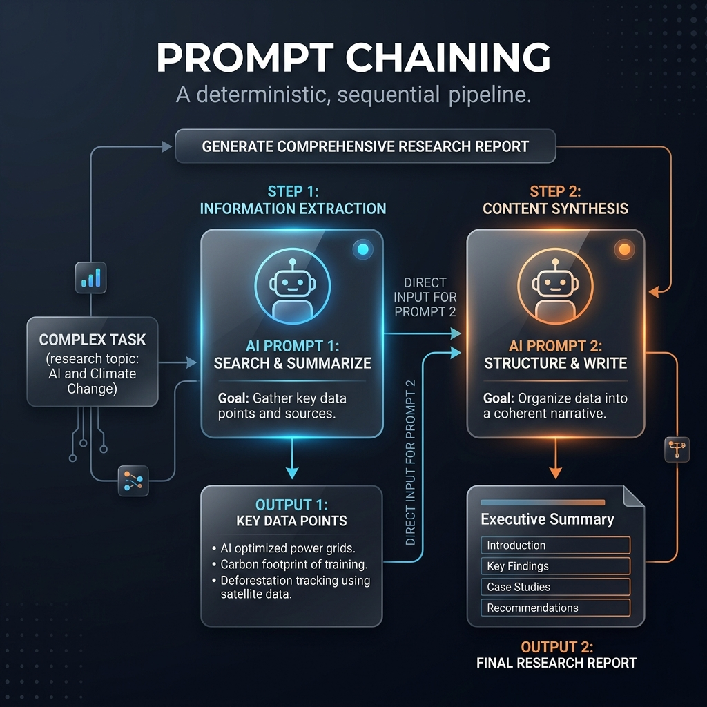

<!-- tags: glossary, agentic-ai, prompt-engineering, prompt-chaining -->
# Prompt Chaining

> An architectural pattern where a complex task is broken down into a sequence of smaller LLM calls, where the output of one prompt becomes the input for the next.

| Aspect | Detail |
| --- | --- |
| **Domain** | Prompt Engineering |
| **Used by** | AI engineer, backend developer |
| **Related** | Pipeline, ReAct, Prompt Template |

📅 Created: 2026-04-28 · 🔄 Updated: 2026-05-06 · ⏱️ 5 min read

---

## 1. DEFINE

If you ask an LLM to "Read this 50-page document, extract all legal risks, format them into a table, and then write an executive summary," it will likely suffer from "lost in the middle" syndrome, skip steps, or hallucinate.

**Prompt Chaining** solves this by enforcing a deterministic pipeline. The developer breaks the task into distinct steps. Node 1 only extracts the risks. Node 2 takes the output of Node 1 and formats it. Node 3 takes the output of Node 2 and summarizes it. By narrowing the focus of each individual prompt, accuracy and reliability skyrocket.

---

## 2. CONTEXT

**Who uses it**: AI engineers building reliable, production-grade AI pipelines.

**When**: Used when a task is too complex for a single prompt but too linear/deterministic to require an autonomous agent.

**In this ecosystem**:
- It is the underlying logic of a [Pipeline](../workflow-orchestration/66-pipeline.md).
- It is the deterministic alternative to the autonomous [ReAct Loop](../agentic-core/36-react-loop.md).

---

## 3. EXAMPLES

### Example 1: The Content Generator
Instead of generating a blog post in one shot, a prompt chain works like this:
1. **Prompt 1**: "Given this topic {topic}, generate 5 SEO keywords." -> *Output: Keywords*
2. **Prompt 2**: "Given these {Keywords}, generate a 3-point outline." -> *Output: Outline*
3. **Prompt 3**: "Write a blog post following this {Outline}." -> *Final Output*

---

## 4. COMPARE

| | Prompt Chaining | ReAct Loop | Chain of Thought (CoT) |
|--|---|---|---|
| **Structure** | Multiple API calls, hardcoded sequence | Multiple API calls, autonomous sequence | Single API call |
| **Control** | Developer (Code) | Agent (LLM) | Agent (LLM) |
| **Best For** | Multi-step, predictable data transformation | Unpredictable, interactive tasks | Improving logic in a single turn |

---

## 5. REF

| Resource | Type | Link | Note |
| --- | --- | --- | --- |
| Anthropic Chaining Guide | Docs | https://docs.anthropic.com/ | Recommends chaining for complex Claude workflows |

---

## 6. RECOMMEND

| Explore next | When | Why | File/Link |
| --- | --- | --- | --- |
| Pipeline | You are orchestrating chains | A pipeline is the formal workflow for chaining | [Pipeline](../workflow-orchestration/66-pipeline.md) |
| ReAct | The task isn't perfectly linear | ReAct allows dynamic branching instead of strict chains | [ReAct](./23-react.md) |

**Links**: [← Previous](./28-prompt-template.md) · [→ Next](./30-meta-prompt.md)
