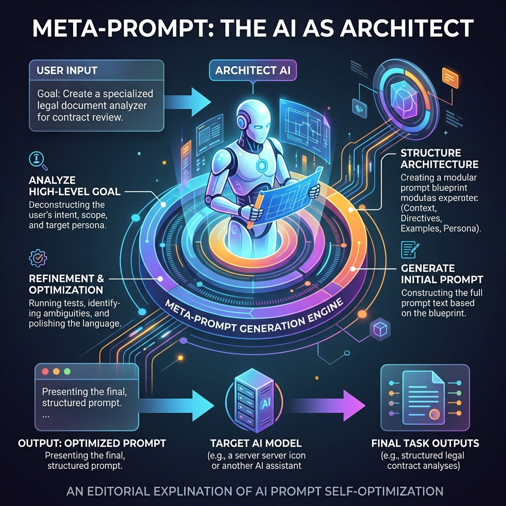

<!-- tags: glossary, agentic-ai, prompt-engineering, meta-prompt -->
# Meta Prompt

> A prompt designed to generate, evaluate, or optimize other prompts. The AI is instructed to act as a prompt engineer.

| Aspect | Detail |
| --- | --- |
| **Domain** | Prompt Engineering |
| **Used by** | Prompt engineer, AI researcher |
| **Related** | System Prompt, Role Prompting |

📅 Created: 2026-04-28 · 🔄 Updated: 2026-05-06 · ⏱️ 5 min read

---

## 1. DEFINE

A **Meta Prompt** is a higher-order prompt where the LLM is not solving the user's primary problem, but rather generating the instructions needed to solve the problem. 

Because modern LLMs have read every prompt engineering guide on the internet during their training, they are exceptionally good at writing system prompts for other LLMs. By providing a meta prompt, developers can automatically generate highly optimized, context-rich instructions for sub-agents.

---

## 2. CONTEXT

**Who uses it**: Prompt engineers optimizing templates, and advanced orchestration systems generating agents on the fly.

**When**: Used during development to write better instructions, or at runtime to dynamically construct new skills.

**In this ecosystem**:
- It generates [System Prompts](./14-system-prompt.md).
- It often utilizes [Role Prompting](./26-role-prompting.md) ("You are an expert prompt engineer").

---

## 3. EXAMPLES

### Example 1: The Prompt Optimizer
**Meta Prompt**: "You are an expert prompt engineer. I want to build a bot that helps people learn guitar. Write a highly detailed System Prompt for this bot. Include tone guidelines, rules for when to correct the user, and an example of a good interaction."

The LLM will output a massive, highly structured System Prompt that the developer can then paste into their application's code.

---

## 4. COMPARE

| | Meta Prompt | System Prompt | User Prompt |
|--|---|---|---|
| **Objective** | Write instructions for an AI | Act as the instructions for the AI | Provide the task to the AI |
| **Target Audience**| The Developer / Another AI | The AI Agent | The AI Agent |

---

## 5. REF

| Resource | Type | Link | Note |
| --- | --- | --- | --- |
| DSPy | Framework | https://github.com/stanfordnlp/dspy | A framework that heavily utilizes meta-prompting and compiling to optimize LLM programs automatically |

---

## 6. RECOMMEND

| Explore next | When | Why | File/Link |
| --- | --- | --- | --- |
| System Prompt | You generated the prompt | The output of a meta prompt is usually a system prompt | [System Prompt](./14-system-prompt.md) |
| Prompt Template | You are parameterizing the output | The generated prompt often needs variables | [Prompt Template](./28-prompt-template.md) |

**Links**: [← Previous](./29-prompt-chaining.md) · [→ Next](./31-negative-prompting.md)
