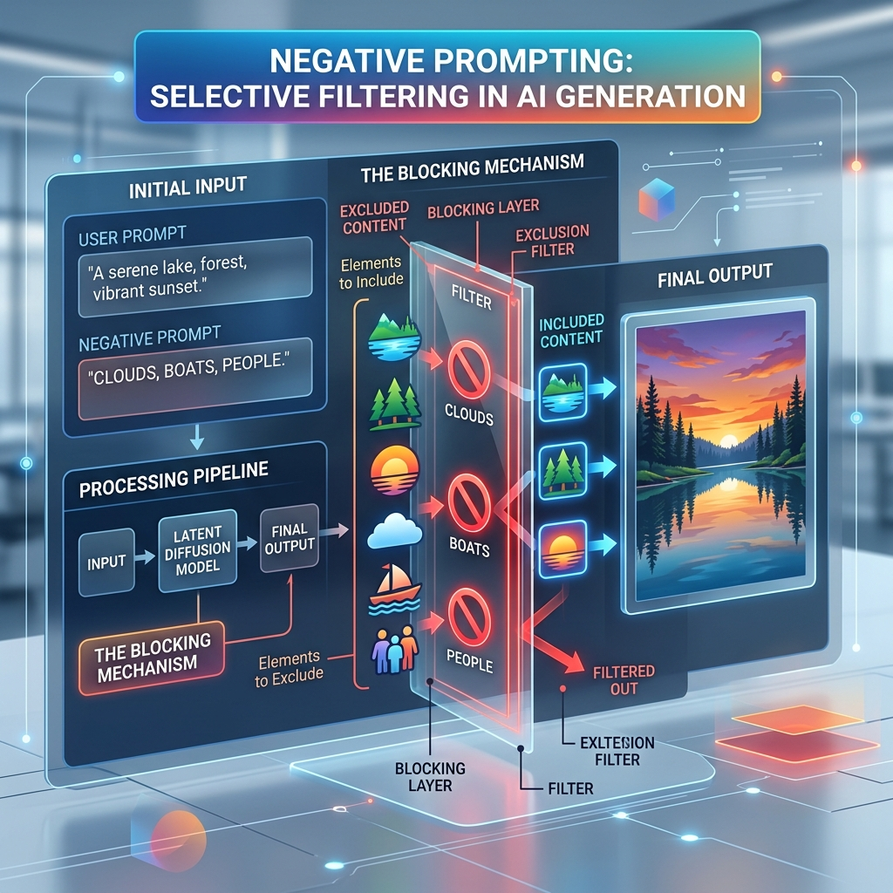

<!-- tags: glossary, agentic-ai, prompt-engineering, negative-prompting -->
# Negative Prompting

> The practice of explicitly telling the LLM what NOT to do, what formats to avoid, or what concepts to ignore in its response.

| Aspect | Detail |
| --- | --- |
| **Domain** | Prompt Engineering |
| **Used by** | Prompt engineer |
| **Related** | Constrained Decoding, System Prompt |

📅 Created: 2026-04-28 · 🔄 Updated: 2026-05-06 · ⏱️ 5 min read

---

## 1. DEFINE

LLMs are highly eager to please and tend to be extremely verbose. If asked for code, they will often output pleasantries ("Sure! Here is the code:"). If asked to classify data, they will explain their classification.

**Negative Prompting** involves adding strict boundaries to the prompt to suppress this behavior. While highly formalized in image generation (where "negative prompts" are a separate input box to avoid rendering certain features), in text-based LLMs it involves explicitly stating prohibitions: "Do not explain", "Never use markdown", "Do not apologize."

*Note: Overusing negative prompts can sometimes confuse earlier models (the "Pink Elephant" paradox), but modern models handle them reasonably well.*

---

## 2. CONTEXT

**Who uses it**: Developers attempting to wrangle clean, parsable data from verbose chat models.

**When**: When an agent consistently includes unwanted conversational filler or hallucinates specific unwanted details.

**In this ecosystem**:
- Commonly placed inside the [System Prompt](./14-system-prompt.md).
- Often a poor-man's substitute for true [Constrained Decoding](./33-constrained-decoding.md).

---

## 3. EXAMPLES

### Example 1: Enforcing JSON
A classic developer prompt:
`Extract the entities from the text into JSON. DO NOT include any conversational filler. DO NOT wrap the output in markdown backticks. Output NOTHING except the valid JSON string.`

---

## 4. COMPARE

| | Negative Prompting | Constrained Decoding | System Guardrails |
|--|---|---|---|
| **Mechanism** | Natural language instructions | Inference engine grammar rules | Post-generation filtering |
| **Reliability** | Moderate (LLM might still ignore it) | 100% Guaranteed | High |
| **Level** | Prompt layer | Infrastructure layer | Application layer |

---

## 5. REF

| Resource | Type | Link | Note |
| --- | --- | --- | --- |
| Anthropic Claude Guidelines | Guide | https://docs.anthropic.com/ | Offers advice on when to use positive vs negative constraints |

---

## 6. RECOMMEND

| Explore next | When | Why | File/Link |
| --- | --- | --- | --- |
| Constrained Decoding | Negative prompting isn't working | Constrained decoding guarantees strict formatting mathematically | [Constrained Decoding](./33-constrained-decoding.md) |
| Structured Output | You are trying to get pure JSON | Better patterns exist for enforcing data formats | [Structured Output](./32-structured-output.md) |

**Links**: [← Previous](./30-meta-prompt.md) · [→ Next](./32-structured-output.md)
