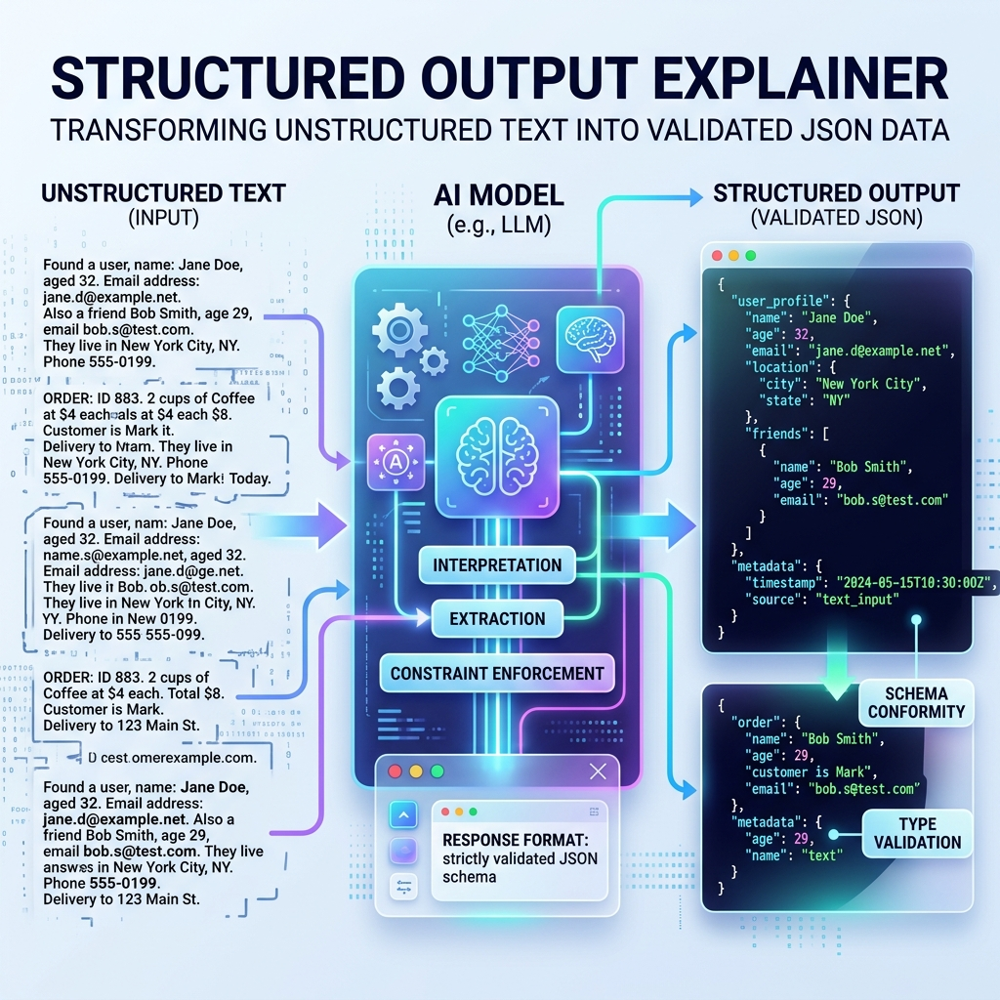

<!-- tags: glossary, agentic-ai, prompt-engineering, structured-output -->
# Structured Output

> The practice of forcing an LLM to return its response in a strictly defined, machine-readable data format (such as JSON, XML, or YAML) rather than natural language prose.

| Aspect | Detail |
| --- | --- |
| **Domain** | Prompt Engineering |
| **Used by** | Backend developer, AI engineer |
| **Related** | Constrained Decoding, Tool Registry, Scaffolding |

📅 Created: 2026-04-28 · 🔄 Updated: 2026-05-06 · ⏱️ 5 min read

---

## 1. DEFINE

APIs communicate in JSON. Humans communicate in prose. For an AI agent to interact with software systems (databases, search engines, webhooks), it must generate **Structured Output**.

Structured Output bridges the gap between natural language processing and traditional deterministic code. By providing a schema (often a JSON Schema or a Pydantic model) and instructing the LLM to populate that schema, developers can safely parse the LLM's response using standard `JSON.parse()` methods and pass the variables into other functions. 

Without structured output, agentic systems cannot use tools.

---

## 2. CONTEXT

**Who uses it**: Backend developers connecting LLMs to actual application logic.

**When**: Absolutely mandatory whenever the LLM's output is being read by a computer program rather than a human.

**In this ecosystem**:
- It is processed by the [Scaffolding](../scaffolding-harness/57-scaffolding.md).
- It is the required payload format for calling tools in the [Tool Registry](../tools-capabilities/48-tool-registry.md).
- It is enforced mathematically by [Constrained Decoding](./33-constrained-decoding.md).

---

## 3. EXAMPLES



### Example 1: Data Extraction
A developer wants to extract data from a resume. Instead of asking "What is the name and email?", they use a Structured Output prompt:
```text
Extract the candidate data. You must return ONLY JSON matching this schema:
{
  "name": "string",
  "email": "string",
  "years_experience": "integer"
}
```
The application code can now safely execute: `data = json.loads(llm_response)`.

---

## 4. COMPARE

| | Structured Output | Prose Output | Constrained Decoding |
|--|---|---|---|
| **Format** | JSON, XML, YAML | Paragraphs, lists, markdown | The engine mechanic |
| **Consumer** | Application Code (Scaffolding) | Human User | N/A (Infrastructure) |
| **Error Rate** | Prone to syntax errors if not constrained | N/A | Guarantees zero syntax errors |

---

## 5. REF

| Resource | Type | Link | Note |
| --- | --- | --- | --- |
| OpenAI JSON Mode | Docs | https://platform.openai.com/docs/guides/text-generation/json-mode | OpenAI's API feature to ensure the model outputs valid JSON strings |

---

## 6. RECOMMEND

| Explore next | When | Why | File/Link |
| --- | --- | --- | --- |
| Constrained Decoding | The LLM misses a comma in the JSON | Constrained decoding fixes syntax errors mathematically | [Constrained Decoding](./33-constrained-decoding.md) |
| Tool Registry | The JSON represents an action | Structured output is how tools are invoked | [Tool Registry](../tools-capabilities/48-tool-registry.md) |
| Scaffolding | You need to parse the JSON | Scaffolding handles the `JSON.parse()` | [Scaffolding](../scaffolding-harness/57-scaffolding.md) |

**Links**: [← Previous](./31-negative-prompting.md) · [→ Next](./33-constrained-decoding.md)
