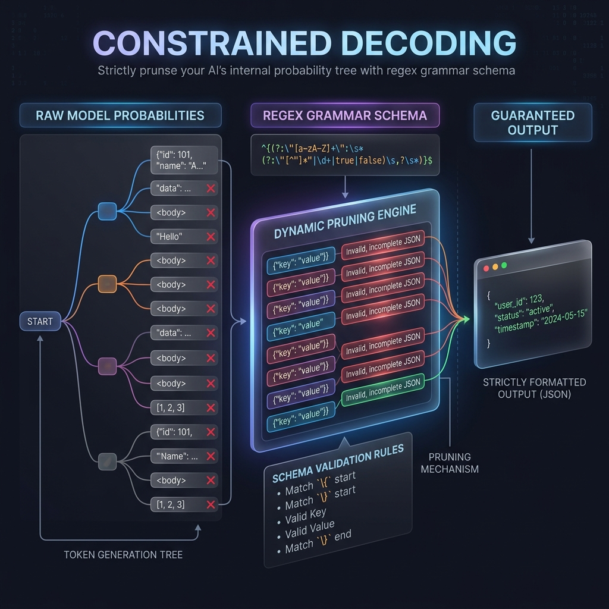

<!-- tags: glossary, agentic-ai, prompt-engineering, constrained-decoding -->
# Constrained Decoding

> A deterministic technique enforced at the model-inference layer that restricts the LLM from selecting any token that would violate a predefined formal grammar or schema.

| Aspect | Detail |
| --- | --- |
| **Domain** | Prompt Engineering |
| **Used by** | Platform engineer, backend developer |
| **Related** | Structured Output, Temperature |

📅 Created: 2026-04-28 · 🔄 Updated: 2026-05-06 · ⏱️ 5 min read

---

## 1. DEFINE

When you ask an LLM for JSON via a prompt (e.g., "Output valid JSON"), you are relying on probability. The model will *probably* output valid JSON, but occasionally it will add a trailing comma or a markdown backtick, crashing your application's parser.

**Constrained Decoding** solves this permanently. It operates beneath the prompt level, directly inside the LLM's inference engine (the decoder). The developer provides a strict grammar (like a JSON Schema or regex). At every single token generation step, the constrained decoder analyzes the probabilities produced by the LLM and mathematically sets the probability of any token that violates the schema to absolute `0`. 

The model is physically blocked from generating a syntax error.

---

## 2. CONTEXT

**Who uses it**: Backend engineers building highly reliable agents that interact with APIs or databases where a single syntax error is catastrophic.

**When**: Mandatory when the output must conform to a strict computer language (SQL, JSON, Python) without relying on fragile string parsing or retry loops.

**In this ecosystem**:
- It is the ultimate evolution of [Structured Output](./32-structured-output.md).
- It reduces the need for a complex [Retry Policy](../workflow-orchestration/70-retry-policy.md) in the agentic loop.

---

## 3. EXAMPLES

### Example 1: Blocking the Trailing Comma
The LLM generates: `{ "name": "John", "age": 30 , `
The LLM wants to predict the next token as `}` (closing bracket).
However, a trailing comma before a closing bracket is invalid JSON. The **Constrained Decoder** intercepts the prediction, forces the probability of `}` to 0%, and forces the LLM to pick the next highest probability token (e.g., `"city"`).

### Example 2: Outlines / Guidance / OpenAI Structured Outputs
Open-source libraries like `Outlines` or `Guidance`, and proprietary features like OpenAI's `response_format: {"type": "json_schema"}`, use constrained decoding under the hood to guarantee 100% schema compliance.

---

## 4. COMPARE

| | Constrained Decoding | Structured Output via Prompting | Negative Prompting |
|--|---|---|---|
| **Mechanism** | Engine-level token masking (Math) | Natural language request | Natural language prohibition |
| **Reliability** | 100% Guaranteed | ~95% (Prone to edge cases) | ~80% |
| **Requirement** | Access to the inference engine / API feature | None | None |

---

## 5. REF

| Resource | Type | Link | Note |
| --- | --- | --- | --- |
| Outlines Library | Code | https://github.com/outlines-dev/outlines | A leading open-source library for neural text generation with structural constraints |

---

## 6. RECOMMEND

| Explore next | When | Why | File/Link |
| --- | --- | --- | --- |
| Structured Output | You want the foundational concept | Constrained decoding guarantees structured output | [Structured Output](./32-structured-output.md) |
| Retry Policy | You aren't using constrained decoding | You will need retry loops to catch formatting errors | [Retry Policy](../workflow-orchestration/70-retry-policy.md) |

**Links**: [← Previous](./32-structured-output.md) · [→ Next](../README.md)
