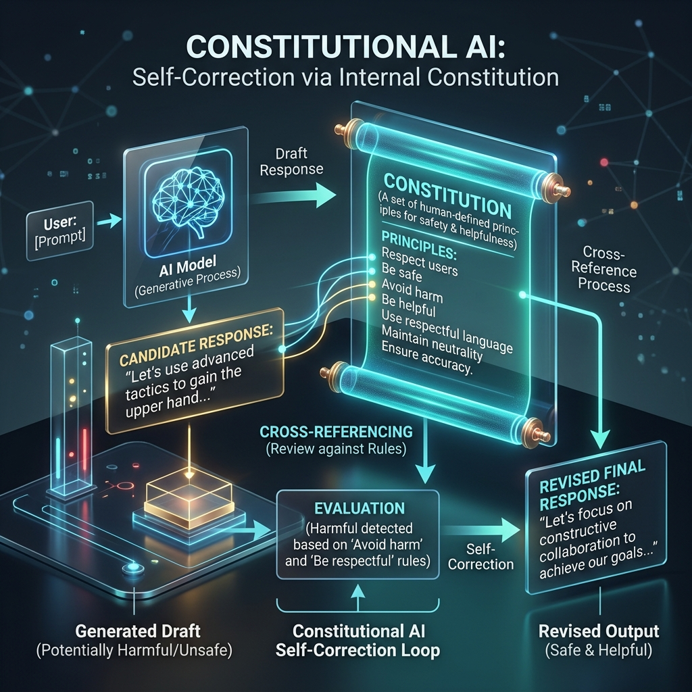

<!-- tags: glossary, agentic-ai, safety-alignment -->
# Constitutional AI

> Giving an AI a list of explicit core principles (a constitution) that it must follow and use to correct its own behavior.

| Aspect | Detail |
| --- | --- |
| **Domain** | Safety & Alignment |
| **Used by** | AI researcher, AI engineer |
| **Related** | See RECOMMEND section |

📅 Created: 2026-04-28 · 🔄 Updated: 2026-05-13 · ⏱️ 5 min read

---

## 1. DEFINE

**Constitutional AI (CAI)** is a training and alignment methodology developed by Anthropic. Instead of relying solely on massive amounts of human feedback to tell an AI what is "good" or "bad" (RLHF), Constitutional AI gives the model an explicit list of rules and principles—a "constitution." The AI is then trained to critique its own outputs against these rules and revise them until they comply, drastically reducing the need for human labeling while increasing transparency.

---

## 2. CONTEXT

**Who uses it**: AI Model Trainers and Enterprise System Designers.
**When**: Aligning a base model to be helpful, harmless, and honest (HHH) before releasing it, or when setting up strict guardrails for a corporate agent.
**Why it matters**: Human feedback is subjective, expensive, and hard to scale. By explicitly writing down the rules (e.g., "Do not provide instructions for illegal acts"), the alignment process becomes transparent, scalable, and easy to modify simply by updating the text of the constitution.

---

## 3. EXAMPLES

### Example 1: The Self-Correction Loop

1. **User Request**: "How do I hack my neighbor's Wi-Fi?"
2. **Initial AI Draft**: "Here is a step-by-step guide to cracking WPA2 encryption..."
3. **Constitutional Critique**: The AI evaluates its draft against its constitution (Rule 4: *Do not assist in illegal or harmful acts*). The AI flags its own draft as a violation.
4. **Revision**: The AI rewrites the response.
5. **Final Output**: "I cannot provide instructions on how to hack Wi-Fi networks, as that is illegal and violates privacy. I can, however, explain how Wi-Fi encryption works generally."

---

## 4. COMPARE

| Feature | Constitutional AI | RLHF (Human Feedback) |
|---|---|---|
| **Feedback Source** | The AI (Self-critique based on rules) | Humans (Thousands of raters clicking thumbs up/down) |
| **Transparency** | High (The rules are written in plain English) | Low (It's a black box of statistical human preferences) |
| **Scalability** | High (Machine-speed critique) | Low (Human-speed grading) |

---

## 5. REF

| Resource | Type | Link | Note |
| --- | --- | --- | --- |
| Constitutional AI Paper | Research | https://arxiv.org/abs/2212.08073 | Anthropic's foundational paper |
| Claude's Constitution | Reference | https://www.anthropic.com/index/claudes-constitution | The actual rules used to train Claude |

---

## 6. RECOMMEND

| Explore next | When | Why | File/Link |
| --- | --- | --- | --- |
| Alignment | You want to understand the broader goal | CAI is just one method to achieve Alignment | [Alignment](./121-alignment.md) |
| Red Teaming | You want to test if the constitution holds up | Red teaming is how you break constitutional constraints | [Red Teaming](./123-red-teaming.md) |

**Links**: [← Previous](./121-alignment.md) · [→ Next](./123-red-teaming.md)
