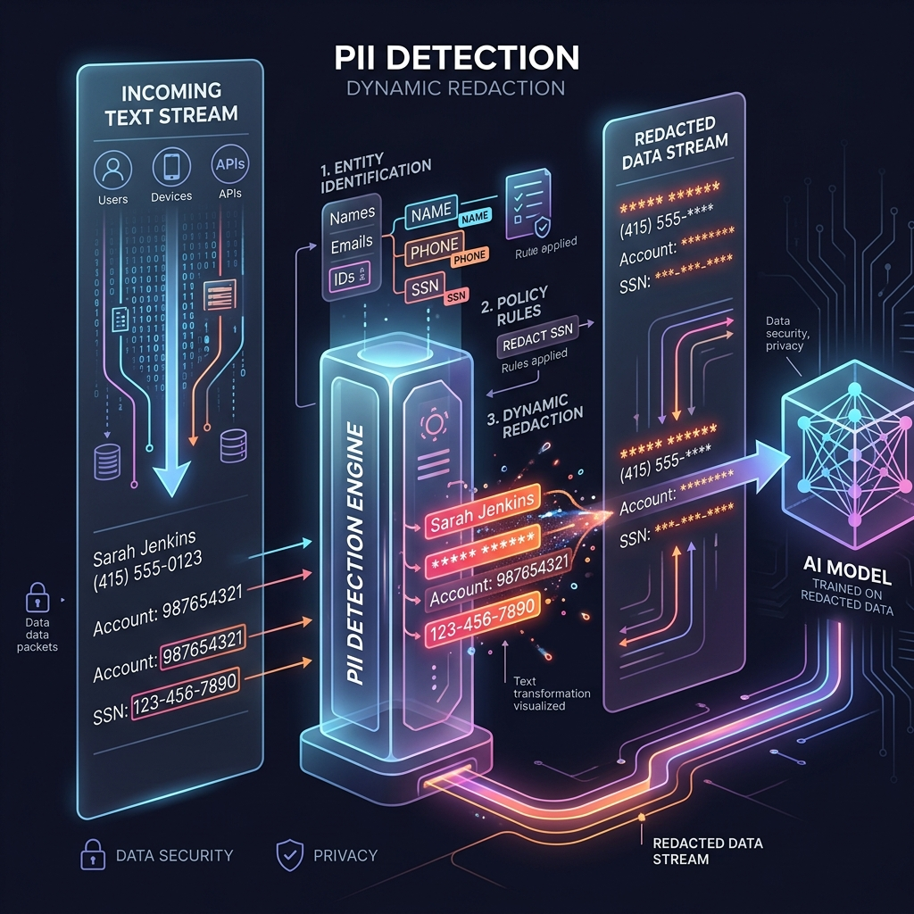

<!-- tags: glossary, agentic-ai, safety-alignment -->
# PII Detection & Redaction

> Automatically finding and hiding sensitive data (like phone numbers or credit cards) before sending it to an AI model.

| Aspect | Detail |
| --- | --- |
| **Domain** | Safety & Alignment |
| **Used by** | Data engineer, security engineer, AI engineer |
| **Related** | See RECOMMEND section |

📅 Created: 2026-04-28 · 🔄 Updated: 2026-05-13 · ⏱️ 5 min read

---

## 1. DEFINE

**PII (Personally Identifiable Information) Detection** is a critical safety mechanism that scans textual or visual payloads for sensitive data—such as social security numbers, credit card details, addresses, and full names. In an AI pipeline, this data must be dynamically detected and either redacted (removed) or tokenized (replaced with a safe reference ID) *before* the data is sent via API to external LLM providers, ensuring compliance with privacy laws like GDPR and HIPAA.

---

## 2. CONTEXT

**Who uses it**: Security Engineers and AI Platform Architects.
**When**: Building systems that process customer data, support tickets, medical records, or HR documents.
**Why it matters**: Sending unredacted PII to third-party APIs (like OpenAI or Anthropic) is a massive security risk and legal violation. Even if using a local model, preventing the model from absorbing PII prevents it from accidentally leaking that data to other users in the future.

---

## 3. EXAMPLES

### Example 1: Dynamic Tokenization

A customer submits a support ticket:
`"Hi, my name is John Doe. My phone number is 555-0199 and my account is #8891."`

1. **PII Detection Layer**: Uses Microsoft Presidio (a PII scanner) to process the text.
2. **Redacted Text**: `"Hi, my name is [NAME_1]. My phone number is [PHONE_1] and my account is [ACCT_1]."`
3. **LLM Processing**: The AI reads the safe text and generates a response: `"I will look into the account for [NAME_1]."`
4. **Re-hydration**: The system swaps the safe tokens back to the real data before showing it to the customer.

---

## 4. COMPARE

| Feature | Regular Expressions (Regex) | NLP PII Scanners (e.g., Presidio) |
|---|---|---|
| **Mechanism** | Matches hardcoded text patterns | Uses ML to understand context |
| **Strengths** | Fast, perfect for Social Security and Credit Cards | Can detect Names and Addresses based on sentence structure |
| **Weaknesses** | Fails on unstructured names or typos | Slower, can have false positives |

---

## 5. REF

| Resource | Type | Link | Note |
| --- | --- | --- | --- |
| Microsoft Presidio | Library | https://microsoft.github.io/presidio/ | The industry standard open-source PII detection library |
| AWS Comprehend Medical | Service | https://aws.amazon.com/comprehend/medical/ | Specialized detection for PHI (Protected Health Info) |

---

## 6. RECOMMEND

| Explore next | When | Why | File/Link |
| --- | --- | --- | --- |
| Safety Layer | You are deciding where to put the PII scanner | PII scanning is implemented inside the Safety Layer | [Safety Layer](./124-safety-layer.md) |
| Audit Log | You need to prove compliance | Audit logs track what data was redacted and when | [Audit Log](./128-audit-log.md) |

**Links**: [← Previous](./124-safety-layer.md) · [→ Next](./126-sandboxing.md)
