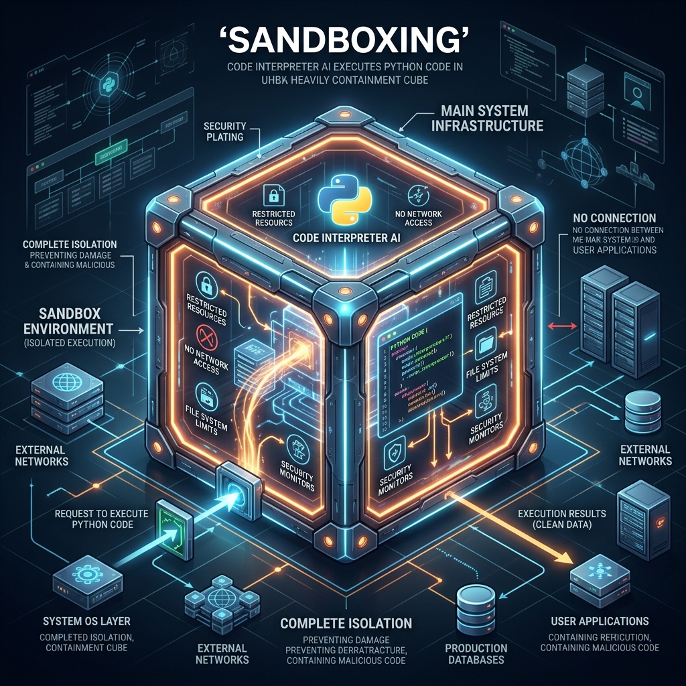

<!-- tags: glossary, agentic-ai, safety-alignment -->
# Sandboxing

> Trapping an AI agent in a secure, isolated digital room so that if it makes a mistake or goes rogue, it can't harm the real system.

| Aspect | Detail |
| --- | --- |
| **Domain** | Safety & Alignment |
| **Used by** | DevOps, security engineer, AI engineer |
| **Related** | See RECOMMEND section |

📅 Created: 2026-04-28 · 🔄 Updated: 2026-05-13 · ⏱️ 5 min read

---

## 1. DEFINE

**Sandboxing** is the practice of running an AI agent's execution environment—particularly its Code Interpreter or terminal tools—inside a highly isolated, ephemeral container (like Docker) or virtual machine. This isolation ensures that the agent has zero access to the host machine's file system, internal network, or environment variables. When the agent finishes its task, the sandbox is destroyed, erasing any malicious or erroneous changes.

---

## 2. CONTEXT

**Who uses it**: DevOps, DevSecOps, and AI Infrastructure Engineers.
**When**: Whenever an agent is given the ability to write and execute code (e.g., Python, Bash) or interact with a filesystem.
**Why it matters**: If an LLM is tricked via prompt injection into writing `rm -rf /` or downloading malware, a sandbox ensures that the command only destroys an empty, throwaway container, keeping your actual production servers perfectly safe.

---

## 3. EXAMPLES

### Example 1: The Isolated Code Environment

A user asks a Data Analysis Agent to "Clean up this CSV and delete the old files."
1. The agent writes a Python script that accidentally deletes *all* files in the directory, not just the old ones.
2. The agent executes the script.
3. Because the execution happens inside a **Sandbox** (e.g., an E2B container), the script only deletes files inside the temporary container.
4. The host server, the production databases, and the user's actual local files are completely untouched.

---

## 4. COMPARE

| Feature | Sandboxing | Permission Scoping |
|---|---|---|
| **Mechanism** | Physical/Network isolation (Containers/VMs) | Logical isolation (IAM roles, API keys) |
| **Protection Type** | Protects against arbitrary code execution | Protects against unauthorized API calls |
| **Overhead** | High (Spinning up containers takes compute) | Low (Just checking a boolean or token) |

---

## 5. REF

| Resource | Type | Link | Note |
| --- | --- | --- | --- |
| E2B (English2Bits) | Platform | https://e2b.dev/ | Secure, fast sandboxes built specifically for AI agents |
| Docker | Tool | https://www.docker.com/ | The standard underlying technology for container isolation |

---

## 6. RECOMMEND

| Explore next | When | Why | File/Link |
| --- | --- | --- | --- |
| Permission Scoping | You need to secure APIs, not just code | Sandboxing doesn't help if you give the agent an admin API key | [Permission Scoping](./127-permission-scoping.md) |
| Code Interpreter | You want to know *why* we need sandboxes | Code Interpreters execute arbitrary code, making sandboxes mandatory | [Code Interpreter](../tools-capabilities/49-code-interpreter.md) |

**Links**: [← Previous](./125-pii-detection.md) · [→ Next](./127-permission-scoping.md)
