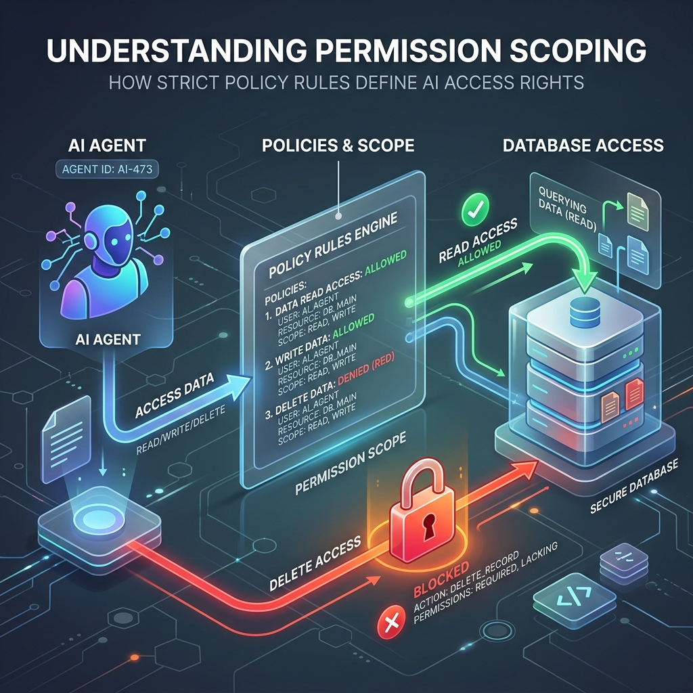

<!-- tags: glossary, agentic-ai, safety-alignment -->
# Permission Scoping

> Giving an AI agent the absolute minimum level of access it needs to do its job, and nothing more.

| Aspect | Detail |
| --- | --- |
| **Domain** | Safety & Alignment |
| **Used by** | Security engineer, backend developer |
| **Related** | See RECOMMEND section |

📅 Created: 2026-04-28 · 🔄 Updated: 2026-05-13 · ⏱️ 5 min read

---

## 1. DEFINE

**Permission Scoping** (based on the Principle of Least Privilege) is the security practice of strictly limiting the access rights, database permissions, and API scopes granted to an AI agent's tools. Instead of giving an agent universal administrative access, the agent is bound to explicit, granular policies (e.g., `read-only`, `insert-only`, or access limited to a specific user's row ID) enforced at the backend architecture level.

---

## 2. CONTEXT

**Who uses it**: Security Engineers and Backend API Developers.
**When**: Designing the Tool Registry and granting tools access to internal databases, external SaaS platforms (like Jira or Slack), or file systems.
**Why it matters**: AI agents are fundamentally unpredictable and susceptible to jailbreaks. If an agent goes rogue, the damage it can cause is entirely dependent on its permissions. An agent with `read-only` access can leak data, but it cannot drop a production database.

---

## 3. EXAMPLES

### Example 1: Database Scoping

A company builds an HR Agent to help employees check their vacation balances.
- **Bad Implementation**: The agent connects to the SQL database using the `sa` (System Admin) root password. A prompt injection attack tricks the agent into dropping the entire `employees` table.
- **Good Implementation (Scoping)**: The agent connects via a specific API that authenticates using the requesting user's JWT token. The database strictly enforces Row-Level Security (RLS). The agent can only ever query `SELECT * FROM vacations WHERE user_id = {current_user}`. Modifications are completely blocked.

---

## 4. COMPARE

| Feature | Permission Scoping | Guardrails (Safety Layer) |
|---|---|---|
| **Focus** | Access Control (What the agent is *allowed* to do) | Content Filtering (What the agent is *saying*) |
| **Enforcement** | Hardcoded in API logic / Database RLS | NLP models / Regex scanning |
| **Bypass Difficulty** | Virtually impossible to bypass if designed well | Can occasionally be bypassed with clever prompts |

---

## 5. REF

| Resource | Type | Link | Note |
| --- | --- | --- | --- |
| Principle of Least Privilege | Concept | https://en.wikipedia.org/wiki/Principle_of_least_privilege | The core security concept |
| OAuth 2.0 Scopes | Standard | https://oauth.net/2/scope/ | The industry standard for limiting API access |

---

## 6. RECOMMEND

| Explore next | When | Why | File/Link |
| --- | --- | --- | --- |
| Sandboxing | You are executing code, not just API calls | Sandboxes isolate the compute environment; Scopes isolate data access | [Sandboxing](./126-sandboxing.md) |
| Audit Log | You want to track what the permissions were used for | Auditing logs every authorized and denied action | [Audit Log](./128-audit-log.md) |

**Links**: [← Previous](./126-sandboxing.md) · [→ Next](./128-audit-log.md)
