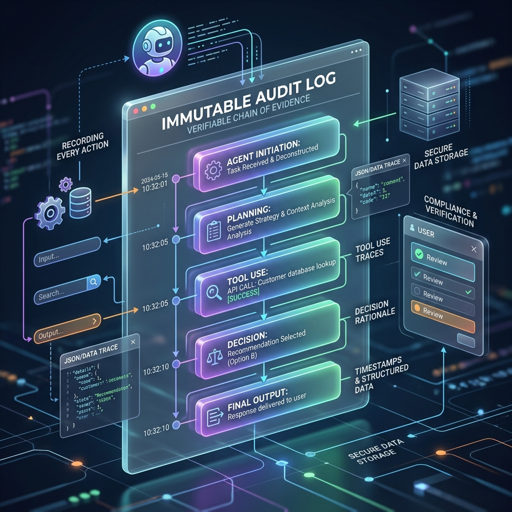

<!-- tags: glossary, agentic-ai, safety-alignment -->
# Audit Log (Agent Tracing)

> A permanent, uneditable receipt of every thought, tool call, and action an AI agent takes, used for debugging and accountability.

| Aspect | Detail |
| --- | --- |
| **Domain** | Safety & Alignment |
| **Used by** | DevOps, security engineer, product manager |
| **Related** | See RECOMMEND section |

📅 Created: 2026-04-28 · 🔄 Updated: 2026-05-13 · ⏱️ 5 min read

---

## 1. DEFINE

An **Audit Log** (or Agent Trace) is a persistent, immutable telemetry record that captures the entire lifecycle of an AI agent's execution. It records the exact user input, the agent's internal reasoning (Chain of Thought), the tools it decided to call, the exact payloads sent to those tools, the latency, and the final output. In highly regulated environments, this ledger is essential for compliance, debugging, and post-mortem analysis of AI failures.

---

## 2. CONTEXT

**Who uses it**: DevOps, AI Engineers, and Security Compliance Officers.
**When**: From day one of development through to production monitoring.
**Why it matters**: Agentic systems are non-deterministic black boxes. If an agent deletes a file or sends a highly offensive email, you must be able to forensically reconstruct exactly *why* it made that decision. Without an audit log, debugging an agentic failure is practically impossible.

---

## 3. EXAMPLES

### Example 1: The Forensic Trace

An automated trading agent accidentally buys $10,000 of the wrong stock. The engineering team pulls the Audit Log:
1. `[10:01:00]` **User Prompt**: "Buy 100 shares of Apple."
2. `[10:01:02]` **LLM Reasoning**: "User wants Apple. Ticker is AAPL. I will call `buy_stock`."
3. `[10:01:03]` **Tool Call**: `buy_stock(ticker="APLE", shares=100)` -> *Error identified! The LLM hallucinated the ticker symbol.*
4. `[10:01:05]` **Tool Response**: `Success: Bought 100 APLE`.

Thanks to the log, the team realizes they need to add a "Ticker Validation" step before execution.

---

## 4. COMPARE

| Feature | Audit Log (Tracing) | Standard Application Logs |
|---|---|---|
| **Content** | Prompts, Token usage, Tool payloads, Chain of Thought | HTTP status codes, stack traces, latency |
| **Structure** | Highly nested (Spans, Sub-spans for sub-agents) | Flat text or simple JSON lines |
| **Primary Use** | Understanding LLM reasoning and behavior | Monitoring server health and uptime |

---

## 5. REF

| Resource | Type | Link | Note |
| --- | --- | --- | --- |
| LangSmith | Tool | https://smith.langchain.com/ | Industry standard for tracing and evaluating LLM apps |
| OpenTelemetry | Standard | https://opentelemetry.io/ | The underlying observability standard being adapted for AI |

---

## 6. RECOMMEND

| Explore next | When | Why | File/Link |
| --- | --- | --- | --- |
| Red Teaming | You want to test your logging | Run a red team attack and see if your audit log catches it | [Red Teaming](./123-red-teaming.md) |
| Supervisor Agent | You are tracing complex systems | Audit logs will show exactly how the Supervisor routed the task | [Supervisor Agent](../multi-agent-systems/87-supervisor-agent.md) |

**Links**: [← Previous](./127-permission-scoping.md) · [→ Next](../README.md)
