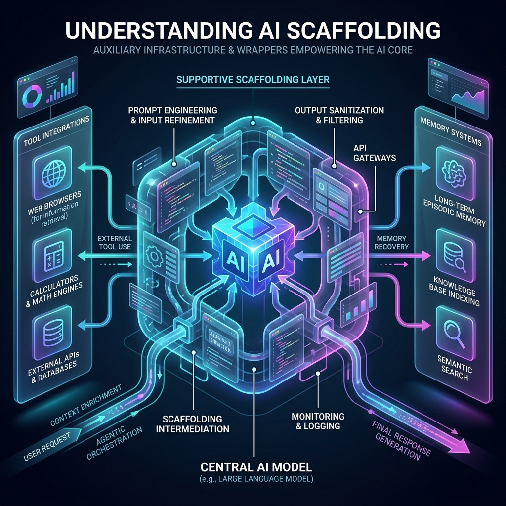

<!-- tags: glossary, agentic-ai, scaffolding-harness, scaffolding -->
# Scaffolding

> The auxiliary code, prompt templates, and infrastructure wrappers that support a foundation model, transforming it from a raw text generator into a functional agent capable of interacting with its environment.

| Aspect | Detail |
| --- | --- |
| **Domain** | Scaffolding & Harness |
| **Used by** | AI engineer, backend developer |
| **Related** | Agent Runtime, Prompt Template, Tool Registry |

📅 Created: 2026-04-28 · 🔄 Updated: 2026-05-06 · ⏱️ 5 min read

---

## 1. DEFINE

A foundation model (like GPT-4) is simply a text-prediction engine. By itself, it cannot browse the web, read a database, or remember a conversation from five minutes ago. 

**Scaffolding** is the "glue code" developers write around the model. It forms a supportive exoskeleton that parses user inputs, injects [System Prompts](../prompt-engineering/14-system-prompt.md), handles API requests to the model, intercepts the model's text output, parses that text for tool calls (e.g., extracting JSON), executes the real-world tool, and feeds the result back into the model. 

Without scaffolding, there is no agent—only a chatbot.

---

## 2. CONTEXT

**Who uses it**: AI engineers turning standard LLMs into autonomous problem-solvers.

**When**: The first step in building any agentic system.

**In this ecosystem**:
- Scaffolding connects the model to the [Tool Registry](../tools-capabilities/48-tool-registry.md).
- It executes within the [Agent Runtime](./59-agent-runtime.md).
- Frameworks like LangChain and LlamaIndex provide pre-built scaffolding.

---

## 3. EXAMPLES

*Figure: AI Scaffolding acts as the supportive exoskeleton around the central glowing LLM, connecting the raw intelligence to memory, tools, and environmental interfaces.*

### Example 1: The ReAct Scaffold
A developer implements the ReAct (Reason + Act) pattern. The LLM outputs: `Action: Search, Query: "Weather"`. The LLM itself didn't search the web. The developer's **Scaffolding** code uses regex to catch the word `Action: Search`, halts the LLM, makes a Google API call in Python, formats the result into text, and pushes it back into the LLM context. 

### Example 2: LangChain Wrappers
When you use `create_react_agent` in LangChain, you are importing thousands of lines of scaffolding designed to handle formatting, error parsing, and memory management automatically so you don't have to write the glue code yourself.

---

## 4. COMPARE

| | Scaffolding | Foundation Model | AI Orchestrator |
|--|---|---|---|
| **Role** | The exoskeleton and glue code | The reasoning engine | The multi-agent traffic controller |
| **Intelligence** | Deterministic (Python/TS code) | Probabilistic | Deterministic |
| **Human Analogy** | The nervous system and muscles | The brain | The manager |

---

## 5. REF

| Resource | Type | Link | Note |
| --- | --- | --- | --- |
| ReAct Paper | Research | https://arxiv.org/abs/2210.03629 | The origin of the most common scaffolding pattern for agents |

---

## 6. RECOMMEND

| Explore next | When | Why | File/Link |
| --- | --- | --- | --- |
| Agent Runtime | You run the scaffolding | The runtime is where the scaffolding executes | [Agent Runtime](./59-agent-runtime.md) |
| Prompt Template | You write the scaffolding | Scaffolding relies heavily on injecting context via templates | [Prompt Template](../prompt-engineering/28-prompt-template.md) |
| Tool Registry | The scaffolding needs tools | Scaffolding connects the LLM to the tools | [Tool Registry](../tools-capabilities/48-tool-registry.md) |

**Links**: [← Previous](./README.md) · [→ Next](./58-harness.md)
