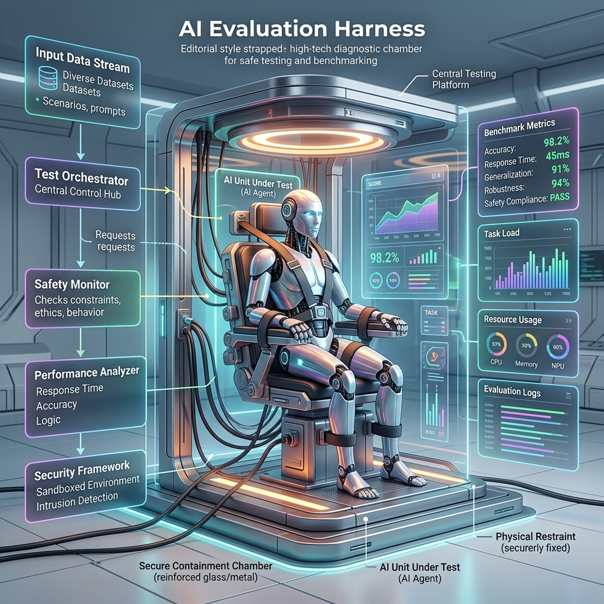

<!-- tags: glossary, agentic-ai, scaffolding-harness, harness -->
# Harness

> A testing and execution environment designed specifically to evaluate, benchmark, and constrain an AI agent's behavior under controlled conditions.

| Aspect | Detail |
| --- | --- |
| **Domain** | Scaffolding & Harness |
| **Used by** | AI researcher, QA engineer |
| **Related** | Agent Sandbox, Execution Environment, Evaluation |

📅 Created: 2026-04-28 · 🔄 Updated: 2026-05-06 · ⏱️ 5 min read

---

## 1. DEFINE

In software engineering, a test harness is a collection of software and test data configured to test a program unit. In AI, a **Harness** (or Evaluation Harness) serves the exact same purpose but is adapted for the probabilistic nature of LLMs.

Because agents are autonomous, you cannot simply write `assert x == 5`. A Harness spins up an ephemeral environment, injects a predefined prompt or task into the agent, monitors its tool usage and reasoning traces, captures its final output, and then uses a separate scoring mechanism (often an LLM-as-a-Judge) to grade the agent's performance.

Harnesses are critical for preventing regressions; before deploying a new agent version, developers run it through the harness to ensure it hasn't lost capability.

---

## 2. CONTEXT

**Who uses it**: AI researchers and QA engineers establishing benchmarks for agent performance.

**When**: Used in the CI/CD pipeline of AI development to run automated evaluations against a dataset of known problems.

**In this ecosystem**:
- A Harness often utilizes an [Agent Sandbox](./60-agent-sandbox.md) to safely run tests.
- It is the primary tool for [Regression Testing](../evaluation-observability/120-regression-testing-for-ai.md).

---

## 3. EXAMPLES

### Example 1: The Code-Eval Harness
A team is building an agent that writes SQL queries. They build an evaluation harness. The harness spins up a temporary SQLite database, provides the agent with 100 natural language questions ("How many users signed up today?"), executes the agent's generated SQL against the test DB, and compares the result to the known correct answer.

### Example 2: OpenAI Evals
OpenAI open-sourced their `evals` framework. It acts as a harness where developers can submit prompts and expected completions, allowing the community to benchmark how well different versions of GPT handle specific logic puzzles.

---

## 4. COMPARE

| | Evaluation Harness | AI Orchestrator | Agent Sandbox |
|--|---|---|---|
| **Purpose** | Testing, grading, and benchmarking | Running the agent in production | Isolating execution for security |
| **Lifecycle** | Ephemeral (Starts, tests, dies) | Persistent (Runs the application) | Ephemeral or Persistent |
| **Output** | Metrics, scores, logs | Business value, user responses | Safe execution of code |

---

## 5. REF

| Resource | Type | Link | Note |
| --- | --- | --- | --- |
| OpenAI Evals | Framework | https://github.com/openai/evals | A standard framework for evaluating LLMs and systems |
| EleutherAI LM Evaluation Harness | Repo | https://github.com/EleutherAI/lm-evaluation-harness | A popular open-source harness for zero-shot evaluations |

---

## 6. RECOMMEND

| Explore next | When | Why | File/Link |
| --- | --- | --- | --- |
| Agent Sandbox | You need to safely execute the agent | Harnesses use sandboxes to prevent test code from breaking hosts | [Agent Sandbox](./60-agent-sandbox.md) |
| Regression Testing | You are running the harness | Harnesses are used to prevent regressions | [Regression Testing](../evaluation-observability/120-regression-testing-for-ai.md) |
| Execution Environment | You are defining the harness | The harness is a specialized execution environment | [Execution Environment](./61-execution-environment.md) |

**Links**: [← Previous](./57-scaffolding.md) · [→ Next](./59-agent-runtime.md)
