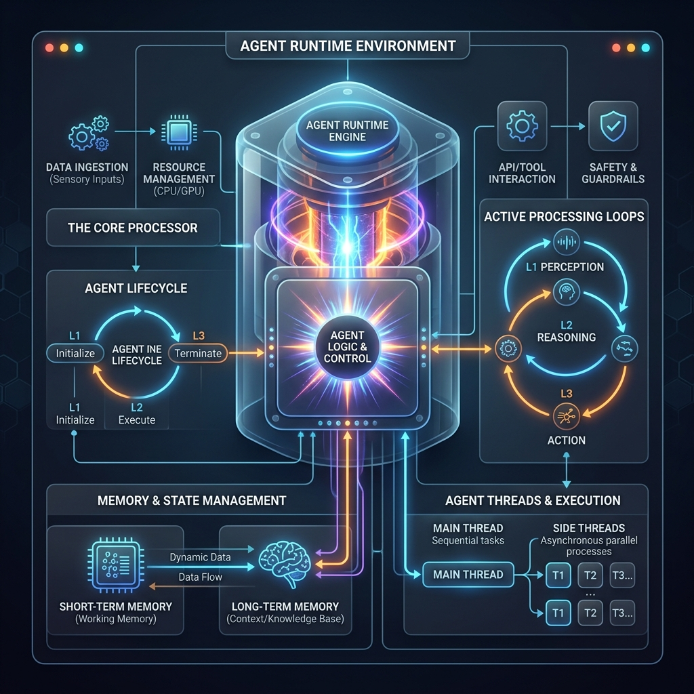

<!-- tags: glossary, agentic-ai, scaffolding-harness, agent-runtime -->
# Agent Runtime

> The active execution environment and lifecycle manager where an agent operates, maintaining its memory, managing threads, and executing its loops.

| Aspect | Detail |
| --- | --- |
| **Domain** | Scaffolding & Harness |
| **Used by** | Platform engineer, backend developer |
| **Related** | Execution Environment, Scaffolding, AI Orchestrator |

📅 Created: 2026-04-28 · 🔄 Updated: 2026-05-06 · ⏱️ 5 min read

---

## 1. DEFINE

Just as a Node.js runtime provides the environment necessary for JavaScript code to execute outside a browser, an **Agent Runtime** provides the environment necessary for an LLM to operate as a persistent, stateful agent.

The Runtime is the "OS process" for the agent. When an agent is invoked, the Runtime is responsible for instantiating it in memory, loading its historical context, managing its event loop (the cycle of prompting, tool use, and reflection), handling network I/O, and ensuring it shuts down gracefully when the task is complete or a timeout is reached.

---

## 2. CONTEXT

**Who uses it**: Platform engineers building scalable infrastructure to host thousands of concurrent agents.

**When**: Used when moving from simple, stateless scripts to long-running, autonomous agentic systems.

**In this ecosystem**:
- The Runtime executes the [Scaffolding](./57-scaffolding.md).
- Multiple Runtimes are often managed by a central [AI Orchestrator](../workflow-orchestration/63-ai-orchestrator.md).
- It provides the active boundary of the [Execution Environment](./61-execution-environment.md).

---

## 3. EXAMPLES

### Example 1: The Long-Running Research Task
A user asks an agent to read a 500-page PDF and write a summary. This will take 10 minutes and dozens of API calls. The **Agent Runtime** manages this long-lived process. It keeps the agent's memory in active RAM, manages the asynchronous API calls to the LLM provider, catches any timeout exceptions, and persists the final output to a database before terminating the process.

### Example 2: Thread Management
If three different users are interacting with the same `Support_Agent` persona, the Agent Runtime spins up three isolated threads or memory instances. It ensures User A's context does not bleed into User B's context, managing the state isolation securely.

---

## 4. COMPARE

| | Agent Runtime | Scaffolding | AI Orchestrator |
|--|---|---|---|
| **Definition** | The active process managing the lifecycle | The code defining the agent's behavior | The control plane routing tasks between agents |
| **Software Analogy** | The Node.js Engine (V8) | The Application Code (`app.js`) | Kubernetes / Load Balancer |

---

## 5. REF

| Resource | Type | Link | Note |
| --- | --- | --- | --- |
| AutoGen Architecture | Docs | https://microsoft.github.io/autogen/ | Explains how agents are instantiated and executed within a runtime |

---

## 6. RECOMMEND

| Explore next | When | Why | File/Link |
| --- | --- | --- | --- |
| Execution Environment | You are hosting the runtime | The runtime lives inside the broader environment | [Execution Environment](./61-execution-environment.md) |
| Scaffolding | You are writing the agent code | Scaffolding is the logic the runtime executes | [Scaffolding](./57-scaffolding.md) |
| AI Orchestrator | You have multiple runtimes | Orchestrators manage fleets of active runtimes | [AI Orchestrator](../workflow-orchestration/63-ai-orchestrator.md) |

**Links**: [← Previous](./58-harness.md) · [→ Next](./60-agent-sandbox.md)
