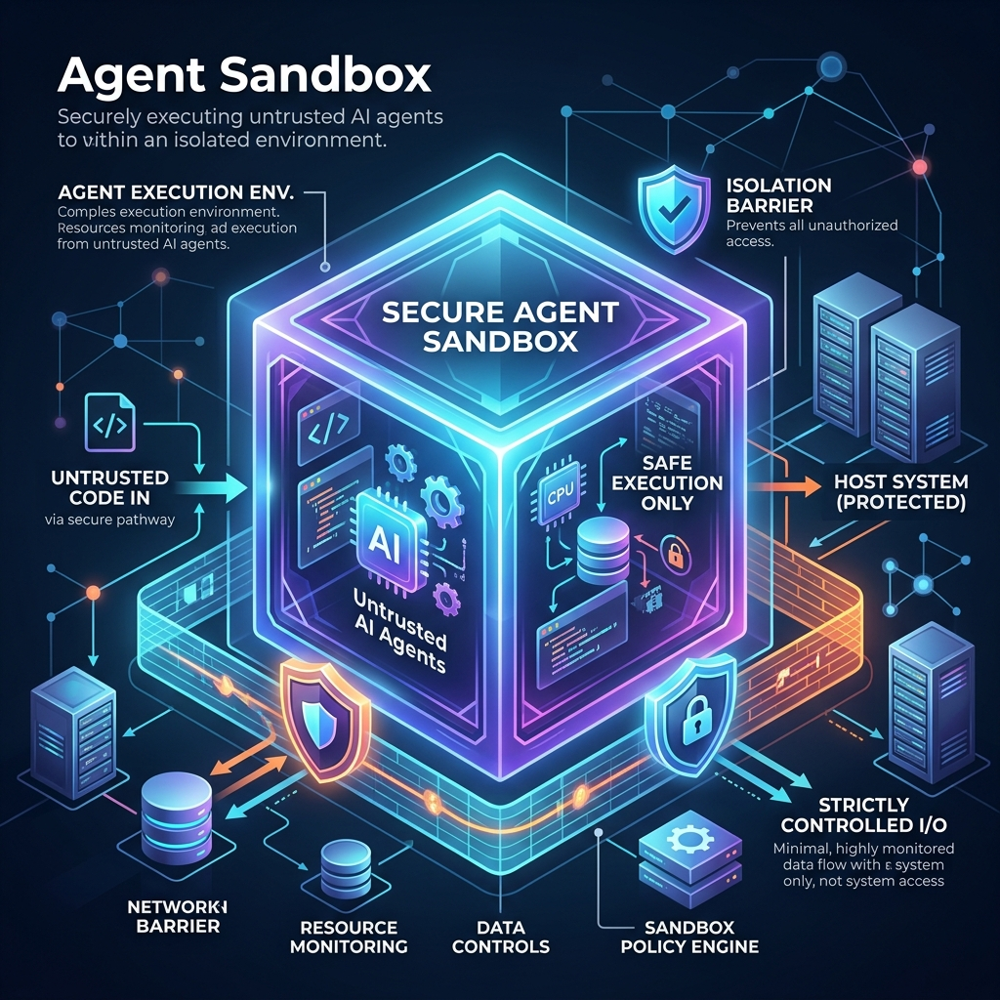

<!-- tags: glossary, agentic-ai, scaffolding-harness, agent-sandbox -->
# Agent Sandbox

> A highly secure, isolated execution environment where an agent can run untrusted code, execute terminal commands, or browse the web without risking the host system.

| Aspect | Detail |
| --- | --- |
| **Domain** | Scaffolding & Harness |
| **Used by** | DevSecOps, platform engineer |
| **Related** | Execution Environment, Harness, Agent Runtime |

📅 Created: 2026-04-28 · 🔄 Updated: 2026-05-06 · ⏱️ 5 min read

---

## 1. DEFINE

Giving an LLM the ability to write and execute code (e.g., Python, Bash) is the most powerful capability in agentic AI. It is also the most dangerous. A hallucinating agent could accidentally run `rm -rf /` or leak API keys.

An **Agent Sandbox** is a strict security boundary. It is an ephemeral, isolated container (often built on Docker, Firecracker microVMs, or WebAssembly) where the agent is allowed to execute its tools. If the agent writes a malicious script or crashes the environment, the sandbox is simply destroyed and recreated. The host infrastructure remains entirely unharmed.

---

## 2. CONTEXT

**Who uses it**: DevSecOps teams and platform engineers building code-generation or data-analysis agents.

**When**: Mandatory anytime an agent is given a tool that allows arbitrary code execution or unfiltered internet access.

**In this ecosystem**:
- It is a specialized, secure sub-type of an [Execution Environment](./61-execution-environment.md).
- It is frequently used within a testing [Harness](./58-harness.md).

---

## 3. EXAMPLES

### Example 1: The Code Interpreter
When you ask ChatGPT to "analyze this CSV," it uses a Python Code Interpreter. That interpreter runs in an **Agent Sandbox**. The LLM writes Python to parse your data and plot a chart. The sandbox executes the code securely, completely disconnected from OpenAI's core infrastructure or the internet, preventing data exfiltration.

### Example 2: E2B Cloud Environments
E2B (English2Bits) provides specialized cloud sandboxes for AI agents. When a developer builds a coding agent, they use E2B's SDK to spin up a secure, long-running microVM. The agent connects to this sandbox, installs NPM packages, runs a development server, and edits files, all while being completely isolated from the developer's laptop.

---

## 4. COMPARE

| | Agent Sandbox | Agent Runtime | Virtual Machine (Traditional) |
|--|---|---|---|
| **Purpose** | Secure execution of untrusted agent code | Managing the agent's memory and lifecycle | General purpose computing |
| **Isolation Level** | Extreme (often no internet, no host access) | Low to Medium | Medium |
| **Lifespan** | Highly ephemeral (seconds to minutes) | Tied to the task duration | Persistent |

---

## 5. REF

| Resource | Type | Link | Note |
| --- | --- | --- | --- |
| E2B | Platform | https://e2b.dev/ | An industry leader providing secure sandboxes for AI agents |
| SWE-agent | Paper/Repo | https://github.com/princeton-nlp/SWE-agent | Demonstrates advanced sandbox usage for resolving GitHub issues |

---

## 6. RECOMMEND

| Explore next | When | Why | File/Link |
| --- | --- | --- | --- |
| Execution Environment | You want to understand the broader context | Sandboxes exist within execution environments | [Execution Environment](./61-execution-environment.md) |
| Harness | You are testing code generation | Harnesses use sandboxes to safely score agent outputs | [Harness](./58-harness.md) |
| Agent Shell | You are interacting with the sandbox | A shell allows developers to peek inside the sandbox | [Agent Shell](./62-agent-shell.md) |

**Links**: [← Previous](./59-agent-runtime.md) · [→ Next](./61-execution-environment.md)
