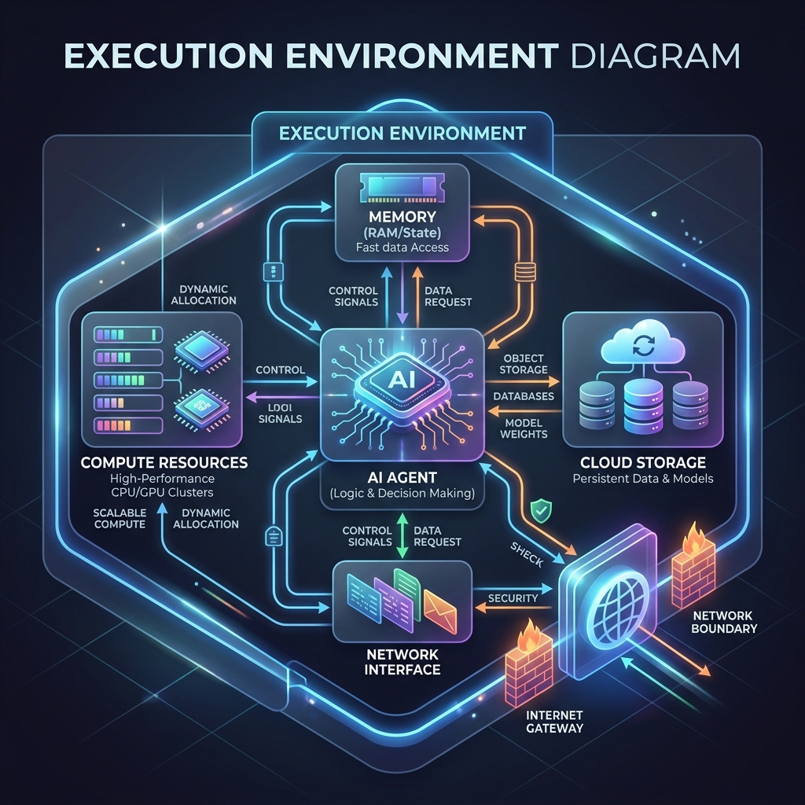

<!-- tags: glossary, agentic-ai, scaffolding-harness, execution-environment -->
# Execution Environment

> The broader, defined computational space in which an agent operates, encompassing the available compute resources, file systems, environment variables, and network access.

| Aspect | Detail |
| --- | --- |
| **Domain** | Scaffolding & Harness |
| **Used by** | DevOps, platform engineer |
| **Related** | Agent Sandbox, Agent Runtime |

📅 Created: 2026-04-28 · 🔄 Updated: 2026-05-06 · ⏱️ 5 min read

---

## 1. DEFINE

An **Execution Environment** is the total computational habitat where an agentic system lives. 

Unlike a specific [Agent Sandbox](./60-agent-sandbox.md) (which is narrowly focused on isolating dangerous code execution), the Execution Environment encompasses the entire architectural footprint: the server (or serverless function), the attached volumes (for persistent memory), the network configuration (VPC), the injected environment variables (API keys), and the specific binary dependencies required to run the agent's tools.

Properly defining the execution environment ensures that the agent has exactly the resources it needs to function, and nothing more (Principle of Least Privilege).

---

## 2. CONTEXT

**Who uses it**: DevOps teams and platform engineers deploying agentic applications to production.

**When**: During the deployment phase, moving from local development to cloud infrastructure.

**In this ecosystem**:
- It hosts the [Agent Runtime](./59-agent-runtime.md).
- It provisions the [Agent Sandbox](./60-agent-sandbox.md).
- It manages secrets required by [Skills](../skills-plugins/103-skill.md).

---

## 3. EXAMPLES

### Example 1: The Serverless Agent
A developer deploys a simple summarization agent as an AWS Lambda function. The **Execution Environment** is defined by the Lambda configuration: 512MB RAM, a 15-minute timeout limit, read-only access to a specific S3 bucket, and standard Python 3.11 libraries. If the agent tries to perform a task requiring 2GB of memory, the environment kills the process.

### Example 2: The Enterprise Kubernetes Environment
A high-security financial agent is deployed inside a Kubernetes pod. Its Execution Environment is strictly controlled: it runs in a private VPC with zero outbound internet access, uses IAM roles to access an internal Postgres database, and mounts a secure vault for its OpenAI API keys.

---

## 4. COMPARE

| | Execution Environment | Agent Sandbox | Agent Runtime |
|--|---|---|---|
| **Scope** | Broad (Infrastructure, Network, OS) | Narrow (Isolated code execution) | Software (Event loop, state) |
| **Focus** | Resource provisioning & access control | Security & isolation | Lifecycle management |
| **Example** | A Docker container / AWS Lambda | A Firecracker microVM | LangGraph Python process |

---

## 5. REF

| Resource | Type | Link | Note |
| --- | --- | --- | --- |
| 12-Factor App | Methodology | https://12factor.net/ | The foundational principles for configuring execution environments |

---

## 6. RECOMMEND

| Explore next | When | Why | File/Link |
| --- | --- | --- | --- |
| Agent Sandbox | You need to restrict the environment | Sandboxes are highly restricted sub-environments | [Agent Sandbox](./60-agent-sandbox.md) |
| Agent Runtime | You are executing code inside the environment | The runtime lives within the execution environment | [Agent Runtime](./59-agent-runtime.md) |
| Scaffolding | You are writing the agent logic | Scaffolding relies on the environment's configuration | [Scaffolding](./57-scaffolding.md) |

**Links**: [← Previous](./60-agent-sandbox.md) · [→ Next](./62-agent-shell.md)
