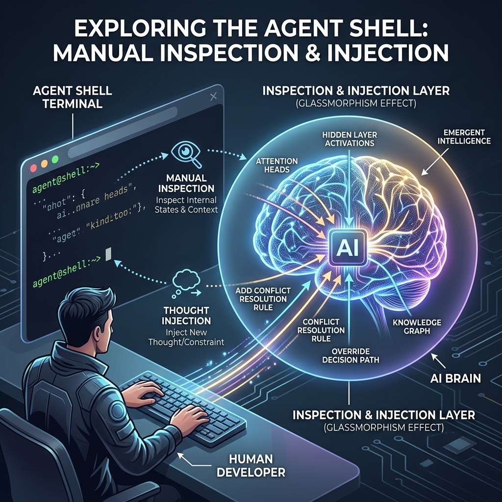

<!-- tags: glossary, agentic-ai, scaffolding-harness, agent-shell -->
# Agent Shell

> An interactive, text-based terminal interface that allows a human developer to directly communicate with, inspect, and command an agent's runtime.

| Aspect | Detail |
| --- | --- |
| **Domain** | Scaffolding & Harness |
| **Used by** | AI engineer, backend developer |
| **Related** | Agent Runtime, Human in the Loop, Evaluation |

📅 Created: 2026-04-28 · 🔄 Updated: 2026-05-06 · ⏱️ 5 min read

---

## 1. DEFINE

In traditional software, developers use a command-line interface (CLI) or REPL to execute code line-by-line and inspect variables. In agentic engineering, developers use an **Agent Shell**.

An Agent Shell is an interactive terminal that hooks directly into an active [Agent Runtime](./59-agent-runtime.md). It allows the developer to chat with the agent, view its internal reasoning trace (Chain of Thought) in real-time, inspect the exact payload of its tool executions, pause its loop, or manually inject facts into its context window. It is the primary debugging environment for agent development.

---

## 2. CONTEXT

**Who uses it**: AI engineers building and debugging agent loops.

**When**: Used heavily during local development before the agent is deployed behind a graphical user interface (GUI) or API endpoint.

**In this ecosystem**:
- It acts as the debugger for the [Agent Runtime](./59-agent-runtime.md).
- It is a common implementation of [Human in the Loop](../agentic-core/44-human-in-the-loop.md).

---

## 3. EXAMPLES

### Example 1: Debugging an Infinite Loop
An agent gets stuck in a loop trying to call a weather API with the wrong parameters. The developer drops into the **Agent Shell**. Instead of just seeing the final error, the shell prints: 
`> Tool: WeatherAPI`
`> Input: {loc: "New York"}`
`> Error: Missing parameter 'zipcode'`
`> Agent Thought: I will try again.`
The developer uses the shell to inject a message: "System Override: Use zip code 10001." The agent recovers and continues.

### Example 2: LangChain / LlamaIndex CLI
When building local agents, frameworks often provide a `.chat()` or `.repl()` method. When invoked in the terminal, this creates a simple Agent Shell, color-coding human inputs, agent thoughts, and tool executions.

---

## 4. COMPARE

| | Agent Shell | Chatbot UI (e.g., ChatGPT) | Agent Sandbox |
|--|---|---|---|
| **User** | Developer / Engineer | End User | The Agent itself |
| **Visibility** | Full (Thoughts, tools, raw data) | Partial (Only the final response) | N/A (It is an environment) |
| **Interactivity** | Can override state and inject tools | Can only provide conversational text | N/A |

---

## 5. REF

| Resource | Type | Link | Note |
| --- | --- | --- | --- |
| AutoGen CLI | Tool | https://microsoft.github.io/autogen/ | AutoGen relies heavily on terminal-based agent shells for demonstrating multi-agent interactions |

---

## 6. RECOMMEND

| Explore next | When | Why | File/Link |
| --- | --- | --- | --- |
| Agent Runtime | You are using the shell | The shell connects to the active runtime | [Agent Runtime](./59-agent-runtime.md) |
| Human in the Loop | You want to pause execution | Shells often implement HITL capabilities | [Human in the Loop](../agentic-core/44-human-in-the-loop.md) |
| Agent Sandbox | The agent is running code | The shell monitors what the agent executes in the sandbox | [Agent Sandbox](./60-agent-sandbox.md) |

**Links**: [← Previous](./61-execution-environment.md) · [→ Next](../README.md)
