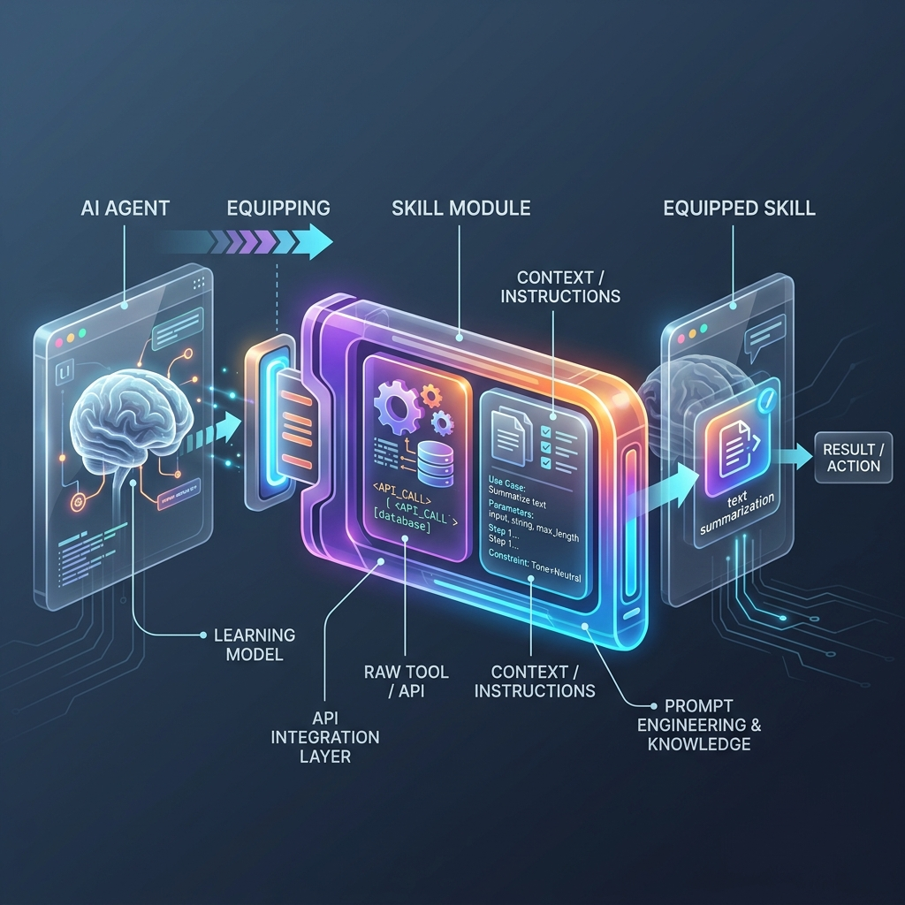

<!-- tags: glossary, agentic-ai, skills-plugins, skill -->
# Skill

> A packaged, self-contained capability that an agent can invoke—such as sending an email, querying a database, or generating an image—that is highly reusable across different contexts.

| Aspect | Detail |
| --- | --- |
| **Domain** | Skills & Plugins |
| **Used by** | AI engineer, backend developer |
| **Related** | Tool Registry, Skill Library, MCP |

📅 Created: 2026-04-28 · 🔄 Updated: 2026-05-06 · ⏱️ 5 min read

---

## 1. DEFINE

A **Skill** is the operational unit of an agent's capability. While a foundation model provides the raw reasoning engine, skills provide the actual "hands" to interact with the outside world.

Critically, a skill is more than just a raw API endpoint. It is a *wrapper* that encapsulates the raw Tool (e.g., a SQL connection string) alongside the specific *Context and Prompt Instructions* necessary for the LLM to use that tool effectively (e.g., "Use this tool to query the CRM. Always return the user's ID and email, but never expose password hashes").

By packaging APIs into Skills, developers allow agents to perform complex, deterministic actions without needing to fine-tune the underlying language model.

---

## 2. CONTEXT

**Who uses it**: AI engineers expanding an agent's capabilities without modifying the core orchestrator or retraining the model.

**When**: When integrating agentic systems with internal microservices, SaaS platforms, or databases.

**In this ecosystem**:
- A Skill often registers itself into a [Tool Registry](../tools-capabilities/48-tool-registry.md).
- Multiple skills are bundled into a [Skill Library](./104-skill-library.md).
- Standards like [MCP (Model Context Protocol)](./110-mcp.md) define how skills are built and exposed.

---

## 3. EXAMPLES

*Figure: An AI agent 'equips' a Skill Module. The module clearly encapsulates both the raw Tool/API (gears/data) and the specific Context/Instructions needed for the LLM to use it.*

### Example 1: The Jira Integration Skill
A raw API requires a JSON payload with specific project IDs and transition states. If you give an LLM just the raw API, it will often hallucinate the JSON schema.
A "Jira Skill" bundles the API with a system prompt: "To move a ticket, you must first fetch the valid transition IDs using GET /transitions. Then construct the payload matching this exact JSON schema: {...}". The agent invokes the Skill flawlessly.

### Example 2: Data Visualization Skill
Instead of asking an LLM to "write Python code, run it, capture the output, and render a chart," a developer builds a `DataViz` skill. The agent simply calls `DataViz(dataset="sales.csv", chart_type="bar")`, and the skill handles the deterministic execution behind the scenes.

---

## 4. COMPARE

| | Skill | Tool | Agent |
|--|---|---|---|
| **Definition** | A packaged capability (API + Instructions) | The raw executable function or API | The autonomous orchestrator |
| **Intelligence** | Minimal (deterministic execution) | None (dumb pipe) | High (reasoning and planning) |
| **Human Analogy** | A power drill + the instruction manual | A drill bit | The carpenter |

---

## 5. REF

| Resource | Type | Link | Note |
| --- | --- | --- | --- |
| LangChain Tools | Docs | https://python.langchain.com/docs/modules/tools/ | How to build custom tools/skills in LangChain |
| OpenAI Function Calling | API | https://platform.openai.com/docs/guides/function-calling | The foundational mechanic for invoking skills |

---

## 6. RECOMMEND

| Explore next | When | Why | File/Link |
| --- | --- | --- | --- |
| Skill Library | You have built multiple skills | Skills are organized into a searchable library | [Skill Library](./104-skill-library.md) |
| Capability Discovery | An agent needs to find a skill | Agents must dynamically discover what skills they have | [Capability Discovery](./105-capability-discovery.md) |
| MCP | You want to standardize your skills | MCP is the open standard for building reusable skills | [MCP](./110-mcp.md) |

**Links**: [← Previous](./README.md) · [→ Next](./104-skill-library.md)
