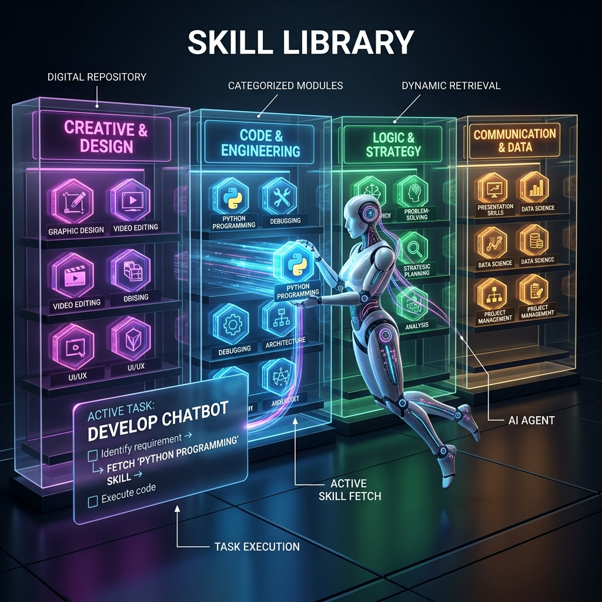

<!-- tags: glossary, agentic-ai, skills-plugins, skill-library -->
# Skill Library

> A curated collection of reusable skills available to an agentic system, from which an agent dynamically selects the appropriate capability for a specific sub-task.

| Aspect | Detail |
| --- | --- |
| **Domain** | Skills & Plugins |
| **Used by** | AI architect, platform engineer |
| **Related** | Capability Discovery, Skill, Tool Registry |

📅 Created: 2026-04-28 · 🔄 Updated: 2026-05-06 · ⏱️ 5 min read

---

## 1. DEFINE

A **Skill Library** is the central repository where [Skills](./103-skill.md) are stored, versioned, and managed. 

Because modern LLMs have finite context windows (and get easily confused if provided with 500 different tool descriptions simultaneously), developers cannot hardcode every possible capability into an agent's starting prompt. Instead, they organize capabilities into a Skill Library.

When an agent receives a complex task, it searches the Skill Library, fetches only the specific skills required for that exact task, loads them into its active context, and executes them. This allows an agentic ecosystem to scale infinitely without degrading the core model's performance.

---

## 2. CONTEXT

**Who uses it**: Platform engineers building enterprise-wide AI systems where multiple agents share capabilities.

**When**: Used when the total number of tools exceeds what is practical to load into a single LLM context window.

**In this ecosystem**:
- The library is populated by individual [Skills](./103-skill.md).
- Agents utilize [Capability Discovery](./105-capability-discovery.md) to search the library.
- It acts as a higher-level organizational unit over a simple [Tool Registry](../tools-capabilities/48-tool-registry.md).

---

## 3. EXAMPLES

*Figure: A digital Skill Library filled with categorized 'Skill' modules. An AI agent is shown dynamically browsing the repository to fetch the specific capability it needs for its current task.*

### Example 1: The Enterprise Agent Toolkit
A company has 200 distinct internal APIs. They wrap these in Skills and categorize them into a Skill Library (e.g., "HR Skills", "Finance Skills", "DevOps Skills"). 
When an employee asks an agent, "How much PTO do I have?", the agent searches the library, retrieves the `HR_Check_PTO` skill, and ignores the 199 other skills, keeping its context clean and hallucination-free.

### Example 2: OpenAI's GPT Store / LangChain Toolkits
Public platforms like the GPT Store or LangChain Community Toolkits serve as global Skill Libraries. Developers write a skill once, publish it to the library, and thousands of different agents can fetch and utilize it.

---

## 4. COMPARE

| | Skill Library | Tool Registry | Microservice Architecture |
|--|---|---|---|
| **Contents** | LLM-ready capabilities (APIs + Prompts) | Raw function signatures | Independent software services |
| **Consumer** | AI Agents | Code Orchestrators / Event loops | Other software applications |
| **Purpose** | Capability discovery and context management | Execution routing | Decoupled scaling |

---

## 5. REF

| Resource | Type | Link | Note |
| --- | --- | --- | --- |
| Gorilla: Large Language Model Connected with Massive APIs | Paper | https://arxiv.org/abs/2305.15334 | Research on how LLMs interact with massive libraries of APIs |
| OpenAI GPTs | Product | https://openai.com/chatgpt/custom-instructions/ | A commercial example of user-facing skill libraries |

---

## 6. RECOMMEND

| Explore next | When | Why | File/Link |
| --- | --- | --- | --- |
| Capability Discovery | You want to know how the agent searches the library | Agents must query the library to find skills | [Capability Discovery](./105-capability-discovery.md) |
| Skill Routing | You need to direct tasks to specific skills | The orchestrator routes work to library components | [Skill Routing](./108-skill-routing.md) |
| Plugin | You are packaging skills for external distribution | Plugins are often the delivery mechanism for libraries | [Plugin](./109-plugin.md) |

**Links**: [← Previous](./103-skill.md) · [→ Next](./105-capability-discovery.md)
