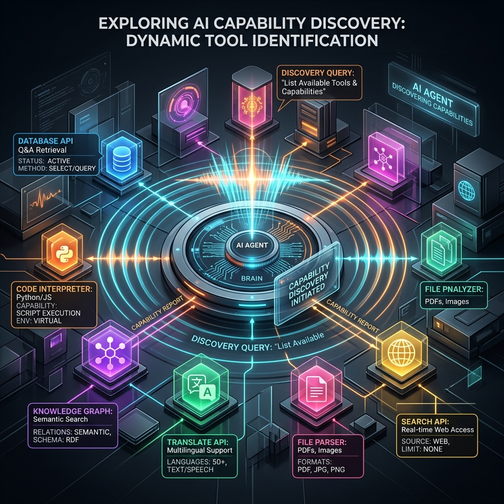

<!-- tags: glossary, agentic-ai, skills-plugins, capability-discovery -->
# Capability Discovery

> The dynamic process by which an agent queries its environment, registries, or skill libraries at runtime to understand what tools and capabilities are currently available to it.

| Aspect | Detail |
| --- | --- |
| **Domain** | Skills & Plugins |
| **Used by** | AI architect, backend developer |
| **Related** | Skill Library, MCP, Tool Registry |

📅 Created: 2026-04-28 · 🔄 Updated: 2026-05-06 · ⏱️ 5 min read

---

## 1. DEFINE

In traditional software, dependencies are hardcoded: Script A imports Module B. If Module B is missing, the code crashes at compile time.

**Capability Discovery** is the agentic equivalent of dynamic dependency injection. Instead of hardcoding what an agent can do, the agent is programmed to "wake up" and ask: *"What tools do I have access to right now?"* 

It queries a registry or [Skill Library](./104-skill-library.md), receives a JSON manifest of available capabilities, and loads their descriptions into its context window. This allows agentic systems to be incredibly resilient and adaptable; if a new tool is deployed to the environment, the agent automatically discovers and uses it without any code changes to the agent itself.

---

## 2. CONTEXT

**Who uses it**: AI architects designing decoupled, highly scalable, and self-assembling AI ecosystems.

**When**: Essential in distributed environments (like microservices) where tools frequently come online, go offline, or update their schemas without warning.

**In this ecosystem**:
- Discovery is the bridge between the agent and the [Skill Library](./104-skill-library.md).
- Standardized by protocols like [MCP](./110-mcp.md), which define exactly *how* an agent asks an environment for its tools.

---

## 3. EXAMPLES

*Figure: An AI agent sends out a 'radar ping' (a dynamic query) into its environment. In response, various tools and skills (glowing nodes) illuminate and report back their capabilities.*

### Example 1: The MCP Handshake
An AI IDE extension (like Cursor) uses the Model Context Protocol (MCP). When the IDE starts, it sends a `tools/list` request to a local MCP server. The server responds with `["read_file", "write_file", "git_commit"]`. The agent has just discovered its capabilities and now knows how to edit the user's codebase.

### Example 2: Graceful Degradation
An agent typically uses an `Enterprise_Search` skill. One day, that service is down. During Capability Discovery, the agent realizes `Enterprise_Search` is missing from the registry, but `Local_Vector_DB` is available. The agent seamlessly degrades to using the local DB instead of crashing.

---

## 4. COMPARE

| | Capability Discovery | Hardcoded Dependencies | Service Discovery (e.g., Consul) |
|--|---|---|---|
| **Mechanism** | Runtime query for functional descriptions | Compile-time imports | Runtime query for IP addresses |
| **Consumer** | The AI Agent (LLM) | The Compiler / Interpreter | Network Load Balancers |
| **Outcome** | Changes the agent's prompt/context | Fixed execution path | Routes network traffic |

---

## 5. REF

| Resource | Type | Link | Note |
| --- | --- | --- | --- |
| Model Context Protocol (MCP) | Specification | https://modelcontextprotocol.io/ | The definitive open standard for capability discovery |
| Toolformer | Paper | https://arxiv.org/abs/2302.04761 | Early research on models learning to use and discover tools |

---

## 6. RECOMMEND

| Explore next | When | Why | File/Link |
| --- | --- | --- | --- |
| MCP | You want to implement discovery | MCP is the standard protocol for discovery | [MCP](./110-mcp.md) |
| Skill Library | You want to know what is being discovered | The library holds the capabilities | [Skill Library](./104-skill-library.md) |
| Composable Skills | The agent discovers multiple small skills | Discovered skills can be chained together | [Composable Skills](./106-composable-skills.md) |

**Links**: [← Previous](./104-skill-library.md) · [→ Next](./106-composable-skills.md)
