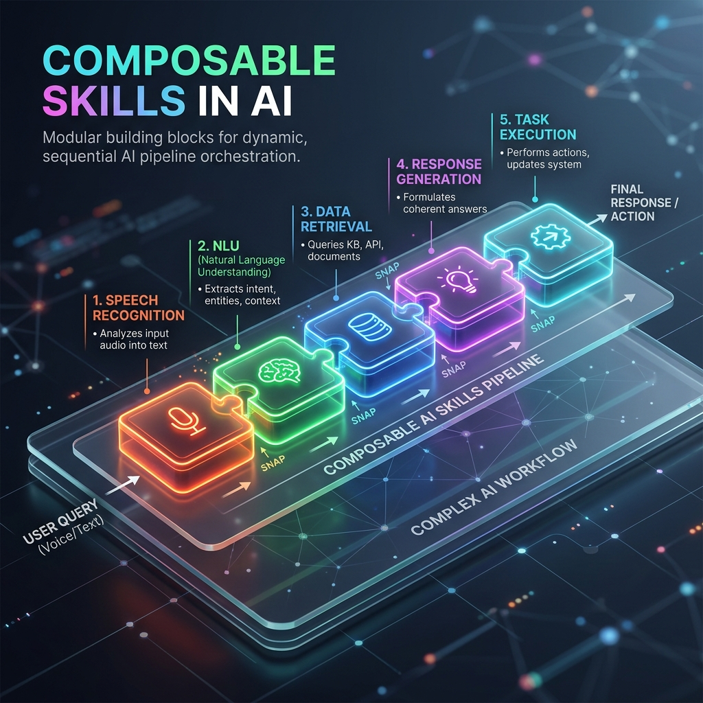

<!-- tags: glossary, agentic-ai, skills-plugins, composable-skills -->
# Composable Skills

> A design principle where individual, narrow-scope skills are built so they can be chained together to form complex workflows, rather than building massive, monolithic skills.

| Aspect | Detail |
| --- | --- |
| **Domain** | Skills & Plugins |
| **Used by** | AI architect, backend developer |
| **Related** | Atomic Action, Workflow, Pipeline |

📅 Created: 2026-04-28 · 🔄 Updated: 2026-05-06 · ⏱️ 5 min read

---

## 1. DEFINE

In software engineering, the Unix philosophy states: *"Write programs that do one thing and do it well. Write programs to work together."* 

**Composable Skills** applies this philosophy to agentic AI. Instead of creating a massive `AnalyzeDatabaseAndDraftEmail` skill, developers create a `QueryDatabase` skill, a `FormatData` skill, and a `SendEmail` skill. 

Because LLMs are excellent at routing and formatting data, they can dynamically snap these smaller skills together like Lego blocks to solve novel problems that the developer never explicitly planned for. This maximizes reusability, simplifies testing, and prevents context-window bloat.

---

## 2. CONTEXT

**Who uses it**: AI architects designing robust, scalable, and highly maintainable agent ecosystems.

**When**: When building out a [Skill Library](./104-skill-library.md) to ensure the capabilities are versatile rather than rigidly domain-specific.

**In this ecosystem**:
- Composable skills are often built around [Atomic Actions](./107-atomic-action.md).
- They are orchestrated into sequences by a [Workflow](../workflow-orchestration/64-workflow.md).
- They allow for highly effective [Prompt Chaining](../hooks-middleware/README.md).

---

## 3. EXAMPLES

*Figure: Composable Skills illustrated as distinct AI modules snapping together sequentially to form a larger, complex workflow pipeline.*

### Example 1: The Monolith vs. The Legos
*   **Anti-pattern (Monolith)**: A developer builds a `OnboardEmployee` skill. It creates an email, provisions a Slack account, and updates HR. If the company stops using Slack, the whole skill breaks.
*   **Pattern (Composable)**: A developer builds `CreateEmail`, `ProvisionSlack`, and `UpdateHRRecord` skills. The agent orchestrator figures out how to call them in sequence. If Slack is removed, the agent simply stops calling the Slack skill.

### Example 2: Unplanned Synergy
A user asks: "Get the latest error logs and summarize them into a Jira ticket." The developer never built a specific skill for this. However, because the agent has access to a `FetchSplunkLogs` skill and a `CreateJiraIssue` skill, it *composes* them dynamically to solve the request.

---

## 4. COMPARE

| | Composable Skills | Monolithic Tool | Agent Orchestrator |
|--|---|---|---|
| **Scope** | Single responsibility (Narrow) | Many responsibilities (Broad) | Manages the workflow |
| **Reusability** | Extremely High | Low | N/A |
| **LLM Reasoning Load** | High (must figure out how to link them) | Low (just runs one command) | Very High |

---

## 5. REF

| Resource | Type | Link | Note |
| --- | --- | --- | --- |
| LangChain Runnables / LCEL | Docs | https://python.langchain.com/docs/expression_language/ | The standard framework for piping skills and prompts together |

---

## 6. RECOMMEND

| Explore next | When | Why | File/Link |
| --- | --- | --- | --- |
| Atomic Action | You are designing a composable skill | Skills should ideally be atomic to prevent partial failures | [Atomic Action](./107-atomic-action.md) |
| Workflow | You want to hardcode the composition | Workflows define specific paths for composable skills | [Workflow](../workflow-orchestration/64-workflow.md) |
| Skill Library | You want to store these skills | A library is built from composable units | [Skill Library](./104-skill-library.md) |

**Links**: [← Previous](./105-capability-discovery.md) · [→ Next](./107-atomic-action.md)
