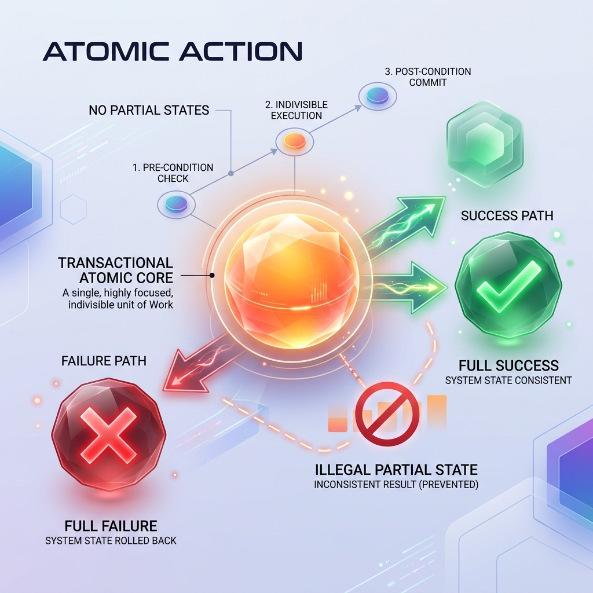

<!-- tags: glossary, agentic-ai, skills-plugins, atomic-action -->
# Atomic Action

> A skill or unit of work that either succeeds entirely or fails entirely, ensuring no partial state changes or corrupted data are left behind.

| Aspect | Detail |
| --- | --- |
| **Domain** | Skills & Plugins |
| **Used by** | Backend developer, data engineer |
| **Related** | Composable Skills, Checkpoint, Rollback |

📅 Created: 2026-04-28 · 🔄 Updated: 2026-05-06 · ⏱️ 5 min read

---

## 1. DEFINE

LLM agents are non-deterministic; they can and will fail mid-execution due to hallucination, context limits, or API timeouts. 

An **Atomic Action** is a design pattern borrowed from database engineering (ACID transactions) and applied to AI skills. It mandates that any tool modifying external state (writing to a database, sending emails, moving files) must be designed so that if it crashes halfway through, the system automatically reverts to its original state. 

If an agent is given non-atomic tools, a mid-task failure leaves the system in a corrupted, half-finished state that the agent is usually incapable of fixing itself, requiring manual human cleanup.

---

## 2. CONTEXT

**Who uses it**: Backend developers wrapping legacy APIs into skills for LLM consumption.

**When**: Critical when designing agents that have write-access to production systems, financial data, or external communications.

**In this ecosystem**:
- Atomic Actions are the safest building blocks for [Composable Skills](./106-composable-skills.md).
- They allow an [Agentic Loop](../agentic-core/35-agentic-loop.md) to safely retry failed steps without corrupting data.

---

## 3. EXAMPLES

*Figure: An Atomic Action illustrated as a single, highly focused unit of work that either succeeds entirely (green check) or fails entirely (red cross) with no partial states.*

### Example 1: The Refactoring Agent
An agent is asked to rename a variable across 10 different files. It uses a `WriteFile` skill. It succeeds on 8 files, but crashes on the 9th due to a token limit. 
*   **Non-Atomic**: The codebase is now broken and won't compile. The developer has to manually find and revert the 8 files.
*   **Atomic**: The `RefactorCodebase` skill creates a Git branch, applies changes, and only merges if all 10 files succeed. If the 9th fails, it abandons the branch. The state is clean.

### Example 2: Financial Transactions
An agent transferring money between two accounts uses a transactional wrapper. It deducts $100 from Account A. The network drops before adding to Account B. Because the skill is atomic, the database rolls back the deduction from Account A automatically.

---

## 4. COMPARE

| | Atomic Action | Idempotent Action | Non-Atomic Action |
|--|---|---|---|
| **Definition** | All-or-nothing execution | Safe to run multiple times | May leave partial state on failure |
| **Example** | Database transaction (Commit/Rollback) | `GET` request or `PUT` (overwrite) | Looping over a list and sending emails |
| **Failure Recovery** | Safe to retry | Safe to retry | Dangerous to retry (causes duplication/corruption) |

---

## 5. REF

| Resource | Type | Link | Note |
| --- | --- | --- | --- |
| ACID Database Properties | Concept | https://en.wikipedia.org/wiki/ACID | The foundational computer science theory behind atomic agent actions |

---

## 6. RECOMMEND

| Explore next | When | Why | File/Link |
| --- | --- | --- | --- |
| Composable Skills | You are building a toolkit | Atomic actions make the best composable blocks | [Composable Skills](./106-composable-skills.md) |
| Checkpoint | The agent is executing long workflows | Checkpoints save state between atomic actions | [Checkpoint](../workflow-orchestration/71-checkpoint.md) |
| Retry Policy | An atomic action fails | Because it is atomic, you can safely apply a retry policy | [Retry Policy](../workflow-orchestration/70-retry-policy.md) |

**Links**: [← Previous](./106-composable-skills.md) · [→ Next](./108-skill-routing.md)
