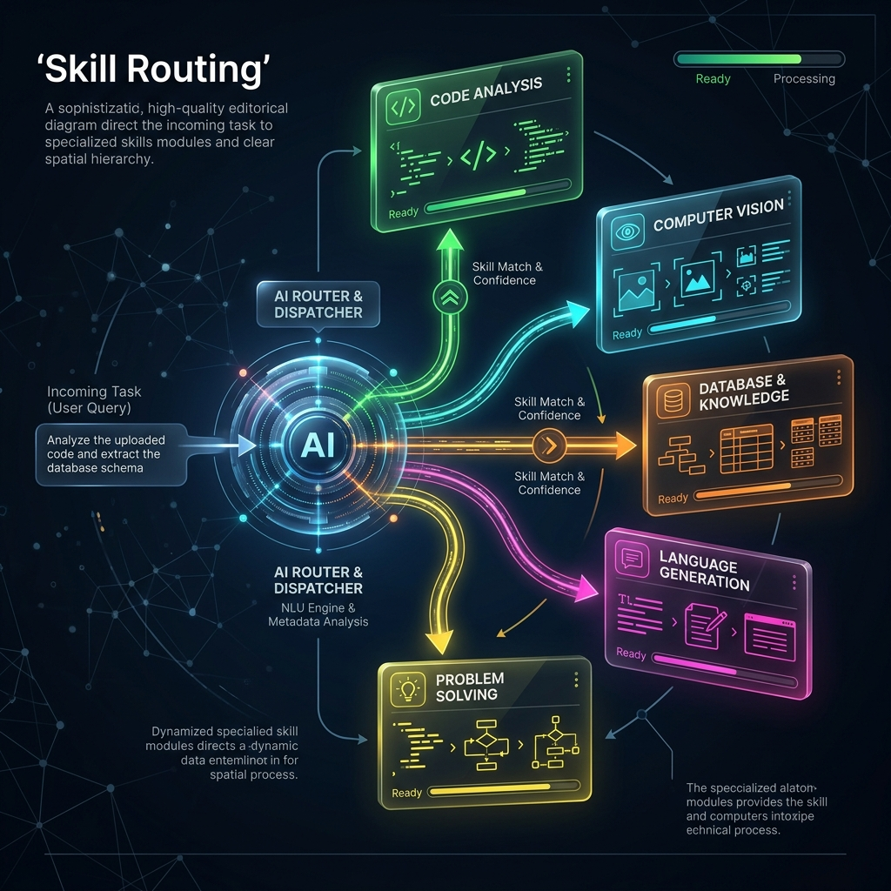

<!-- tags: glossary, agentic-ai, skills-plugins, skill-routing -->
# Skill Routing

> The mechanism by which a central orchestrator determines which specific skill, tool, or sub-agent is best suited to handle a specific user intent.

| Aspect | Detail |
| --- | --- |
| **Domain** | Skills & Plugins |
| **Used by** | AI architect, backend developer |
| **Related** | Skill Library, Capability Discovery, AI Orchestrator |

📅 Created: 2026-04-28 · 🔄 Updated: 2026-05-06 · ⏱️ 5 min read

---

## 1. DEFINE

As an agentic system scales, its [Skill Library](./104-skill-library.md) grows. You cannot feed 500 tool descriptions into a single LLM prompt—it causes context bloat, increases latency, and leads to severe hallucinations where the LLM uses the wrong tool.

**Skill Routing** (or Semantic Routing) is the architectural pattern that solves this. It uses a fast, lightweight classifier (often a smaller LLM or a vector embedding search) to evaluate the incoming user request and map it to a specific subset of skills. 

The router acts as the traffic cop. If the user asks about invoices, the router sends the request *only* to the Finance Skills module, completely hiding the DevOps and HR skills from the downstream execution context.

---

## 2. CONTEXT

**Who uses it**: AI architects building highly scalable, enterprise-grade multi-agent systems.

**When**: Implemented when the number of available tools exceeds ~10-15, or when different domains require completely different LLM personas.

**In this ecosystem**:
- Routing is a core responsibility of an [AI Orchestrator](../workflow-orchestration/63-ai-orchestrator.md).
- It relies on semantic understanding, unlike traditional keyword-based API routing.

---

## 3. EXAMPLES

*Figure: A central AI dispatcher receiving a task and dynamically directing it along glowing paths to the correct specialized Skill module based on the task's requirements.*

### Example 1: The Semantic Router
A customer support system has three skill sets: `[Refund_Tools]`, `[Technical_Support_Tools]`, and `[Sales_Tools]`.
User inputs: *"My screen is cracked, can I get my money back?"*
A fast embedding-based router maps "money back" to the `Refund_Tools` intent. It routes the user's prompt to an agent equipped *only* with the refund API, preventing the agent from accidentally trying to troubleshoot a cracked screen.

### Example 2: Multi-Agent Handoff
Routing isn't just for skills; it's for sub-agents. A `Router_Agent` receives a prompt to "Build a web app". It routes the database tasks to the `DB_Agent`, the CSS tasks to the `Frontend_Agent`, and the deployment to the `DevOps_Agent`.

---

## 4. COMPARE

| | Semantic Skill Routing | Traditional API Routing | Zero-Shot Tool Selection |
|--|---|---|---|
| **Mechanism** | Embeddings or LLM classification | Exact URL path / Regex | The main LLM chooses from a massive list |
| **Scalability** | Extremely High (thousands of skills) | High | Very Low (context limits) |
| **Latency** | Low (if using embeddings/small models) | Near Zero | High (massive prompt processing) |

---

## 5. REF

| Resource | Type | Link | Note |
| --- | --- | --- | --- |
| Semantic Router (Aurelio) | Library | https://github.com/aurelio-labs/semantic-router | A popular open-source library for ultra-fast intent routing |
| LangGraph Multi-Agent Routing | Docs | https://langchain-ai.github.io/langgraph/tutorials/multi_agent/multi-agent-collaboration/ | Supervisor-based routing patterns |

---

## 6. RECOMMEND

| Explore next | When | Why | File/Link |
| --- | --- | --- | --- |
| AI Orchestrator | You want to know what executes the routing | The orchestrator holds the routing logic | [AI Orchestrator](../workflow-orchestration/63-ai-orchestrator.md) |
| Skill Library | You want to know what is being routed to | The router selects from the library | [Skill Library](./104-skill-library.md) |
| Multi-Agent Systems | You are routing to agents instead of skills | Routing is the core of multi-agent architectures | [Multi-Agent Systems](../multi-agent-systems/README.md) |

**Links**: [← Previous](./107-atomic-action.md) · [→ Next](./109-plugin.md)
