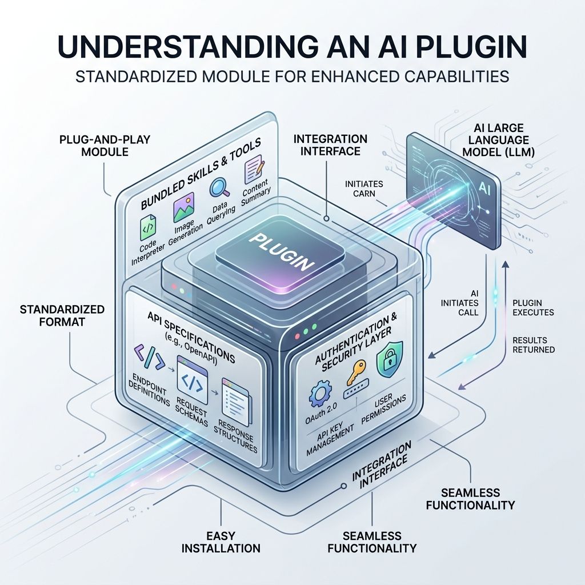

<!-- tags: glossary, agentic-ai, skills-plugins, plugin -->
# Plugin

> A standardized, installable package that bundles one or more skills, API configurations, and authentication logic into a single module that can be hot-swapped into an agent's environment.

| Aspect | Detail |
| --- | --- |
| **Domain** | Skills & Plugins |
| **Used by** | AI engineer, platform architect |
| **Related** | Skill, MCP, Capability Discovery |

📅 Created: 2026-04-28 · 🔄 Updated: 2026-05-06 · ⏱️ 5 min read

---

## 1. DEFINE

If a [Skill](./103-skill.md) is a single tool (like a hammer), a **Plugin** is the standardized toolbox you buy from the store that contains the hammer, nails, and the safety manual. 

In agentic architecture, a Plugin serves as the deployment and distribution container for capabilities. It bundles the raw executable code (APIs), the natural language descriptions required by the LLM (OpenAPI specs/prompts), and the necessary authentication mechanisms (OAuth, API keys) into a unified interface.

Plugins allow developers to write a capability once and distribute it across entirely different agent orchestrators, abstracting away the complex integration plumbing.

---

## 2. CONTEXT

**Who uses it**: Platform architects building extensible AI systems, and 3rd-party developers creating integrations for popular AI platforms.

**When**: Used when capabilities need to be modular, installable, and easily distributed to users or other development teams.

**In this ecosystem**:
- A Plugin contains one or more [Skills](./103-skill.md).
- Plugins are published to a [Skill Library](./104-skill-library.md).
- Modern plugins are built using standardized protocols like [MCP](./110-mcp.md).

---

## 3. EXAMPLES

*Figure: A conceptual diagram of a Plugin acting as a standardized container, bundling multiple specific skills, API specs, and authentication layers into a single plug-and-play module.*

### Example 1: The GitHub Plugin
A developer wants their agent to manage code. Instead of writing custom API calls, they install a third-party `GitHub Plugin`. 
This single plugin provides the agent with multiple distinct skills: `search_repo`, `read_file`, `create_branch`, and `open_pr`. It also handles the OAuth token lifecycle automatically. The agent simply discovers these capabilities and starts using them.

### Example 2: ChatGPT Plugins (Historical Context)
OpenAI introduced the concept of LLM plugins, where a simple `manifest.json` and an OpenAPI specification allowed ChatGPT to interact with services like Expedia or Wolfram Alpha. This established the paradigm that an LLM can act as an operating system executing third-party plugins.

---

## 4. COMPARE

| | Plugin | Skill | Foundation Model |
|--|---|---|---|
| **Definition** | The installable package/container | The specific executable action | The reasoning engine |
| **Contents** | Multiple skills, auth, manifests | Tool code + prompt context | Neural network weights |
| **Human Analogy** | The toolbox | The hammer | The brain |

---

## 5. REF

| Resource | Type | Link | Note |
| --- | --- | --- | --- |
| OpenAI Plugin Docs (Archived) | Standard | https://platform.openai.com/docs/plugins/introduction | The early conceptual framework for LLM plugins |
| Model Context Protocol (MCP) | Specification | https://modelcontextprotocol.io/ | The modern, open standard replacing proprietary plugin architectures |

---

## 6. RECOMMEND

| Explore next | When | Why | File/Link |
| --- | --- | --- | --- |
| MCP | You want to build a modern plugin | MCP is the industry standard for plugin architecture | [MCP](./110-mcp.md) |
| Skill | You are writing the code inside the plugin | Plugins are just wrappers for skills | [Skill](./103-skill.md) |
| Capability Discovery | You install a plugin | The agent must discover what the plugin contains | [Capability Discovery](./105-capability-discovery.md) |

**Links**: [← Previous](./108-skill-routing.md) · [→ Next](./110-mcp.md)
