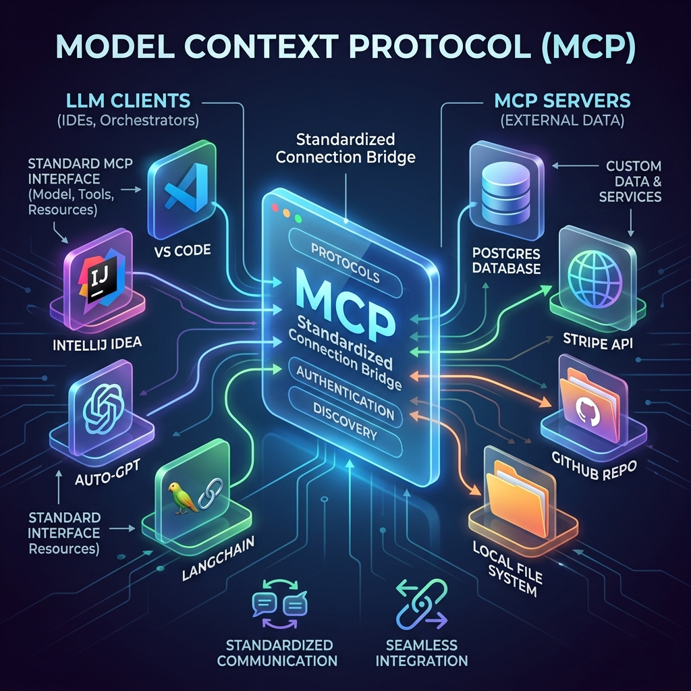

<!-- tags: glossary, agentic-ai, skills-plugins, mcp -->
# Model Context Protocol (MCP)

> An open standard that defines how AI models can securely discover, connect to, and consume external tools and data sources.

| Aspect | Detail |
| --- | --- |
| **Domain** | Skills & Plugins |
| **Used by** | AI architect, backend developer |
| **Related** | Capability Discovery, Plugin, Skill |

📅 Created: 2026-04-28 · 🔄 Updated: 2026-05-06 · ⏱️ 5 min read

---

## 1. DEFINE

Historically, integrating an AI agent with a database required writing custom glue code specific to that agent's framework (e.g., LangChain) and the specific LLM (e.g., OpenAI's function calling format). If you switched to Claude, you had to rewrite the integration.

The **Model Context Protocol (MCP)** solves this N-to-M integration nightmare. It is an open, universal standard (championed by Anthropic) that defines a unified architecture for how agents talk to tools.

It operates on a Client-Server model. The LLM IDE or orchestrator acts as the **MCP Client**. It connects to an **MCP Server** (a lightweight wrapper around your tools or database). The Server standardizes [Capability Discovery](./105-capability-discovery.md) and tool execution, meaning you write an integration once, and *any* MCP-compliant agent can use it immediately.

---

## 2. CONTEXT

**Who uses it**: Backend developers exposing their proprietary data to AI tools, and platform architects standardizing their agent ecosystems.

**When**: Used when building modern [Plugins](./109-plugin.md) or exposing internal company data to LLMs securely.

**In this ecosystem**:
- MCP standardizes how [Skills](./103-skill.md) are exposed.
- It is the defining protocol for [Capability Discovery](./105-capability-discovery.md).
- It runs locally or over standard transports (stdio, SSE), keeping data highly secure.

---

## 3. EXAMPLES

*Figure: The Model Context Protocol (MCP) architecture, showing a standardized connection bridging various LLM Clients to diverse external MCP Servers (databases, tools, APIs).*

### Example 1: The Universal Database Connector
A data engineering team wants developers to query their internal PostgreSQL database using AI. Instead of writing a custom Slack bot, a VS Code extension, and a LangChain tool, they write a single `Postgres_MCP_Server`. 
Now, a developer using Cursor (IDE) can point it at the local MCP server, and Cursor instantly learns how to query the database. A separate team using Claude Desktop can connect to the exact same server and get the same capabilities.

### Example 2: Local File System Access
An MCP Server running via `stdio` exposes the local file system. Because it runs locally with the user's permissions, it securely allows a cloud-based LLM (like Claude 3.5 Sonnet) to read and edit local files without the files ever being permanently uploaded to a third-party server.

---

## 4. COMPARE

| | Model Context Protocol (MCP) | Custom API Integration | REST API |
|--|---|---|---|
| **Standardization** | Universal (Write once, run anywhere) | Vendor-specific (LangChain, OpenAI) | Standardized transport, unstandardized intent |
| **Discovery** | Built-in capability discovery | Hardcoded | Requires Swagger/OpenAPI |
| **Primary Consumer** | Foundation Models / Agents | Orchestrator Code | Web/Mobile Apps |

---

## 5. REF

| Resource | Type | Link | Note |
| --- | --- | --- | --- |
| Official MCP Documentation | Spec | https://modelcontextprotocol.io/ | The definitive guide and SDKs for building MCP servers |
| Anthropic MCP Announcement | Blog | https://www.anthropic.com/news/model-context-protocol | The origin of the standard |

---

## 6. RECOMMEND

| Explore next | When | Why | File/Link |
| --- | --- | --- | --- |
| Capability Discovery | You want to know how MCP lists tools | The `tools/list` endpoint is core to MCP | [Capability Discovery](./105-capability-discovery.md) |
| Plugin | You want to package your MCP server | MCP is the modern way to build plugins | [Plugin](./109-plugin.md) |
| Skill | You are writing the logic inside the MCP server | The MCP server exposes specific skills | [Skill](./103-skill.md) |

**Links**: [← Previous](./109-plugin.md) · [→ Next](../workflow-orchestration/README.md)
