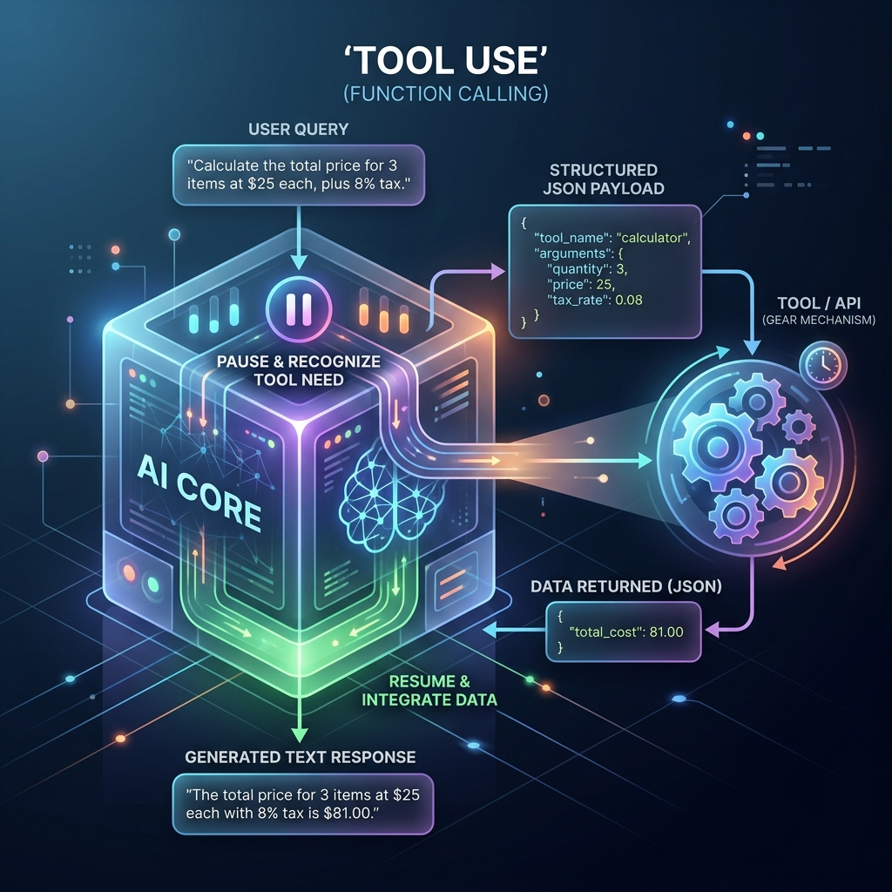

<!-- tags: glossary, agentic-ai, tools-capabilities -->
# Tool Use / Function Calling

> LLM calling external functions (search, calculator, API) to get real information instead of hallucinating — the bridge from text to action.

| Aspect | Detail |
| --- | --- |
| **Domain** | Tools & Capabilities |
| **Used by** | AI engineer, backend developer, tech lead |
| **Related** | See RECOMMEND section |

📅 Created: 2026-04-28 · 🔄 Updated: 2026-05-07 · ⏱️ 5 min read

---

## 1. DEFINE

**Tool Use** (also known as **Function Calling**) is the capability of a Large Language Model to reliably output structured data (usually JSON) that maps exactly to the signature of a predefined external function. Instead of attempting to answer a query solely from its static training weights, the LLM emits a command, pauses execution, waits for the host system to execute the external function, and then resumes generation using the function's real-world result.

---

## 2. CONTEXT

**Who uses it**: AI Engineers and Backend Developers.
**When**: Building agents that need to interact with external systems, databases, APIs, or the web.
**Why it matters**: Tool Use transforms LLMs from passive text generators into active computational engines. It solves the hallucination problem for temporal or private data by forcing the model to "look it up" or "take action" rather than guess.

---

## 3. EXAMPLES

### Example 1: The Function Calling Loop



When a user asks "What is the weather in Tokyo?", an LLM without tools will guess or refuse. With Tool Use:
1. **Prompting**: The LLM is provided a description of a `get_weather(location)` tool.
2. **LLM Output**: Instead of a text response, the LLM outputs a JSON payload: `{"name": "get_weather", "arguments": {"location": "Tokyo, Japan"}}`.
3. **Host Execution**: The host application parses this JSON, calls the actual weather API, and gets `{"temp": 22, "condition": "Sunny"}`.
4. **Resumption**: The host appends this result to the conversation history and calls the LLM again. The LLM now responds: "The weather in Tokyo is currently 22°C and sunny."

### Example 2: Go Implementation of Tool Execution

```go
// A simple host-side execution of an LLM's tool call
func HandleToolCall(ctx context.Context, call llm.ToolCall) (string, error) {
    switch call.Name {
    case "get_weather":
        var args struct { Location string `json:"location"` }
        if err := json.Unmarshal(call.Arguments, &args); err != nil {
            return "", err
        }
        return fetchWeatherAPI(args.Location)
    case "execute_sql":
        // LLM acts as a data analyst
        return runQuery(call.Arguments)
    default:
        return "", fmt.Errorf("unknown tool: %s", call.Name)
    }
}
```

---

## 4. COMPARE

| Feature | Tool Use / Function Calling | Standard Prompting |
|---|---|---|
| **Data Source** | Live, external APIs and databases | Static pre-trained weights |
| **Output Format** | Strictly typed JSON matching a schema | Unstructured natural language text |
| **Execution Flow** | Multi-turn (LLM pauses, host runs, LLM resumes) | Single-turn (Immediate text generation) |
| **Hallucination Risk** | Very Low (relies on real data) | High (especially for factual/math queries) |

---

## 5. REF

| Resource | Type | Link | Note |
| --- | --- | --- | --- |
| OpenAI Function Calling | Guide | https://platform.openai.com/docs/guides/function-calling | The industry standard implementation |
| Anthropic Tool Use | Guide | https://docs.anthropic.com/en/docs/tool-use | Claude's approach to tool use |

---

## 6. RECOMMEND

| Explore next | When | Why | File/Link |
| --- | --- | --- | --- |
| Tool Schema | You need to define a function for the LLM to call | The schema is what makes Tool Use possible | [Tool Schema](./47-tool-schema.md) |
| Prompt Injection | You are exposing internal APIs to an LLM | Tools create a massive attack surface for prompt injection | [Prompt Injection](../prompt-engineering/24-prompt-injection.md) |

**Links**: [← Previous](./README.md) · [→ Next](./47-tool-schema.md)
