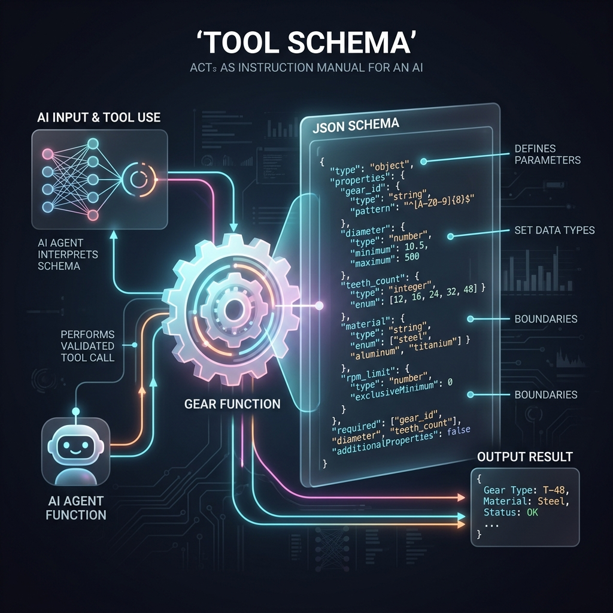

<!-- tags: glossary, agentic-ai, tools-capabilities -->
# Tool Schema

> A JSON definition describing a function's signature — name, description, parameters — so the LLM knows how to call it correctly.

| Aspect | Detail |
| --- | --- |
| **Domain** | Tools & Capabilities |
| **Used by** | AI engineer, backend developer, tech lead |
| **Related** | See RECOMMEND section |

📅 Created: 2026-04-28 · 🔄 Updated: 2026-05-07 · ⏱️ 5 min read

---

## 1. DEFINE

A **Tool Schema** is a strictly formatted JSON object (typically conforming to the JSON Schema standard) that describes an external function to a Large Language Model. It defines the function's name, its purpose (description), and the precise structure, data types, and constraints of its required and optional parameters, acting as the interface contract between the LLM and the host application.

---

## 2. CONTEXT

**Who uses it**: Backend Engineers and AI Developers.
**When**: Defining the tools and capabilities available to an agent during system initialization.
**Why it matters**: The LLM relies entirely on the semantic quality of the schema's `description` fields to determine *when* to call a tool, and relies on the parameter definitions to determine *how* to construct the arguments correctly. Poor schemas lead to failed function calls and confused agents.

---

## 3. EXAMPLES

### Example 1: A Complete Tool Schema Definition



Below is an example of a robust Tool Schema for a flight booking system. Notice how highly descriptive the text fields are—these descriptions are read by the LLM, not a compiler.

```json
{
  "name": "book_flight",
  "description": "Books a commercial flight for a user. Call this ONLY when the user has explicitly confirmed the destination and date.",
  "parameters": {
    "type": "object",
    "properties": {
      "destination_airport": {
        "type": "string",
        "description": "The 3-letter IATA airport code (e.g., JFK, LHR)."
      },
      "travel_date": {
        "type": "string",
        "description": "The date of travel in ISO 8601 format (YYYY-MM-DD)."
      },
      "class": {
        "type": "string",
        "enum": ["economy", "business", "first"],
        "description": "The cabin class. Defaults to economy if not specified."
      }
    },
    "required": ["destination_airport", "travel_date"]
  }
}
```

---

## 4. COMPARE

| Feature | Tool Schema | OpenAPI Specification |
|---|---|---|
| **Primary Consumer** | Large Language Models (AI) | Humans and Code Generators |
| **Focus** | Semantic descriptions of intent and constraints | Network protocols, HTTP methods, and status codes |
| **Complexity** | Usually simplified, focusing only on actionable parameters | Comprehensive, detailing every possible API endpoint |

---

## 5. REF

| Resource | Type | Link | Note |
| --- | --- | --- | --- |
| JSON Schema | Standard | https://json-schema.org/ | The foundational standard used by most LLM APIs |
| Outlines / Instructor | Libraries | https://github.com/jxnl/instructor | Tools for generating schemas from Pydantic/Go structs |

---

## 6. RECOMMEND

| Explore next | When | Why | File/Link |
| --- | --- | --- | --- |
| Tool Use / Function Calling | You want to execute the schema | Schema definition is the prerequisite to execution | [Tool Use](./46-tool-use-function-calling.md) |
| Tool Registry | You have dozens of schemas to manage | Registries catalog schemas for dynamic agent discovery | [Tool Registry](./48-tool-registry.md) |

**Links**: [← Previous](./46-tool-use-function-calling.md) · [→ Next](./48-tool-registry.md)
