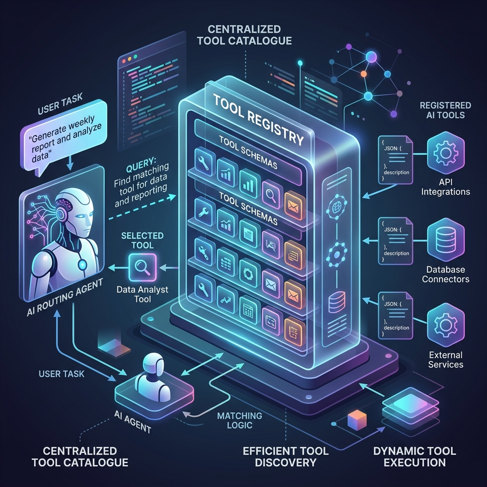

<!-- tags: glossary, agentic-ai, tools-capabilities -->
# Tool Registry

> A catalogue of all tools an agent can use — the agent queries the registry to find the right tool for each sub-task.

| Aspect | Detail |
| --- | --- |
| **Domain** | Tools & Capabilities |
| **Used by** | AI engineer, backend developer, tech lead |
| **Related** | See RECOMMEND section |

📅 Created: 2026-04-28 · 🔄 Updated: 2026-05-07 · ⏱️ 5 min read

---

## 1. DEFINE

Before agents had dynamic capabilities, developers hardcoded specific function calls into their scripts. If an application needed to search the web and send an email, the developer wrote distinct logic paths for both. As systems grew to support dozens of tools, hardcoding became impossible. 

A **Tool Registry** is a centralized catalogue containing the definitions, schemas, and execution boundaries of all tools an AI agent can access. Instead of knowing which tools exist at compile time, an agent queries the registry at runtime to discover available capabilities. The registry provides the agent with JSON schemas (often adhering to standards like JSON Schema or OpenAPI) that describe what each tool does, what parameters it requires, and what output it returns.

---

## 2. CONTEXT

**Who uses it**: AI architects designing multi-agent systems, backend engineers exposing internal APIs to agents, and security teams auditing agent permissions.

**When**: During the agent setup phase to inject available capabilities into the system prompt, and during runtime when an agent routing layer decides which function to call based on user intent.

**In this ecosystem**:
- It stores the [Tool Schema](./47-tool-schema.md) for each capability.
- It enables [Capability Discovery](../skills-plugins/105-capability-discovery.md) for autonomous agents.
- It acts as the enforcement layer for [Permission Scoping](../safety-alignment/127-permission-scoping.md), ensuring agents only see tools they are authorized to use.

---

## 3. EXAMPLES

### Example 1: Dynamic tool discovery in a customer support agent

An enterprise deploys a customer support agent. Instead of loading all 50 possible actions (refund, check status, update address, etc.) into the context window—which would consume excessive tokens and cause hallucination—the agent first queries the Tool Registry with the user's intent. The registry returns only the three most relevant tool schemas, which are then injected into the agent's prompt for execution.

### Example 2: Security-scoped tool access

A single deployment of an internal coding assistant serves both junior developers and senior DevOps engineers. When a junior developer interacts with the agent, the Tool Registry filters its response to only return read-only tools (e.g., `search_logs`, `view_config`). When a DevOps engineer logs in, the registry exposes administrative tools (e.g., `restart_pod`, `deploy_service`) based on the user's IAM role. The registry acts as the security boundary.

---

## 4. COMPARE

| | Tool Registry | Tool Schema | Plugin |
|---|---|---|---|
| **Definition** | The centralized catalogue managing all available tools | The JSON/OpenAPI definition of a single tool | A packaged unit containing both the schema and the execution logic |
| **Role** | Discovery and authorization | Interface contract | Implementation |
| **Analogy** | The app store or service directory | The API documentation | The actual downloaded app |

---

## 5. REF

| Resource | Type | Link | Note |
| --- | --- | --- | --- |
| Model Context Protocol (MCP) | Specification | https://modelcontextprotocol.io | Standardizing how tools are exposed to models |
| LangChain BaseTool | API Doc | https://api.python.langchain.com/en/latest/tools/langchain_core.tools.BaseTool.html | How LangChain registers and manages tools |

---

## 6. RECOMMEND

| Explore next | When | Why | File/Link |
| --- | --- | --- | --- |
| Tool Schema | You need to define a new tool to add to the registry | The schema is what the registry stores and serves | [Tool Schema](./47-tool-schema.md) |
| Tool Use / Function Calling | You want to understand how the agent actually executes the tool | Registration is the prerequisite to execution | [Tool Use / Function Calling](./46-tool-use-function-calling.md) |
| Agent Registry | You are building a multi-agent system | While a tool registry manages functions, an agent registry manages entire specialized agents | [Agent Registry](../multi-agent-systems/94-agent-registry.md) |

**Links**: [← Previous](./47-tool-schema.md) · [→ Next](./49-code-interpreter.md)
