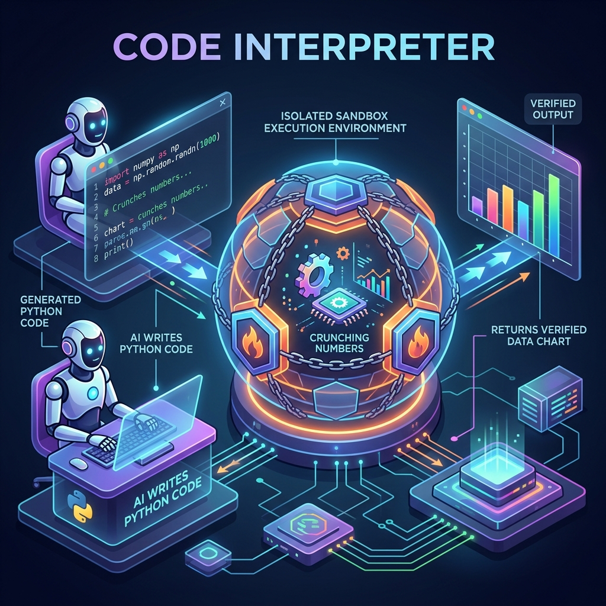

<!-- tags: glossary, agentic-ai, tools-capabilities -->
# Code Interpreter

> An LLM writing and running code in a sandbox to solve math or analyze data instead of guessing the answer.

| Aspect | Detail |
| --- | --- |
| **Domain** | Tools & Capabilities |
| **Used by** | AI engineer, backend developer, tech lead |
| **Related** | See RECOMMEND section |

📅 Created: 2026-04-28 · 🔄 Updated: 2026-05-07 · ⏱️ 5 min read

---

## 1. DEFINE

A **Code Interpreter** is a specialized capability where an LLM is given access to a secure, sandboxed execution environment (typically a Python REPL or container) to dynamically write, execute, and iterate on code. Instead of trying to solve complex logic internally, the LLM writes a script to solve the problem, runs it, reads the output or error logs, and returns the mathematically proven result to the user.

---

## 2. CONTEXT

**Who uses it**: AI Engineers, Data Scientists, and Platform Architects.
**When**: Building agents that perform data analysis, mathematical modeling, file conversions, or chart generation.
**Why it matters**: LLMs are fundamentally language models; they cannot natively do complex math or deterministic logic without hallucinating. A Code Interpreter offloads deterministic computation to a deterministic engine, drastically reducing reasoning errors.

---

## 3. EXAMPLES

### Example 1: The Iterative Execution Loop

When a user asks: "What is the 10,000th prime number?", a standard LLM will hallucinate a random number. An LLM equipped with a Code Interpreter will:
1. Write a Python script to calculate the 10,000th prime.
2. Execute the script in the sandbox.
3. Observe the output (`104729`).
4. Return the exact, verified answer to the user.

### Example 2: E2E Data Analysis

If a user uploads a CSV of sales data and asks for a forecast, the LLM will write `pandas` and `matplotlib` code to parse the CSV, run a linear regression, generate a PNG chart, and save it to the sandbox filesystem. It then returns the path to the generated image, acting as an autonomous data scientist.

---

## 4. COMPARE

| Feature | Code Interpreter | Standard Tool Use |
|---|---|---|
| **Logic Location** | Dynamically written by the LLM at runtime | Hardcoded by developers before runtime |
| **Flexibility** | Infinite (can solve any problem expressible in code) | Limited to the specific predefined functions |
| **Security Risk** | Very High (requires strict sandboxing/gVisor) | Low/Medium (limited to specific API scopes) |

---

## 5. REF

| Resource | Type | Link | Note |
| --- | --- | --- | --- |
| OpenAI Advanced Data Analysis | Product | https://openai.com/index/chatgpt-advanced-data-analysis/ | The most famous implementation |
| E2B | Framework | https://e2b.dev/ | Open-source secure sandboxes for AI agents |

---

## 6. RECOMMEND

| Explore next | When | Why | File/Link |
| --- | --- | --- | --- |
| Sandboxing | You are building a Code Interpreter | Sandboxing is absolutely critical to prevent remote code execution (RCE) attacks | [Sandboxing](../safety-alignment/126-sandboxing.md) |
| Tool Use | You need deterministic, safe API calls | Use standard tools when the logic is fixed and known | [Tool Use](./46-tool-use-function-calling.md) |

**Links**: [← Previous](./48-tool-registry.md) · [→ Next](./50-web-search-tool.md)
