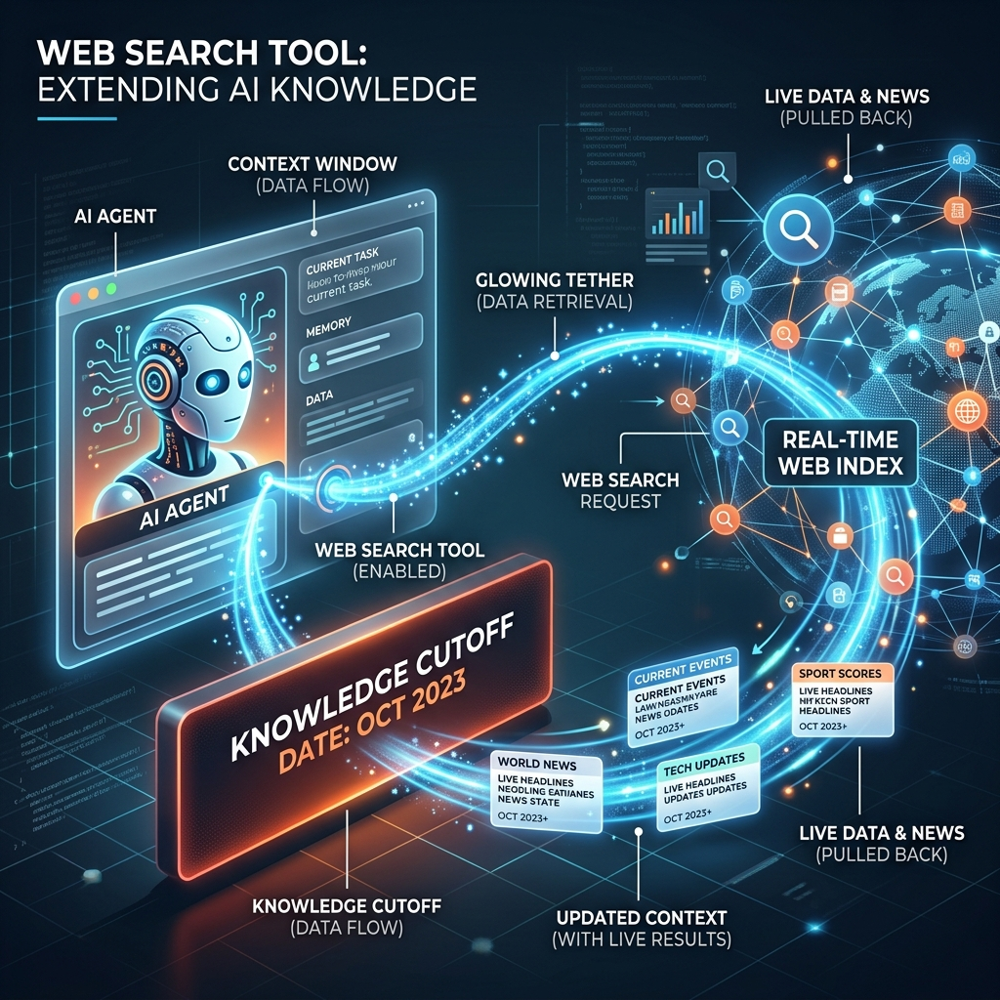

<!-- tags: glossary, agentic-ai, tools-capabilities -->
# Web Search Tool

> Allowing an agent to query Google/Bing to get real-time info beyond its training cutoff.

| Aspect | Detail |
| --- | --- |
| **Domain** | Tools & Capabilities |
| **Used by** | AI engineer, backend developer, tech lead |
| **Related** | See RECOMMEND section |

📅 Created: 2026-04-28 · 🔄 Updated: 2026-05-07 · ⏱️ 5 min read

---

## 1. DEFINE

A **Web Search Tool** is a foundational capability provided to an AI agent that allows it to query live internet search engines (like Google, Bing, or Tavily), retrieve up-to-date web pages, and inject current information into its context window. This bridges the gap between the model's static training data cutoff and real-time world events.

---

## 2. CONTEXT

**Who uses it**: AI Engineers building autonomous researchers or chatbots.
**When**: When users ask questions about current events, live stock prices, modern documentation, or anything that occurred after the model was trained.
**Why it matters**: It is the simplest and most effective way to prevent temporal hallucinations and ground model outputs in reality without building complex, custom databases.

---

## 3. EXAMPLES

### Example 1: Real-Time Grounding

When a user asks: "Who won the Super Bowl last night?", the LLM recognizes its training data does not contain this information.
1. It executes the Web Search Tool with the query: `"Super Bowl winner 2024"`.
2. The tool hits an API (e.g., Tavily Search) and returns snippets from top news articles.
3. The LLM reads the snippets, synthesizes the information, and provides an accurate, cited answer to the user.

---

## 4. COMPARE

| Feature | Web Search Tool | Retrieval-Augmented Generation (RAG) |
|---|---|---|
| **Data Source** | The entire public internet | A private, internal database of documents |
| **Latency** | Slower (requires live HTTP requests to search engines) | Faster (queries an internal vector database) |
| **Maintenance** | Zero maintenance (handled by the search engine) | High maintenance (requires data ingestion pipelines) |

---

## 5. REF

| Resource | Type | Link | Note |
| --- | --- | --- | --- |
| Tavily API | Service | https://tavily.com/ | A search engine built specifically for AI agents |
| Perplexity AI | Product | https://www.perplexity.ai/ | A consumer product showcasing the power of web search tools |

---

## 6. RECOMMEND

| Explore next | When | Why | File/Link |
| --- | --- | --- | --- |
| Browser Use | You need to navigate behind logins or interact with complex web apps | Web Search only reads public text; Browser Use interacts with the DOM | [Browser Use](./51-browser-use.md) |
| RAG | You need to search proprietary company data | Web Search cannot access internal enterprise documents | [RAG](./53-rag.md) |

**Links**: [← Previous](./49-code-interpreter.md) · [→ Next](./51-browser-use.md)
