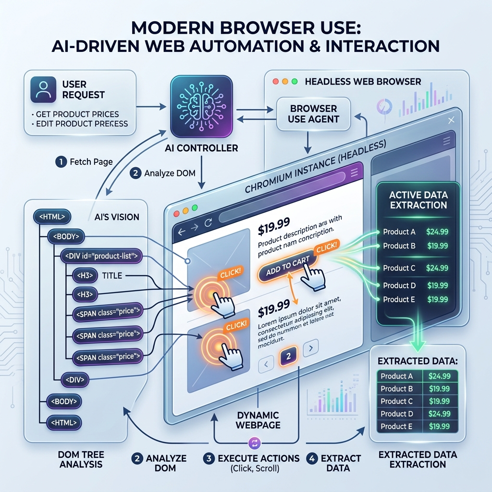

<!-- tags: glossary, agentic-ai, tools-capabilities -->
# Browser Use

> An agent operating a web browser like a human — clicking, typing, scrolling, and extracting DOM data.

| Aspect | Detail |
| --- | --- |
| **Domain** | Tools & Capabilities |
| **Used by** | AI engineer, QA automation, tech lead |
| **Related** | See RECOMMEND section |

📅 Created: 2026-04-28 · 🔄 Updated: 2026-05-07 · ⏱️ 5 min read

---

## 1. DEFINE

**Browser Use** is the capability of an AI agent to autonomously interact with web pages using a headless or visible browser instance (like Puppeteer or Playwright). Instead of relying on structured APIs, the agent reads the DOM (Document Object Model) or visual screenshots, formulates actions (click, type, scroll), and executes them, allowing it to navigate complex, authenticated, or dynamic Single Page Applications (SPAs).

---

## 2. CONTEXT

**Who uses it**: AI Engineers, RPA Developers.
**When**: Automating workflows on websites that lack official APIs, filling out complex forms, or conducting deep QA testing.
**Why it matters**: The vast majority of the world's digital infrastructure is designed for human GUI interaction, not machine API interaction. Browser Use unlocks the entire web for autonomous agents.

---

## 3. EXAMPLES

### Example 1: Autonomous Web Navigation

A user asks: "Cancel my subscription on ExampleCorp."
1. **Navigate**: The agent opens the browser and navigates to the login page.
2. **Interact**: It locates the username and password fields via the DOM, injects credentials from a vault, and clicks "Login".
3. **Navigate**: It searches the DOM for "Account Settings", clicks it, locates "Billing", and clicks "Cancel Subscription".
4. **Confirm**: It reads the confirmation modal and clicks "Yes". 

---

## 4. COMPARE

| Feature | Browser Use | Web Search Tool |
|---|---|---|
| **Mechanism** | Controls a browser (clicks, types) | Calls an API (Google, Tavily) |
| **Target** | Deep, interactive, authenticated web apps | Surface-level public text and news |
| **Speed/Cost** | Very slow and expensive | Fast and cheap |

---

## 5. REF

| Resource | Type | Link | Note |
| --- | --- | --- | --- |
| AgentBrowser | Framework | https://github.com/agent-browser | Open-source framework for browser control |
| MultiOn | Product | https://www.multion.ai/ | Commercial API for agentic browser use |

---

## 6. RECOMMEND

| Explore next | When | Why | File/Link |
| --- | --- | --- | --- |
| Computer Use | You need to interact outside the browser | Computer Use controls the entire OS, not just the DOM | [Computer Use](./52-computer-use.md) |
| Web Search Tool | You just need basic information | Don't use a heavy browser to just read public text | [Web Search Tool](./50-web-search-tool.md) |

**Links**: [← Previous](./50-web-search-tool.md) · [→ Next](./52-computer-use.md)
