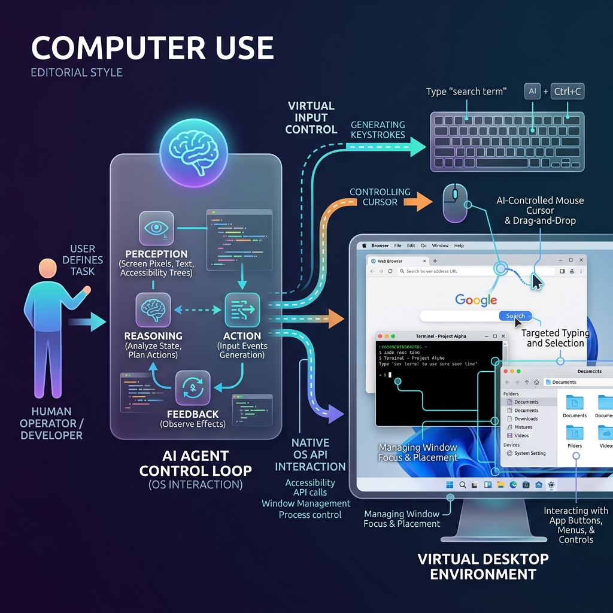

<!-- tags: glossary, agentic-ai, tools-capabilities -->
# Computer Use

> An agent controlling a full desktop OS — moving the mouse, typing on the keyboard, and opening native apps.

| Aspect | Detail |
| --- | --- |
| **Domain** | Tools & Capabilities |
| **Used by** | AI engineer, RPA developer, tech lead |
| **Related** | See RECOMMEND section |

📅 Created: 2026-04-28 · 🔄 Updated: 2026-05-07 · ⏱️ 5 min read

---

## 1. DEFINE

**Computer Use** is an advanced capability where an AI agent interacts directly with a host operating system's graphical user interface (GUI). Unlike Browser Use, which is constrained to the DOM of a web page, Computer Use allows the agent to visually perceive the screen, move the mouse cursor, emit keystrokes, and interact with native desktop applications (like Excel, Terminal, or legacy software) exactly as a human would.

---

## 2. CONTEXT

**Who uses it**: AI Engineers and Enterprise Automation Architects.
**When**: Automating legacy desktop systems, cross-application workflows (e.g., copying data from a PDF into a local ERP system), or comprehensive software testing.
**Why it matters**: It is the ultimate form of automation. If a human can do it on a computer, an agent with Computer Use can (theoretically) do it, entirely bypassing the need for integrations or APIs.

---

## 3. EXAMPLES

### Example 1: Cross-Application Workflow

A user says: "Update the Q3 financial presentation with the new numbers."
1. **Action**: The agent opens the local File Explorer and navigates to the "Q3 Reports" folder.
2. **Action**: It double-clicks `Financials.xlsx` and reads the new revenue numbers from the spreadsheet.
3. **Action**: It opens PowerPoint, navigates to slide 4, clicks on the revenue text box, deletes the old number, and types the new one.
4. **Action**: It saves the file and closes both applications.

---

## 4. COMPARE

| Feature | Computer Use | Browser Use |
|---|---|---|
| **Scope** | The entire Operating System | Constrained to Web Browsers |
| **Input Method** | Virtual mouse movements and keystrokes | DOM manipulation and Javascript injection |
| **Perception** | Relies heavily on visual screenshots / VLM | Relies primarily on HTML/DOM trees |

---

## 5. REF

| Resource | Type | Link | Note |
| --- | --- | --- | --- |
| Anthropic Computer Use | Feature | https://docs.anthropic.com/en/docs/computer-use | Claude's native OS interaction capability |
| OS-Copilot | Research | https://os-copilot.github.io/ | Open-source framework for OS control |

---

## 6. RECOMMEND

| Explore next | When | Why | File/Link |
| --- | --- | --- | --- |
| Browser Use | You only need to interact with websites | Browser Use is much more reliable than full OS control | [Browser Use](./51-browser-use.md) |
| Code Interpreter | You need to do math or data transformations | Code is faster and more deterministic than GUI automation | [Code Interpreter](./49-code-interpreter.md) |

**Links**: [← Previous](./51-browser-use.md) · [→ Next](./53-rag.md)
