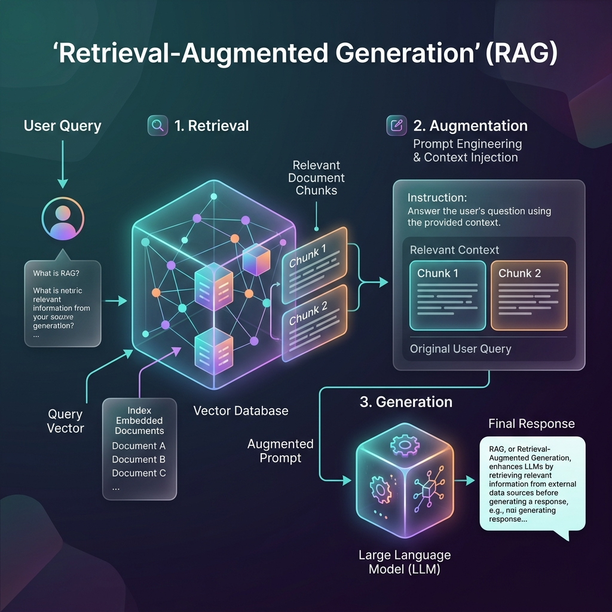

<!-- tags: glossary, agentic-ai, tools-capabilities -->
# RAG (Retrieval-Augmented Generation)

> Searching a private database for relevant documents and pasting them into the LLM's prompt so it can answer questions about them.

| Aspect | Detail |
| --- | --- |
| **Domain** | Tools & Capabilities |
| **Used by** | AI engineer, backend developer, tech lead |
| **Related** | See RECOMMEND section |

📅 Created: 2026-04-28 · 🔄 Updated: 2026-05-07 · ⏱️ 5 min read

---

## 1. DEFINE

**RAG (Retrieval-Augmented Generation)** is an architectural pattern that improves the accuracy and reliability of generative AI models by fetching facts from an external knowledge base before generating a response. Instead of relying solely on its internal training data, the system first retrieves the most relevant documents related to the user's query and injects them directly into the context window, grounding the LLM's answer in verifiable truth.

---

## 2. CONTEXT

**Who uses it**: Backend Engineers, AI Developers, and Enterprise Architects.
**When**: Building enterprise chatbots, internal knowledge bases, or customer support agents that need to answer questions about proprietary company data.
**Why it matters**: RAG is the industry standard solution for overcoming the two biggest limitations of LLMs: hallucinations (making things up) and the knowledge cutoff (not knowing recent or private information).

---

## 3. EXAMPLES

### Example 1: The RAG Pipeline

When an employee asks an internal HR bot: "What is the new remote work policy?", a standard LLM will hallucinate. A RAG pipeline will:
1. **Retrieve**: Search the company's Vector Database for chunks of text matching "remote work policy".
2. **Augment**: Take the top 3 retrieved chunks (e.g., from a PDF uploaded yesterday) and inject them into a Prompt Template: `Context: {chunks} Question: {user_query}`.
3. **Generate**: The LLM reads the fresh context and outputs an accurate, cited response based *only* on the provided policy documents.

---

## 4. COMPARE

| Feature | RAG | Fine-Tuning |
|---|---|---|
| **Purpose** | Adding new knowledge / facts | Changing model behavior / tone |
| **Data Update Speed** | Instant (just add a document to the DB) | Slow (requires retraining the model) |
| **Cost** | Low (database storage + inference) | High (GPU compute time) |
| **Citations** | Yes, can cite exact source documents | No, knowledge is baked into weights |

---

## 5. REF

| Resource | Type | Link | Note |
| --- | --- | --- | --- |
| LangChain RAG Docs | Guide | https://python.langchain.com/docs/use_cases/question_answering/ | The standard framework for building RAG |
| LlamaIndex | Framework | https://www.llamaindex.ai/ | The leading data framework for connecting custom data to LLMs |

---

## 6. RECOMMEND

| Explore next | When | Why | File/Link |
| --- | --- | --- | --- |
| Vector Database | You need to store the documents | Vector DBs are the storage engine powering RAG | [Vector Database](./54-vector-database.md) |
| Semantic Search | You need to retrieve the documents | Semantic search is the retrieval mechanism in RAG | [Semantic Search](./55-semantic-search.md) |

**Links**: [← Previous](./52-computer-use.md) · [→ Next](./54-vector-database.md)
