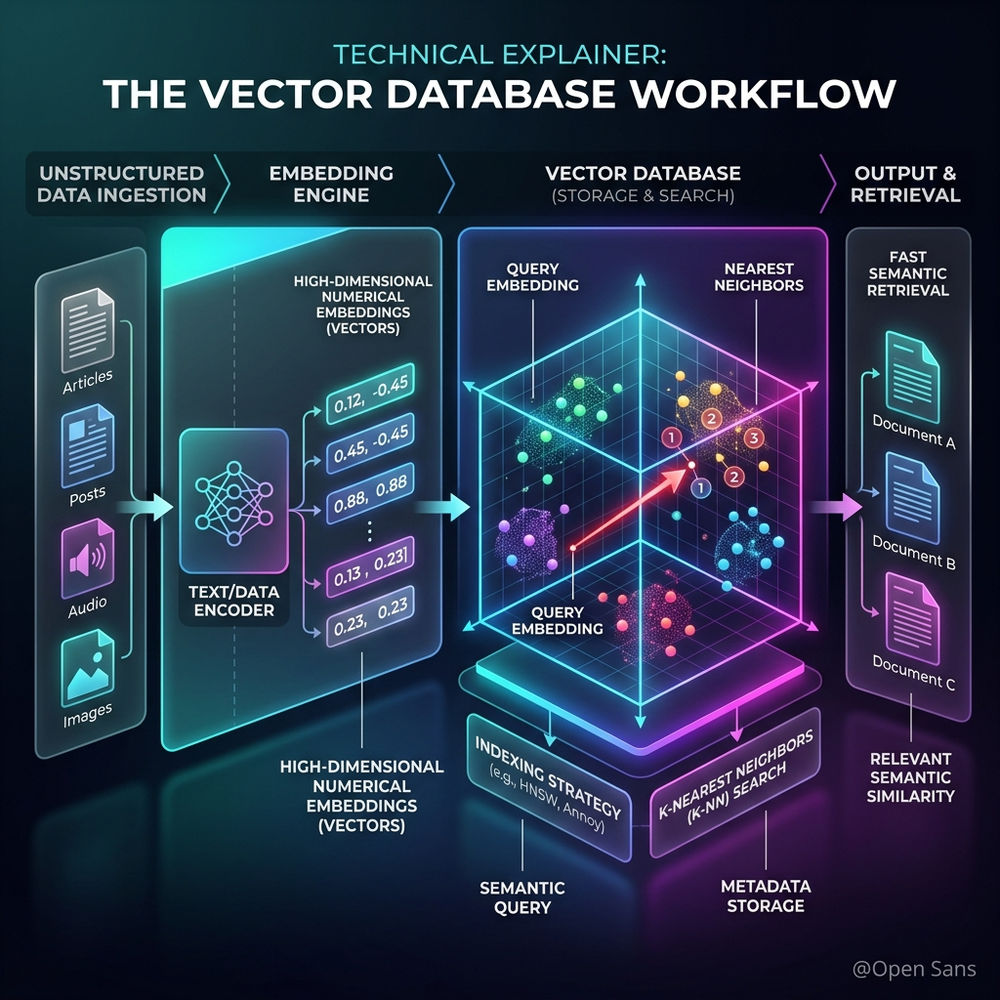

<!-- tags: glossary, agentic-ai, tools-capabilities -->
# Vector Database

> A specialized database that stores unstructured data (text, images) as high-dimensional math arrays (vectors) for semantic similarity searches.

| Aspect | Detail |
| --- | --- |
| **Domain** | Tools & Capabilities |
| **Used by** | Backend developer, data engineer, AI architect |
| **Related** | See RECOMMEND section |

📅 Created: 2026-04-28 · 🔄 Updated: 2026-05-07 · ⏱️ 5 min read

---

## 1. DEFINE

A **Vector Database** is a specialized storage and retrieval engine designed to handle vector embeddings—high-dimensional mathematical arrays that represent the semantic meaning of unstructured data like text, images, or audio. Unlike traditional relational databases that query by exact keyword matches (SQL), a Vector Database queries by measuring the mathematical distance (e.g., cosine similarity) between vectors, allowing it to find data that is *conceptually* similar to a query.

---

## 2. CONTEXT

**Who uses it**: Backend Engineers, Data Engineers, and AI Architects.
**When**: Building the storage layer for RAG (Retrieval-Augmented Generation), semantic search engines, or recommendation systems.
**Why it matters**: LLMs understand the world through vectors. Vector databases provide the scalable infrastructure to index, search, and manage billions of these vectors efficiently, which is the backbone of modern AI memory and knowledge retrieval.

---

## 3. EXAMPLES

### Example 1: Semantic Storage

A company has 10,000 PDF documents.
1. **Embedding**: They pass every paragraph of the PDFs through an embedding model (like `text-embedding-3-small`), converting the text into arrays of 1536 numbers (vectors).
2. **Storage**: These vectors are inserted into a Vector Database (like Pinecone or Milvus) alongside metadata (e.g., `{"author": "Jane", "date": "2024"}`).
3. **Retrieval**: When a user searches for "housing market trends", the query is also turned into a vector. The database mathematically finds the closest vectors in space, returning paragraphs about "real estate price fluctuations"—even if the exact words "housing market" aren't in the text.

---

## 4. COMPARE

| Feature | Vector Database | Relational Database (SQL) |
|---|---|---|
| **Data Type** | High-dimensional numerical arrays (Embeddings) | Structured tables (Rows and Columns) |
| **Search Mechanism** | Approximate Nearest Neighbor (ANN) / Distance | Exact Match / Boolean Logic / LIKE |
| **Primary Use Case** | Semantic Search, RAG | Transactional Data, Analytics |

---

## 5. REF

| Resource | Type | Link | Note |
| --- | --- | --- | --- |
| Pinecone | Product | https://www.pinecone.io/ | A leading managed Vector Database |
| Milvus | Product | https://milvus.io/ | Open-source, highly scalable Vector Database |

---

## 6. RECOMMEND

| Explore next | When | Why | File/Link |
| --- | --- | --- | --- |
| RAG | You are storing vectors to build a chatbot | Vector DBs are the storage backend for RAG | [RAG](./53-rag.md) |
| Semantic Search | You want to understand how the vectors are queried | Vector databases execute semantic searches | [Semantic Search](./55-semantic-search.md) |

**Links**: [← Previous](./53-rag.md) · [→ Next](./55-semantic-search.md)
