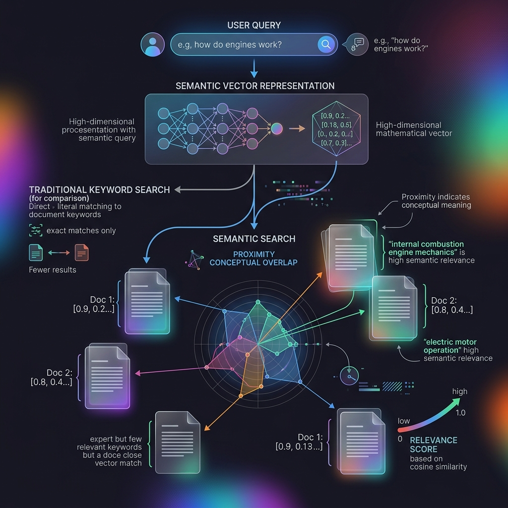

<!-- tags: glossary, agentic-ai, tools-capabilities -->
# Semantic Search

> Searching by the actual meaning and concept of a phrase, rather than just matching exact keywords.

| Aspect | Detail |
| --- | --- |
| **Domain** | Tools & Capabilities |
| **Used by** | AI engineer, backend developer, tech lead |
| **Related** | See RECOMMEND section |

📅 Created: 2026-04-28 · 🔄 Updated: 2026-05-07 · ⏱️ 5 min read

---

## 1. DEFINE

**Semantic Search** is an advanced information retrieval technique that aims to understand the context, intent, and conceptual meaning behind a search query, rather than relying on exact keyword matching. It achieves this by converting both the documents and the search query into vector embeddings and calculating their proximity in high-dimensional mathematical space. 

---

## 2. CONTEXT

**Who uses it**: AI Engineers and Search Architects.
**When**: Designing search experiences for documentation, e-commerce, or the retrieval step in a RAG pipeline.
**Why it matters**: Human language is ambiguous. Traditional search fails when users use synonyms or describe concepts loosely. Semantic search bridges this gap, providing vastly superior user experiences and significantly improving the recall accuracy of AI agents.

---

## 3. EXAMPLES

### Example 1: Conceptual Overlap

A user queries an internal wiki: `"How do I fix the broken screen on my iPhone?"`
- A **Keyword Search** might return a document titled: *"How to fix a broken script in python."* (Matches "How", "fix", "broken").
- A **Semantic Search** understands the concept is *mobile hardware repair*. It returns a document titled: *"Apple Smartphone Display Replacement Guide."* (Zero exact keyword overlap, but 100% semantic overlap).

---

## 4. COMPARE

| Feature | Semantic Search | Lexical (Keyword) Search |
|---|---|---|
| **Mechanism** | Vector Embeddings (Math) | Inverted Index / BM25 (Text) |
| **Handles Synonyms?** | Yes, automatically (e.g., "puppy" = "dog") | No, requires manual synonym dictionaries |
| **Handles Typos?** | Yes, robust to minor variations | Poorly, requires fuzzy matching logic |
| **Weakness** | Can struggle with exact identifiers (IDs, SKUs) | Excellent for exact identifiers |

---

## 5. REF

| Resource | Type | Link | Note |
| --- | --- | --- | --- |
| Sentence Transformers | Library | https://sbert.net/ | The standard library for computing semantic embeddings |
| Cohere Embed | API | https://cohere.com/embeddings | Leading commercial embedding model for search |

---

## 6. RECOMMEND

| Explore next | When | Why | File/Link |
| --- | --- | --- | --- |
| Hybrid Search | You need the best of both worlds | Semantic search struggles with exact SKUs; Hybrid fixes this | [Hybrid Search](./56-hybrid-search.md) |
| Vector Database | You need to scale semantic search | Vector DBs are the engine that run semantic search | [Vector Database](./54-vector-database.md) |

**Links**: [← Previous](./54-vector-database.md) · [→ Next](./56-hybrid-search.md)
