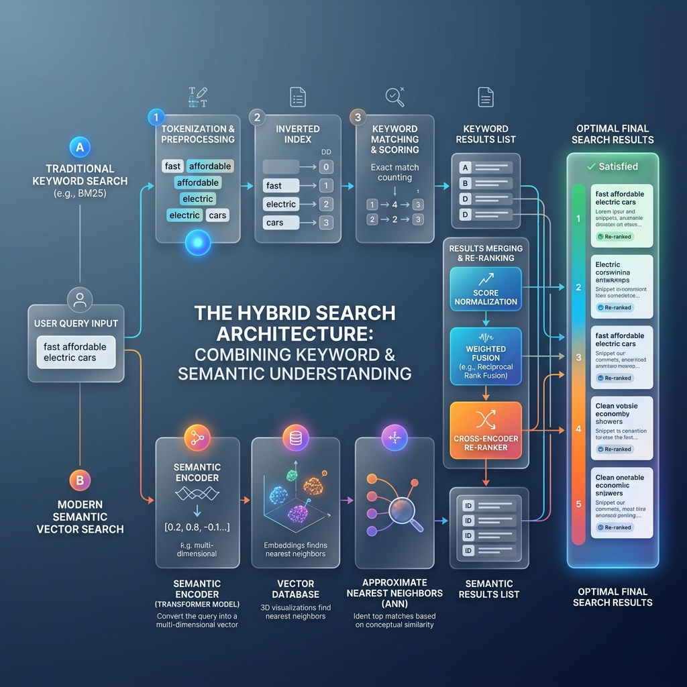

<!-- tags: glossary, agentic-ai, tools-capabilities -->
# Hybrid Search

> Combining keyword search (exact matches) with semantic search (conceptual meaning) to get the best of both worlds.

| Aspect | Detail |
| --- | --- |
| **Domain** | Tools & Capabilities |
| **Used by** | AI engineer, backend developer, tech lead |
| **Related** | See RECOMMEND section |

📅 Created: 2026-04-28 · 🔄 Updated: 2026-05-07 · ⏱️ 5 min read

---

## 1. DEFINE

**Hybrid Search** is an advanced information retrieval architecture that combines traditional lexical/keyword search (e.g., BM25) with modern vector-based semantic search. The system executes both searches in parallel, normalizes the distinct scoring algorithms, and merges the results into a single, highly accurate ranked list.

---

## 2. CONTEXT

**Who uses it**: Backend Engineers, Search Architects, and Data Scientists.
**When**: Building production-grade search engines or enterprise RAG pipelines where both conceptual understanding and exact term matching are mission-critical.
**Why it matters**: Semantic search is great for concepts but terrible at finding specific exact identifiers (like an error code `ERR-404-XYZ` or a specific SKU number `PROD-9921`). Keyword search is great for exact identifiers but fails on synonyms. Hybrid search eliminates the weaknesses of both.

---

## 3. EXAMPLES

### Example 1: Parallel Execution and Re-ranking

A user searches a technical support base for: `"Restarting the AC-Router-v2 after power failure"`
1. **Keyword Search (BM25)**: Looks for the exact string `AC-Router-v2`. It finds the specific product manual.
2. **Semantic Search (Vector)**: Looks for the concept of "rebooting after an outage". It finds general troubleshooting guides for network drops.
3. **Fusion (e.g., Reciprocal Rank Fusion - RRF)**: The system combines both lists. The document that scores highly in *both* (the specific `AC-Router-v2` reboot guide) is pushed to the #1 spot, providing the perfect answer.

---

## 4. COMPARE

| Feature | Hybrid Search | Semantic Search | Lexical Search (BM25) |
|---|---|---|---|
| **Strengths** | Best overall accuracy; handles exact IDs and concepts | Concept matching, synonyms, cross-lingual | Exact phrase matching, part numbers, fast |
| **Weaknesses** | High computational cost, complex to tune | Poor with exact IDs and out-of-vocabulary terms | Fails on synonyms, typos, and paraphrasing |

---

## 5. REF

| Resource | Type | Link | Note |
| --- | --- | --- | --- |
| Reciprocal Rank Fusion (RRF) | Algorithm | https://plg.uwaterloo.ca/~gvcormac/cormacksigir09-rrf.pdf | The standard algorithm for merging search scores |
| Weaviate Hybrid Search | Guide | https://weaviate.io/developers/weaviate/search/hybrid | An excellent implementation of hybrid search |

---

## 6. RECOMMEND

| Explore next | When | Why | File/Link |
| --- | --- | --- | --- |
| Semantic Search | You want to understand the vector component | Semantic search is half of the hybrid equation | [Semantic Search](./55-semantic-search.md) |
| RAG | You are building the retrieval step | Hybrid search is the gold standard retrieval method for RAG | [RAG](./53-rag.md) |

**Links**: [← Previous](./55-semantic-search.md) · [→ Next](../README.md)
