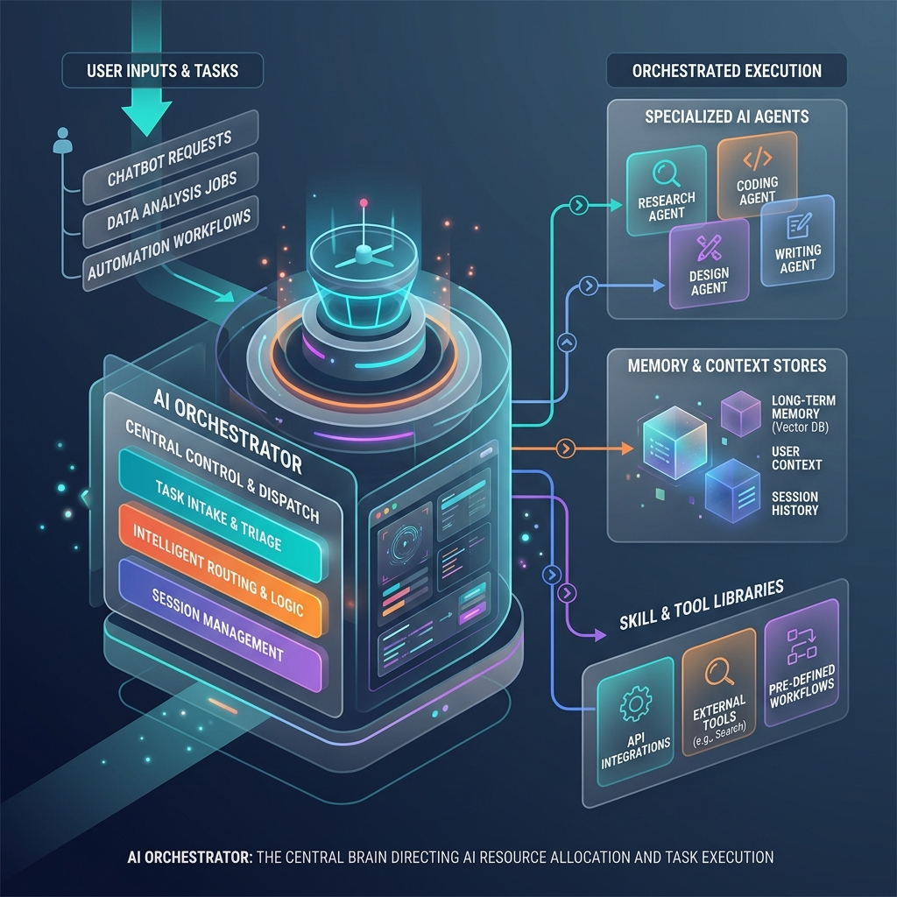

<!-- tags: glossary, agentic-ai, workflow-orchestration, ai-orchestrator -->
# AI Orchestrator

> The central control plane that manages the execution of workflows, routes tasks to appropriate agents or skills, handles state persistence, and manages error recovery.

| Aspect | Detail |
| --- | --- |
| **Domain** | Workflow Orchestration |
| **Used by** | AI architect, platform engineer |
| **Related** | Workflow, DAG, Multi-Agent Systems |

📅 Created: 2026-04-28 · 🔄 Updated: 2026-05-06 · ⏱️ 5 min read

---

## 1. DEFINE

While an individual [AI Agent](../agentic-core/34-ai-agent.md) can reason and execute tasks, building enterprise software requires coordinating many agents, managing memory across sessions, and ensuring the system doesn't crash if a single API call fails.

An **AI Orchestrator** is the overarching framework or engine that governs this ecosystem. It acts as the "air traffic controller." It does not generate text itself; rather, it receives user inputs, spins up the correct agents, manages the state (memory) moving between them, enforces [Human-in-the-Loop](../agentic-core/44-human-in-the-loop.md) checkpoints, and handles retries when tools fail.

Modern orchestrators treat agentic systems as complex graphs or state machines.

---

## 2. CONTEXT

**Who uses it**: AI architects defining the infrastructure for production-grade AI applications.

**When**: Essential as soon as an application moves beyond a simple, single-prompt chatbot.

**In this ecosystem**:
- Popular orchestrator frameworks include LangGraph, AutoGen, and CrewAI.
- Orchestrators execute [Workflows](./64-workflow.md) often modeled as a [DAG](./65-dag.md).
- They handle [Skill Routing](../skills-plugins/108-skill-routing.md).

---

## 3. EXAMPLES

*Figure: An AI Orchestrator acts as the central control plane, receiving tasks and directing traffic between various specialized agents, memory stores, and skill libraries.*

### Example 1: The Multi-Agent Orchestrator
A user requests a deep-dive market research report. The Orchestrator receives the request. It first calls the `Research_Agent` to gather data. The Orchestrator stores the results in its state. It then routes the state to the `Writer_Agent` to draft the report. Finally, it routes the draft to a `Reviewer_Agent`. If the reviewer rejects it, the Orchestrator routes it back to the writer.

### Example 2: Fault Tolerance
An agent attempts to call an external API and fails due to a rate limit. The LLM might panic, but the Orchestrator intercepts the error, applies a predefined [Retry Policy](./70-retry-policy.md) with exponential backoff, and resumes the agent when the API is available.

---

## 4. COMPARE

| | AI Orchestrator | AI Agent | Foundation Model (LLM) |
|--|---|---|---|
| **Role** | Air traffic control | The pilot | The engine |
| **Output** | Control flow and state management | Actions and decisions | Text / Token probabilities |
| **Determinism** | High (Code-based rules) | Medium (Prompt-based logic) | Low (Probabilistic) |

---

## 5. REF

| Resource | Type | Link | Note |
| --- | --- | --- | --- |
| LangGraph Concepts | Framework | https://langchain-ai.github.io/langgraph/concepts/ | A leading framework for building stateful orchestrators |
| Microsoft AutoGen | Framework | https://microsoft.github.io/autogen/ | A framework focused on conversational multi-agent orchestration |

---

## 6. RECOMMEND

| Explore next | When | Why | File/Link |
| --- | --- | --- | --- |
| Workflow | You want to define what the orchestrator manages | Workflows are the rules the orchestrator follows | [Workflow](./64-workflow.md) |
| DAG | You are designing complex dependencies | Orchestrators often compile workflows into DAGs | [DAG](./65-dag.md) |
| Multi-Agent Systems | You are coordinating multiple agents | Orchestrators manage multi-agent topologies | [Multi-Agent Systems](../multi-agent-systems/README.md) |

**Links**: [← Previous](./README.md) · [→ Next](./64-workflow.md)
