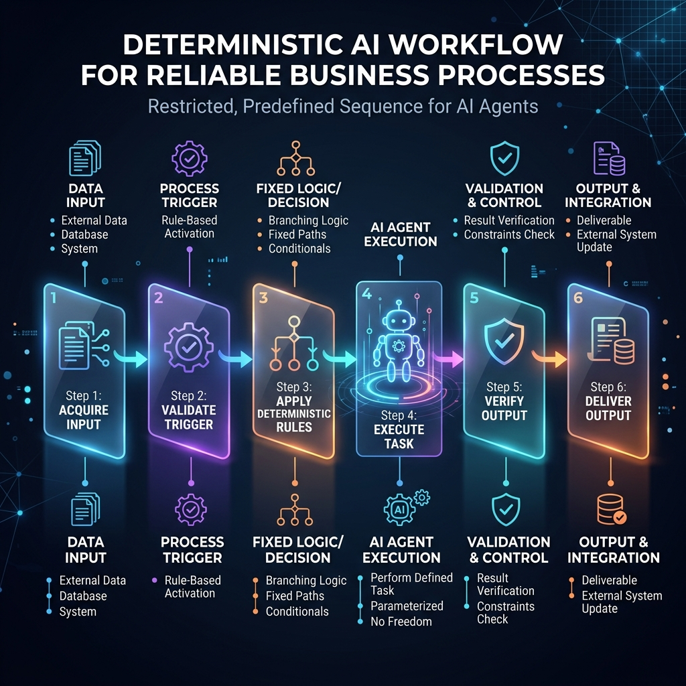

<!-- tags: glossary, agentic-ai, workflow-orchestration, workflow -->
# Workflow

> A defined, repeatable sequence of steps or tasks that an agentic system executes to achieve a specific goal, bringing determinism to non-deterministic models.

| Aspect | Detail |
| --- | --- |
| **Domain** | Workflow Orchestration |
| **Used by** | AI engineer, product manager |
| **Related** | AI Orchestrator, Pipeline, DAG |

📅 Created: 2026-04-28 · 🔄 Updated: 2026-05-06 · ⏱️ 5 min read

---

## 1. DEFINE

Large Language Models are inherently non-deterministic; if you give them a massive prompt and ask them to perform 10 complex steps, they might skip step 4 or execute step 8 out of order.

A **Workflow** is the architectural countermeasure to this unreliability. It is a predefined, code-enforced roadmap that dictates the exact sequence of events. By breaking a large goal into a structured Workflow, developers restrict the LLM's freedom, forcing it to complete specific [Steps](./67-step-node.md) in a specific order.

Workflows ensure that business logic is executed reliably, safely, and consistently, blending the intelligence of AI with the determinism of traditional software.

---

## 2. CONTEXT

**Who uses it**: AI engineers and product managers translating business requirements into reliable AI features.

**When**: Used whenever a task requires guaranteed execution order, specific validation checkpoints, or interactions with critical external systems.

**In this ecosystem**:
- Workflows are executed by an [AI Orchestrator](./63-ai-orchestrator.md).
- They can take the shape of a simple [Pipeline](./66-pipeline.md) or a complex [DAG](./65-dag.md).
- They often incorporate [Conditional Branching](./69-conditional-branching.md) based on LLM decisions.

---

## 3. EXAMPLES

*Figure: A conceptual diagram of a Workflow, showing a predefined, repeatable sequence of steps that guide an AI agent through a deterministic business process.*

### Example 1: Customer Support Triage
An open-ended agent might try to solve a refund request by guessing the database commands.
A structured **Workflow** enforces this sequence:
1.  **Extract Intent**: LLM determines if the user wants a refund.
2.  **Verify Policy**: System checks DB if the purchase is < 30 days old.
3.  **Calculate Amount**: System calculates the refund minus fees.
4.  **Draft Email**: LLM drafts the communication.
The LLM is only utilized for steps 1 and 4. The Workflow handles the orchestration and ensures step 4 never happens before step 2.

### Example 2: The Coding Assistant
Instead of asking an LLM to "build a website," a developer creates a workflow: `Plan Architecture -> Review Plan -> Write HTML -> Write CSS -> Write JS -> Run Tests`. The workflow halts if the tests fail, looping back to the JS step.

---

## 4. COMPARE

| | Workflow | Autonomous Agent | Pipeline |
|--|---|---|---|
| **Structure** | Predefined path, allows branching | Dynamic, self-determined path | Strictly linear |
| **Predictability** | Very High | Low | Maximum |
| **Flexibility** | Medium (can handle expected edge cases) | High (can handle novel situations) | None |

---

## 5. REF

| Resource | Type | Link | Note |
| --- | --- | --- | --- |
| Building Effective Agents (Anthropic) | Guide | https://www.anthropic.com/engineering/building-effective-agents | Discusses the spectrum from strict workflows to autonomous agents |

---

## 6. RECOMMEND

| Explore next | When | Why | File/Link |
| --- | --- | --- | --- |
| Pipeline | Your workflow is strictly linear | A pipeline is the simplest workflow | [Pipeline](./66-pipeline.md) |
| DAG | Your workflow has parallel tasks | DAGs model complex dependencies | [DAG](./65-dag.md) |
| Conditional Branching | Your workflow needs decisions | Branching allows workflows to handle dynamic inputs | [Conditional Branching](./69-conditional-branching.md) |

**Links**: [← Previous](./63-ai-orchestrator.md) · [→ Next](./65-dag.md)
