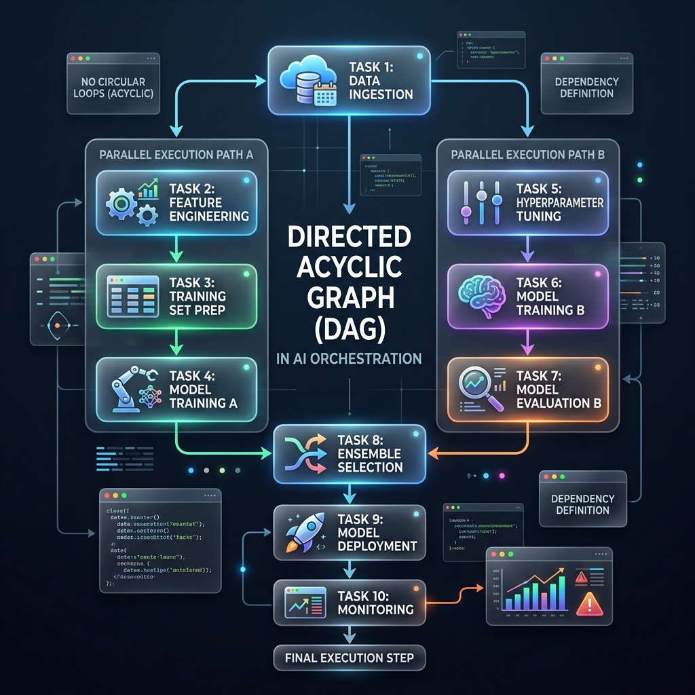

<!-- tags: glossary, agentic-ai, workflow-orchestration, dag -->
# DAG (Directed Acyclic Graph)

> A mathematical structure used to model workflows where tasks (nodes) are connected by directional dependencies (edges), strictly forbidding circular loops.

| Aspect | Detail |
| --- | --- |
| **Domain** | Workflow Orchestration |
| **Used by** | Data engineer, AI architect |
| **Related** | Parallel Execution, Workflow, Pipeline |

📅 Created: 2026-04-28 · 🔄 Updated: 2026-05-06 · ⏱️ 5 min read

---

## 1. DEFINE

A **DAG (Directed Acyclic Graph)** is the foundational data structure used by orchestrators to define how a complex workflow should execute. 

It breaks down into three rules:
1.  **Graph**: It consists of tasks (nodes) connected by relationships (edges).
2.  **Directed**: The relationships have a strict direction (Task A *must finish before* Task B).
3.  **Acyclic**: It cannot contain loops. Task B cannot depend on Task A if Task A depends on Task B (which would create an infinite deadlock).

In AI orchestration, modeling a workflow as a DAG allows the system to instantly calculate dependencies, knowing exactly which tasks must run sequentially and which can be run using [Parallel Execution](./68-parallel-execution.md) to save time.

---

## 2. CONTEXT

**Who uses it**: Data engineers and AI architects building highly optimized, complex multi-step processes.

**When**: Used when a workflow has tasks that can be done simultaneously, rather than forcing a slow, linear pipeline.

**In this ecosystem**:
- A DAG is the logic engine underneath an [AI Orchestrator](./63-ai-orchestrator.md).
- It enables safe [Parallel Execution](./68-parallel-execution.md).
- Contrast this with state machines (like LangGraph) which *do* allow cycles (loops) for iterative agentic reflection.

---

## 3. EXAMPLES

*Figure: A Directed Acyclic Graph showing distinct task nodes connected by directional arrows, illustrating parallel paths merging into a final execution step without any loops.*

### Example 1: The Research Report
An AI system must write a comprehensive profile on a company. 
*   **Node A**: Extract company name from user prompt.
*   **Node B**: Search SEC filings for financial data (Depends on A).
*   **Node C**: Search news APIs for recent scandals (Depends on A).
*   **Node D**: Combine B and C into a final report (Depends on B and C).
Because this is a DAG, the orchestrator knows it can run Node B and Node C at the exact same time, cutting the LLM latency in half.

### Example 2: Preventing Deadlocks
A developer accidentally codes: "To write the code, review the tests. To write the tests, review the code." A DAG compiler will immediately throw a cyclic dependency error before execution, preventing the agents from getting stuck in an infinite waiting loop.

---

## 4. COMPARE

| | DAG (Directed Acyclic Graph) | Pipeline | State Machine |
|--|---|---|---|
| **Structure** | Branching and merging paths | Strictly linear (A -> B -> C) | Nodes connected by conditions |
| **Loops (Cycles)** | Strictly Forbidden | Forbidden | Allowed and expected |
| **Best For** | Complex parallel tasks, ETL | Simple, sequential transformations | Iterative refinement, agentic loops |

---

## 5. REF

| Resource | Type | Link | Note |
| --- | --- | --- | --- |
| Apache Airflow Concepts | Docs | https://airflow.apache.org/docs/apache-airflow/stable/core-concepts/dags.html | The industry standard explanation of DAGs for task orchestration |

---

## 6. RECOMMEND

| Explore next | When | Why | File/Link |
| --- | --- | --- | --- |
| Parallel Execution | You want to optimize the DAG | DAGs enable tasks to run concurrently | [Parallel Execution](./68-parallel-execution.md) |
| Pipeline | Your DAG has no branches | A linear DAG is just a pipeline | [Pipeline](./66-pipeline.md) |
| Conditional Branching | The DAG needs logic | Nodes in a DAG can conditionally execute paths | [Conditional Branching](./69-conditional-branching.md) |

**Links**: [← Previous](./64-workflow.md) · [→ Next](./66-pipeline.md)
