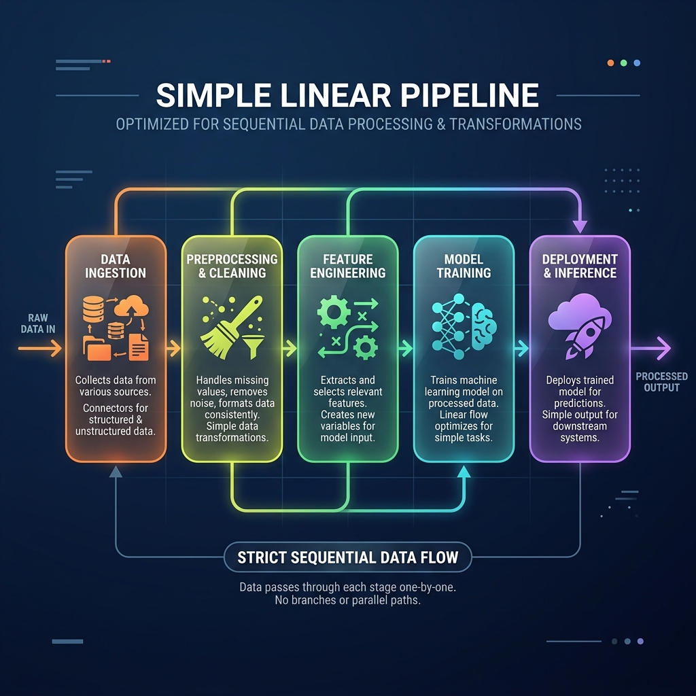

<!-- tags: glossary, agentic-ai, workflow-orchestration, pipeline -->
# Pipeline

> A strictly linear workflow where the output of one step becomes the direct input of the next, optimizing for simple, predictable data transformations.

| Aspect | Detail |
| --- | --- |
| **Domain** | Workflow Orchestration |
| **Used by** | Data engineer, backend developer |
| **Related** | Workflow, DAG, Step / Node |

📅 Created: 2026-04-28 · 🔄 Updated: 2026-05-06 · ⏱️ 5 min read

---

## 1. DEFINE

A **Pipeline** is the simplest form of a workflow. It is a strictly sequential chain of operations where data flows in one direction: from start to finish. The output of Step A is piped directly into Step B, and the output of Step B goes to Step C.

In AI engineering, pipelines are heavily used for data preparation and processing (like RAG ingestion) because they are highly predictable, easy to debug, and simple to monitor. Unlike a DAG, a strict pipeline does not branch or run tasks in parallel.

---

## 2. CONTEXT

**Who uses it**: Data engineers preparing data for LLMs, and backend developers building straightforward AI endpoints.

**When**: Used when the process is a direct assembly line of transformations with no need for complex decision-making, branching, or agentic autonomy.

**In this ecosystem**:
- It is a subset of a [Workflow](./64-workflow.md).
- It is the defining architecture of RAG (Retrieval-Augmented Generation) ingestion.
- Contrast with a [DAG](./65-dag.md), which handles complex parallel dependencies.

---

## 3. EXAMPLES

*Figure: A Pipeline depicted as a linear assembly line, where data flows sequentially from one processing node to the next.*

### Example 1: The RAG Ingestion Pipeline
To feed PDF documents into an AI's memory, developers use a classic linear pipeline:
1.  **Extract**: Read the raw text from the PDF.
2.  **Chunk**: Split the text into 500-word paragraphs.
3.  **Embed**: Send the chunks to an LLM to generate vector embeddings.
4.  **Load**: Save the embeddings into a Vector Database.
If step 2 fails, step 3 cannot proceed. The process is strictly linear.

### Example 2: The Summarization Pipeline
A news aggregator uses an LLM pipeline to process incoming articles:
`Scrape HTML -> Strip Tags -> Prompt LLM for Summary -> Translate to Spanish -> Save to DB`.

---

## 4. COMPARE

| | Pipeline | DAG | Agentic Loop |
|--|---|---|---|
| **Structure** | Linear (A -> B -> C) | Branching (A -> B & C -> D) | Circular (A -> B -> A) |
| **Complexity** | Low | Medium to High | High |
| **Primary Use** | Data transformation, ETL | Complex workflows, parallel tasks | Reasoning, autonomous problem solving |

---

## 5. REF

| Resource | Type | Link | Note |
| --- | --- | --- | --- |
| LlamaIndex Ingestion Pipeline | Docs | https://docs.llamaindex.ai/en/stable/module_guides/loading/ingestion_pipeline/ | An industry-standard implementation of AI data pipelines |

---

## 6. RECOMMEND

| Explore next | When | Why | File/Link |
| --- | --- | --- | --- |
| Step / Node | You are building the pipeline | A pipeline is made up of sequential steps | [Step / Node](./67-step-node.md) |
| DAG | You need steps to run at the same time | Moving from a linear pipeline to a parallel DAG | [DAG](./65-dag.md) |
| Workflow | You want to add business logic | Workflows encompass pipelines and add routing | [Workflow](./64-workflow.md) |

**Links**: [← Previous](./65-dag.md) · [→ Next](./67-step-node.md)
