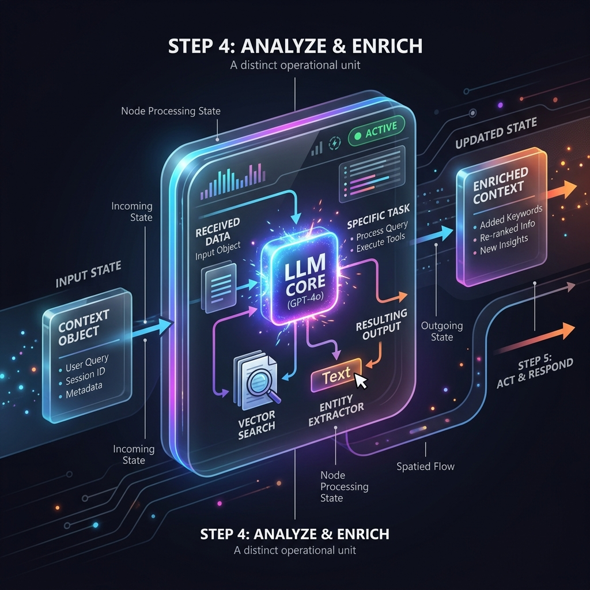

<!-- tags: glossary, agentic-ai, workflow-orchestration, step-node -->
# Step / Node

> A single, distinct operational unit within a workflow or graph that receives input, performs a specific task (like invoking an LLM or a skill), and passes the updated state forward.

| Aspect | Detail |
| --- | --- |
| **Domain** | Workflow Orchestration |
| **Used by** | AI engineer, backend developer |
| **Related** | DAG, Workflow, Atomic Action |

📅 Created: 2026-04-28 · 🔄 Updated: 2026-05-06 · ⏱️ 5 min read

---

## 1. DEFINE

In graph-based orchestration frameworks (like LangGraph), a workflow is composed of nodes and edges. 

A **Node** (often called a **Step** in linear pipelines) is the actual execution block where work happens. When execution reaches a node, the node reads the current global state (memory), performs an action (such as executing Python code, calling an external API, or prompting an LLM), and then updates the global state before the orchestrator moves to the next edge.

Nodes are the structural equivalent of functions in traditional programming, but they are specifically designed to participate in stateful, orchestrated workflows.

---

## 2. CONTEXT

**Who uses it**: AI engineers writing the granular logic for multi-step AI applications.

**When**: Used to isolate logic. If a workflow fails, developers need to know exactly *which* node failed to debug efficiently.

**In this ecosystem**:
- A [Workflow](./64-workflow.md) or [DAG](./65-dag.md) is essentially a map of Nodes.
- A Node is the perfect place to execute an [Atomic Action](../skills-plugins/107-atomic-action.md).
- Transitions between nodes are determined by [Conditional Branching](./69-conditional-branching.md).

---

## 3. EXAMPLES

*Figure: A conceptual diagram of a Step/Node, showing data flowing into the node, being processed by a specific capability or LLM, and the resulting state being passed to the next stage.*

### Example 1: The LangGraph Node
In a customer support application, a developer creates a python function called `classify_sentiment_node`. This node takes the current conversation history, asks a lightweight LLM (like Claude Haiku) if the user is angry or happy, and appends `{"sentiment": "angry"}` to the state object. The orchestrator then uses that state to decide where to go next.

### Example 2: The Human Node
Nodes don't have to be AI. In a [Human-in-the-Loop](../agentic-core/44-human-in-the-loop.md) architecture, a node might simply pause execution, send an alert to a Slack channel, and wait for a human to click an "Approve" button before updating the state and continuing the workflow.

---

## 4. COMPARE

| | Node (Step) | Edge | Skill |
|--|---|---|---|
| **Role in Graph** | The verb (doing the work) | The conjunction (determining the path) | The tool used inside the node |
| **State Interaction** | Modifies the state | Reads the state to route traffic | Unaware of global state |
| **Traditional Analogy** | A function block | An `if/else` statement | An external library |

---

## 5. REF

| Resource | Type | Link | Note |
| --- | --- | --- | --- |
| LangGraph Nodes | Docs | https://langchain-ai.github.io/langgraph/concepts/low_level/#nodes | How nodes function in a state graph architecture |

---

## 6. RECOMMEND

| Explore next | When | Why | File/Link |
| --- | --- | --- | --- |
| DAG | You have multiple nodes | Nodes are organized into a DAG | [DAG](./65-dag.md) |
| Atomic Action | You are writing the code inside the node | Nodes should ideally be atomic to prevent state corruption | [Atomic Action](../skills-plugins/107-atomic-action.md) |
| Conditional Branching | You need to route out of a node | Edges determine which node comes next | [Conditional Branching](./69-conditional-branching.md) |

**Links**: [← Previous](./66-pipeline.md) · [→ Next](./68-parallel-execution.md)
