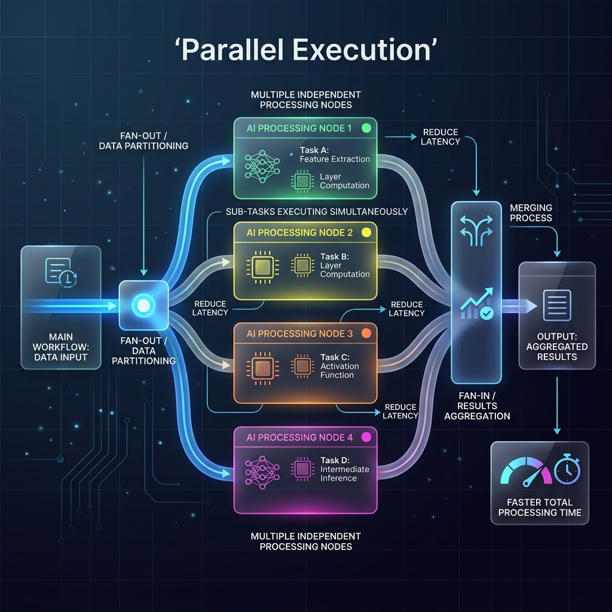

<!-- tags: glossary, agentic-ai, workflow-orchestration, parallel-execution -->
# Parallel Execution

> The simultaneous execution of multiple independent tasks or nodes within a workflow to drastically reduce overall system latency.

| Aspect | Detail |
| --- | --- |
| **Domain** | Workflow Orchestration |
| **Used by** | AI architect, backend developer |
| **Related** | DAG, Workflow, AI Orchestrator |

📅 Created: 2026-04-28 · 🔄 Updated: 2026-05-06 · ⏱️ 5 min read

---

## 1. DEFINE

LLM API calls are notoriously slow. If an agent needs to perform three distinct research tasks that each take 5 seconds, a sequential pipeline will take 15 seconds. 

**Parallel Execution** is an orchestration pattern that runs independent tasks concurrently. In the example above, all three API calls fire simultaneously, and the total execution time drops to just 5 seconds. 

Achieving parallel execution requires modeling the workflow as a [DAG](./65-dag.md), where the orchestrator can mathematically determine which tasks have zero dependencies on each other and can therefore be safely fanned out (parallelized) and subsequently fanned in (merged).

---

## 2. CONTEXT

**Who uses it**: AI architects optimizing the latency and user experience of production LLM applications.

**When**: Crucial for tasks like comprehensive web research, multi-document summarization, or querying multiple disconnected APIs.

**In this ecosystem**:
- It is enabled by defining a proper [DAG](./65-dag.md).
- Managed by the [AI Orchestrator](./63-ai-orchestrator.md).
- Contrasts with a purely linear [Pipeline](./66-pipeline.md).

---

## 3. EXAMPLES

*Figure: A diagram illustrating Parallel Execution, where a main workflow splits (fans out) into multiple independent nodes that process data simultaneously before merging (fanning in) back together.*

### Example 1: The "Fan-Out / Fan-In" Research Agent
A user asks: "Compare the Q3 earnings of Apple, Microsoft, and Google."
*   **Sequential (Bad)**: Agent fetches Apple (5s) -> fetches Microsoft (5s) -> fetches Google (5s) -> Summarizes (5s). Total: 20 seconds.
*   **Parallel (Good)**: Orchestrator **fans out** to 3 independent nodes simultaneously fetching Apple, Microsoft, and Google. After ~5 seconds, it **fans in** the results and summarizes them (5s). Total: 10 seconds.

### Example 2: Multi-LLM Verification
To ensure high accuracy on a critical math problem, an orchestrator sends the exact same prompt to GPT-4, Claude 3.5 Sonnet, and Gemini 1.5 Pro in parallel. It waits for all three to return, then uses a final node to compare the answers and select the consensus.

---

## 4. COMPARE

| | Parallel Execution | Sequential Execution |
|--|---|---|
| **Latency** | Low (Bound by the slowest single task) | High (Sum of all tasks) |
| **Complexity** | High (Requires state merging / DAGs) | Low (Simple loops) |
| **Compute Cost** | Same (Time is saved, but same number of API calls) | Same |

---

## 5. REF

| Resource | Type | Link | Note |
| --- | --- | --- | --- |
| Map-Reduce in LLMs | Concept | https://python.langchain.com/docs/use_cases/summarization/ | A common pattern utilizing parallel execution for summarization |

---

## 6. RECOMMEND

| Explore next | When | Why | File/Link |
| --- | --- | --- | --- |
| DAG | You want to implement parallel execution | You must define a DAG to know what can run in parallel | [DAG](./65-dag.md) |
| Step / Node | You are defining the tasks | Parallel execution runs multiple nodes at once | [Step / Node](./67-step-node.md) |
| AI Orchestrator | You want to execute the graph | The orchestrator handles the thread management | [AI Orchestrator](./63-ai-orchestrator.md) |

**Links**: [← Previous](./67-step-node.md) · [→ Next](./69-conditional-branching.md)
