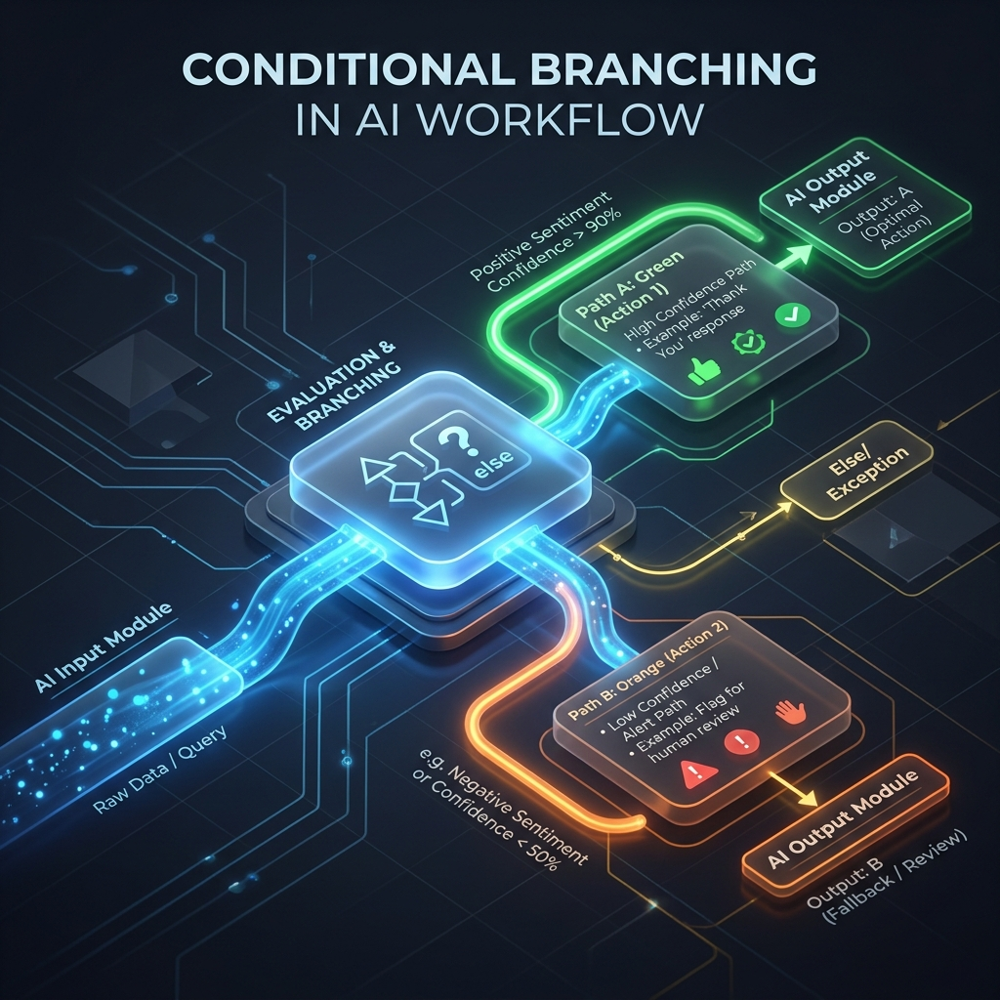

<!-- tags: glossary, agentic-ai, workflow-orchestration, conditional-branching -->
# Conditional Branching

> A workflow pattern where the path of execution splits based on dynamic rules or LLM outputs, allowing the system to adapt to different data states.

| Aspect | Detail |
| --- | --- |
| **Domain** | Workflow Orchestration |
| **Used by** | AI engineer, backend developer |
| **Related** | Skill Routing, Workflow, Step / Node |

📅 Created: 2026-04-28 · 🔄 Updated: 2026-05-06 · ⏱️ 5 min read

---

## 1. DEFINE

If a pipeline is a train track, **Conditional Branching** is the railroad switch. It is the architectural mechanism that allows a workflow to make decisions and change its execution path based on the data it is processing.

In an orchestrator, conditional branching is often implemented as "conditional edges." When a node finishes its work, the orchestrator evaluates the current state against a set of rules (e.g., `if state.sentiment == 'angry'`). Depending on the result, the orchestrator routes the flow to Node A, Node B, or Node C.

This is the primary way developers inject deterministic business logic and safety checks into non-deterministic AI workflows.

---

## 2. CONTEXT

**Who uses it**: AI engineers building dynamic workflows that must react to different user intents or failure states.

**When**: Used when a one-size-fits-all pipeline is insufficient, such as routing a VIP customer differently than a standard customer.

**In this ecosystem**:
- It is the mechanism behind [Skill Routing](../skills-plugins/108-skill-routing.md).
- It allows [Workflows](./64-workflow.md) to handle complex, branching business logic.
- Implemented as routing logic between [Step / Nodes](./67-step-node.md).

---

## 3. EXAMPLES

*Figure: A workflow diagram illustrating Conditional Branching, where an evaluation node acts as a switch, directing the execution flow down different paths based on the evaluation result.*

### Example 1: The Human-Escalation Branch
An AI agent answers customer support tickets. 
*   **Node 1**: Evaluate query complexity.
*   **Conditional Branch**:
    *   *If complexity == "low"*: Route to `Auto_Resolve_Node`.
    *   *If complexity == "high"*: Route to `Human_Support_Queue_Node`.
This simple branch prevents the AI from hallucinating answers to highly complex, edge-case problems.

### Example 2: The Quality Control Loop
Conditional branching enables iterative refinement.
*   **Node 1**: Write Code.
*   **Node 2**: Run Unit Tests.
*   **Conditional Branch**:
    *   *If tests pass*: Route to `Deploy_Node`.
    *   *If tests fail*: Route *back* to Node 1 (Write Code) with the error logs.

---

## 4. COMPARE

| | Conditional Branching | Parallel Execution | Linear Pipeline |
|--|---|---|---|
| **Path Selection** | Choose one path based on rules (XOR) | Take all paths simultaneously (AND) | Only one path exists |
| **Purpose** | Decision making and routing | Reducing latency | Simple data transformation |

---

## 5. REF

| Resource | Type | Link | Note |
| --- | --- | --- | --- |
| LangGraph Conditional Edges | Docs | https://langchain-ai.github.io/langgraph/concepts/low_level/#conditional-edges | How conditional branching is implemented in state graphs |

---

## 6. RECOMMEND

| Explore next | When | Why | File/Link |
| --- | --- | --- | --- |
| Skill Routing | The branches lead to different skills | Routing is an applied use-case of conditional branching | [Skill Routing](../skills-plugins/108-skill-routing.md) |
| Workflow | You are designing the business logic | Workflows utilize branching for complex rules | [Workflow](./64-workflow.md) |
| Step / Node | You are building the blocks | Branches connect different nodes | [Step / Node](./67-step-node.md) |

**Links**: [← Previous](./68-parallel-execution.md) · [→ Next](./70-retry-policy.md)
