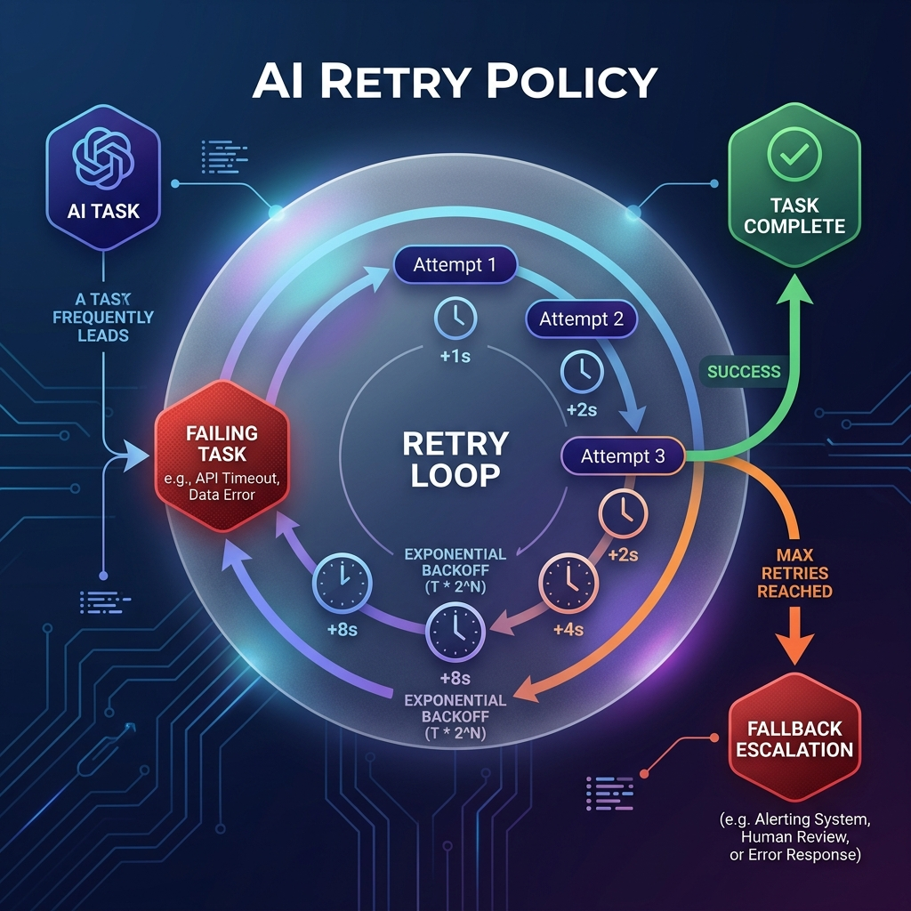

<!-- tags: glossary, agentic-ai, workflow-orchestration, retry-policy -->
# Retry Policy

> A predefined set of rules dictating how an orchestrator should react when a node fails, automatically attempting to recover before crashing the workflow.

| Aspect | Detail |
| --- | --- |
| **Domain** | Workflow Orchestration |
| **Used by** | Backend developer, AI engineer |
| **Related** | Atomic Action, AI Orchestrator |

📅 Created: 2026-04-28 · 🔄 Updated: 2026-05-06 · ⏱️ 5 min read

---

## 1. DEFINE

AI systems are fragile. An LLM might output malformed JSON, a 3rd-party search API might timeout, or a vector database might hit a connection limit. If a workflow crashes every time a transient error occurs, the system is useless in production.

A **Retry Policy** is an automated fault-tolerance mechanism configured at the orchestrator layer. It defines exactly how to handle failures for a specific [Node](./67-step-node.md). A robust policy specifies the maximum number of retry attempts, the delay between attempts (often using exponential backoff to avoid overwhelming external servers), and the specific types of errors it should catch versus errors that should cause an immediate fatal crash.

In AI, retry policies often include an "LLM Repair" step, where the error message is fed *back* to the LLM so it can correct its own mistake.

---

## 2. CONTEXT

**Who uses it**: Backend developers hardening AI orchestrations for production environments.

**When**: Mandatory on any network call (APIs, databases) and highly recommended on LLM formatting tasks (e.g., structured JSON extraction).

**In this ecosystem**:
- It runs inside the [AI Orchestrator](./63-ai-orchestrator.md).
- Relies heavily on the node being an [Atomic Action](../skills-plugins/107-atomic-action.md) (retrying a non-atomic action causes duplicate data).

---

## 3. EXAMPLES

*Figure: A visual representation of a Retry Policy, showing a failing node entering a retry loop with exponential backoff before either succeeding or finally triggering a fallback escalation.*

### Example 1: The Self-Correcting LLM
*   **Task**: Extract a user's address into a strict JSON schema.
*   **Attempt 1**: The LLM includes conversational text before the JSON (`Here is the JSON: {...}`). The JSON parser throws an error.
*   **Retry Policy Action**: The orchestrator catches the `JSONDecodeError`. It appends the error message to the prompt ("Your output failed to parse. Do not include markdown or conversational text.") and fires Attempt 2.
*   **Attempt 2**: The LLM outputs pure JSON. Success.

### Example 2: API Rate Limits (Exponential Backoff)
An agent is querying a busy Wikipedia API and receives an `HTTP 429 Too Many Requests`. The retry policy is configured with exponential backoff:
*   Wait 2 seconds -> Retry -> Fail
*   Wait 4 seconds -> Retry -> Fail
*   Wait 8 seconds -> Retry -> Success.

---

## 4. COMPARE

| | Retry Policy | Interrupt / Escalation | Fallback Model |
|--|---|---|---|
| **Action on Failure** | Try the exact same action again | Stop and ask a human for help | Try the action using a cheaper/faster AI model |
| **Best For** | Transient errors, network timeouts, formatting bugs | Missing context, high-risk blockers | Rate limits on the primary LLM provider |
| **Human Involvement** | Zero | High | Zero |

---

## 5. REF

| Resource | Type | Link | Note |
| --- | --- | --- | --- |
| Tenacity | Python Library | https://github.com/jd/tenacity | The industry-standard Python library for implementing retry behavior |
| LangChain Fallbacks | Docs | https://python.langchain.com/docs/modules/model_io/models/llms/fallbacks/ | Implementing model-level retries and fallbacks |

---

## 6. RECOMMEND

| Explore next | When | Why | File/Link |
| --- | --- | --- | --- |
| Atomic Action | You are configuring a retry policy | Only atomic actions are safe to retry | [Atomic Action](../skills-plugins/107-atomic-action.md) |
| Interrupt / Escalation | The retry policy hits its max limit | When retries fail, escalate to a human | [Interrupt / Escalation](../agentic-core/45-interrupt-escalation.md) |
| AI Orchestrator | You want to know where the policy lives | The orchestrator executes the retries | [AI Orchestrator](./63-ai-orchestrator.md) |

**Links**: [← Previous](./69-conditional-branching.md) · [→ Next](./71-checkpoint.md)
